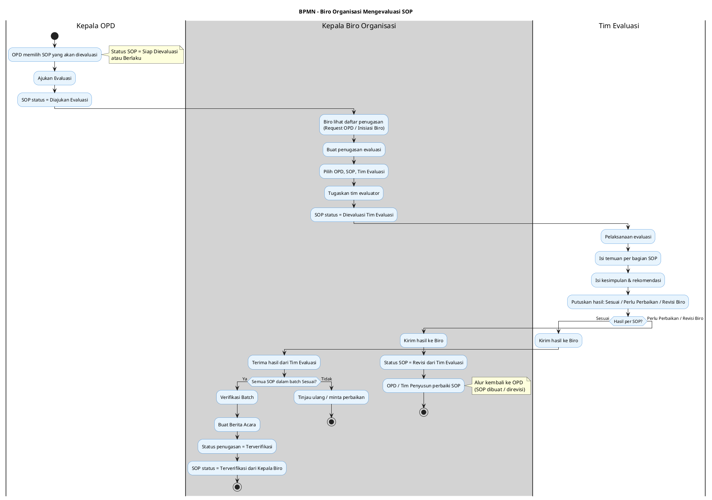
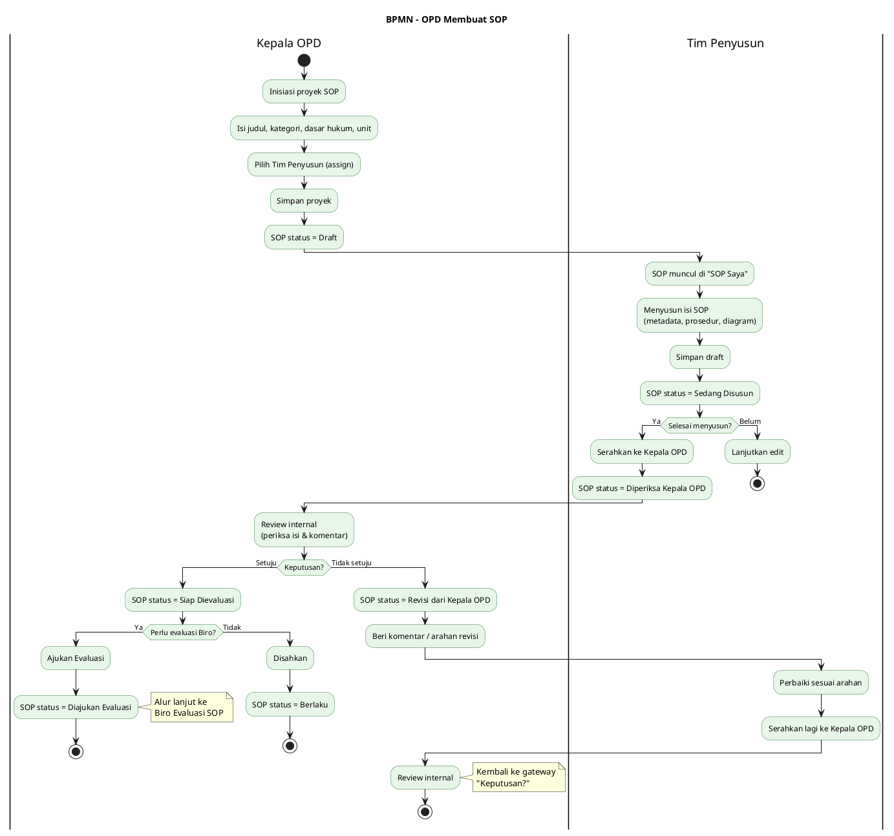

# BPMN Alur Aplikasi Biro Organisasi

Dokumen ini berisi dua diagram BPMN (Business Process Model and Notation) untuk aplikasi manajemen SOP:

1. **BPMN Biro Organisasi Mengevaluasi SOP** — alur evaluasi SOP oleh Biro (Kepala Biro Organisasi + Tim Evaluasi).
2. **BPMN OPD Membuat SOP** — alur pembuatan SOP oleh OPD (Kepala OPD + Tim Penyusun).

Diagram menggunakan sintaks **PlantUML** (activity diagram dengan partition untuk swimlane). Sumber: status dan alur di `client/src/lib/types/sop.ts` dan `docs/WORKFLOW-LIFECYCLE.md`.

---

## 1. BPMN — Biro Organisasi Mengevaluasi SOP

**Ringkasan alur:** OPD mengajukan evaluasi atau Biro menginisiasi penugasan → Biro membuat penugasan & menugaskan Tim Evaluasi → Tim Evaluasi melaksanakan evaluasi (temuan, kesimpulan) → Kirim ke Biro → Kepala Biro verifikasi batch → Terverifikasi + Berita Acara. Jika hasil tidak sesuai, SOP kembali ke OPD untuk perbaikan.

**Keterangan singkat:**

| Elemen | Arti |
|--------|------|
| **Request OPD** | Kepala OPD mengajukan evaluasi dari Daftar SOP → status SOP = Diajukan Evaluasi. |
| **Inisiasi Biro** | Kepala Biro membuat penugasan sendiri (mis. evaluasi rutin), pilih OPD & SOP yang layak evaluasi. |
| **Satu SOP satu case aktif** | Satu SOP hanya boleh dalam satu evaluation case (Draft/Assigned/In Progress) pada satu waktu. |
| **Verifikasi Batch** | Hanya jika semua SOP dalam penugasan dinilai **Sesuai** → Berita Acara & status Terverifikasi. |

---

## 2. BPMN — OPD Membuat SOP

**Ringkasan alur:** Kepala OPD inisiasi proyek SOP dan menugaskan Tim Penyusun → Tim Penyusun menyusun draft → Serahkan ke Kepala OPD → Kepala OPD periksa (gateway: setuju/tidak) → Tidak setuju: Revisi dari Kepala OPD, Tim Penyusun perbaiki dan kirim lagi → Setuju: Siap Dievaluasi → (opsional) Ajukan Evaluasi ke Biro, atau Kepala OPD disahkan → Berlaku.

**Keterangan singkat:**

| Elemen | Arti |
|--------|------|
| **Initiate Proyek** | Halaman Kepala OPD: Initiate Proyek SOP; proyek baru muncul di Daftar SOP dengan status Draft. |
| **SOP Saya** | Tim Penyusun hanya melihat SOP yang ditugaskan kepadanya. |
| **Serahkan ke Kepala OPD** | Aksi "Kirim ke Review Internal" / Submit; status jadi Diperiksa Kepala OPD. |
| **Siap Dievaluasi** | Kepala OPD setuju; SOP bisa diajukan evaluasi ke Biro atau langsung disahkan (jika tidak wajib evaluasi). |
| **Berlaku** | SOP sudah disahkan; perubahan selanjutnya hanya lewat Revisi/Amendment (versi baru). |

---

## 3. Status SOP (Referensi)

| Status | Arti dalam alur |
|--------|------------------|
| Draft | Inisiasi OPD; belum disusun. |
| Sedang Disusun | Tim Penyusun mengerjakan draft. |
| Diperiksa Kepala OPD | Sudah diserahkan, menunggu review Kepala OPD. |
| Revisi dari Kepala OPD | Kepala OPD tidak setuju; Tim Penyusun perbaiki. |
| Siap Dievaluasi | Kepala OPD setuju; bisa ajukan evaluasi atau disahkan. |
| Diajukan Evaluasi | OPD sudah ajukan evaluasi; menunggu Biro buat penugasan. |
| Dievaluasi Tim Evaluasi | Sedang dievaluasi oleh Tim Evaluasi. |
| Revisi dari Tim Evaluasi | Hasil evaluasi tidak sesuai; OPD/penyusun perbaiki. |
| Terverifikasi dari Kepala Biro | Hasil evaluasi sesuai; bisa disahkan. |
| Berlaku | SOP disahkan (dokumen resmi). |
| Dicabut / Batal | SOP tidak berlaku. |

---

## 4. Cara Merender Diagram

- **PlantUML Online:** [plantuml.com/plantuml](https://www.plantuml.com/plantuml/uml/) — paste blok kode antara `@startuml` dan `@enduml`.
- **VS Code:** Ekstensi "PlantUML"; preview dengan Alt+D atau export PNG/SVG.
- **CLI:** `java -jar plantuml.jar docs/BPMN-ALUR-APLIKASI.md` (jika PlantUML mendukung ekstraksi dari markdown).

---

*Sumber alur: `docs/WORKFLOW-LIFECYCLE.md`, `client/src/lib/types/sop.ts`.*
