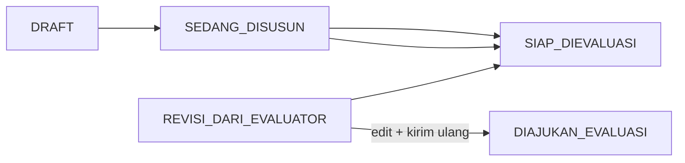

# Business Specification — SOP Management System

> Dokumen ini adalah **sumber kebenaran tunggal** (single source of truth) untuk:
> 1. Alur bisnis per domain
> 2. State-machine status
> 3. Konstanta & invariant yang wajib di-enforce
> 4. Acceptance criteria bergaya **Given–When–Then** (TDD / Spec-Driven)

@schema.prisma (14-82) 

normalisasikan ini  , pindahkan fieldnya
dengan logic yang masih sama, tapi saya raya ini salah si tabel databasenya

harusnya opd ini tabel masiher dan atomik, gada meruk ke pengguna , mengenai 1 opd wajib 1 kepala opd, 1 opd wajib 1 pjpneyusun, dan pj evluator/evluator harus dari BiroOrganisasi, itu harunya di handle di table junction riwayatOpdPengguna

atau nanti mngkin pengguna.peran itu harusnya ad di riwayat?

juga diisin dibuatkan isAktifnya juga, namun ga pelru mulai pada dan berakhir padanya

tolong deseignkan best practinya secara komprehensif baik client maupun server 

---


## usecase
- detailkan lagi flownya di bagian status 
  - status apa aja yang adi di penyusun
  - status apa aja yang ad di evalutor
  - status apa aja yang adi pj evaluator
  - status apa aja yang ada di pj penyusun evaluasi
  - status apa aja yang ada di kepala opd
- optimasi lagi field" yang ada di database
- gimana flow dan busines logic kalau sop ini suda disahkan kemudian mau di evaluasi lagi
- perbaiki diagram sop
- perbaiki erd pada bagain pengguna opd dan peran, handler yang best practice giman
- fix dan perbaiki workflow dari evluator kalau direvisi
  - misal ada 5 pengajuan 1 revisi, gimana proses workflow dari revisi ini?
    - evaluator emngisi catatn revisi -> sop di edit di evaluasi -> kirim kan kembali evaluator
- fix : tengok mana komponent yang dideadkan ketika lagi ngedit atau cuman lihat aja, 
- perjelas lebih detail constraint dari aplikasi

## Daftar Isi

1. [Domain Map](#1-domain-map)
2. [Aktor & Peran](#2-aktor--peran)
   - [2.1 Peta Status per Peran](#21-peta-status-per-peran)
3. [Alur Bisnis — Master & Akses](#3-alur-bisnis--master--akses)
4. [Alur Bisnis — Regulasi](#4-alur-bisnis--regulasi)
5. [Alur Bisnis — Authoring SOP](#5-alur-bisnis--authoring-sop)
6. [State Machine — StatusSOP](#6-state-machine--statussop)
7. [Alur Bisnis — Evaluasi SOP](#7-alur-bisnis--evaluasi-sop)
8. [State Machine — StatusPengajuanEvaluasi](#8-state-machine--statuspengajuanevaluasi)
9. [Alur Bisnis — TTE (Tanda Tangan Elektronik)](#9-alur-bisnis--tte-tanda-tangan-elektronik)
10. [Konstanta & Business Rules Wajib](#10-konstanta--business-rules-wajib)
11. [Acceptance Criteria (Given–When–Then)](#11-acceptance-criteria-givenwhenhen)

---

## 1. Domain Map

```
┌─────────────────────────────────────────────────────────────────┐
│                       SISTEM SOP                                │
│                                                                 │
│  ┌────────────┐   ┌────────────┐   ┌────────────────────────┐  │
│  │  MODUL 1   │   │  MODUL 2   │   │       MODUL 3          │  │
│  │ Master &   │──▶│ Authoring  │──▶│  Kolaborasi SOP        │  │
│  │  Akses     │   │    SOP     │   │ (Komentar, Log Edit)   │  │
│  └────────────┘   └─────┬──────┘   └────────────────────────┘  │
│       │                 │                                       │
│  ┌────┴───────┐         ▼                                       │
│  │ Regulasi   │   ┌────────────┐   ┌────────────────────────┐  │
│  │(Peraturan) │   │  MODUL 5   │──▶│       MODUL 6          │  │
│  └────────────┘   │  Evaluasi  │   │  Legalisasi & TTE      │  │
│                   └────────────┘   └────────────────────────┘  │
└─────────────────────────────────────────────────────────────────┘
```

---

## 2. Aktor & Peran

| Peran | Kode | Tanggung Jawab Utama |
|---|---|---|
| PJ Evaluator Organisasi | `PJ_EVALUATOR` | Memverifikasi hasil evaluasi, tanda tangan BA final. Satu instansi (OPD `isPjEvaluatorOrganisasi = true`). |
| Evaluator | `EVALUATOR` | Mengisi nilai evaluasi per SOP, menyelesaikan sesi evaluasi. |
| Kepala OPD | `KEPALA_OPD` | menandatangain sop OPD-nya. |
| PJ Penyusun | `PJ_PENYUSUN` | Mengkoordinasi penyusunan, tanda tangan Berita Acara Penyusun. |
| Penyusun | `PENYUSUN` | Membuat & mengedit dokumen SOP. |

**Constraint OPD:**
- Satu OPD hanya boleh punya **1 Kepala OPD** (`OPD.kepalaPenggunaId @unique`)
- Satu OPD hanya boleh punya **1 PJ Penyusun** (`OPD.pjPenyusunPenggunaId @unique`)
- Hanya **1 OPD** yang boleh menjadi PJ Evaluator Organisasi (`isPjEvaluatorOrganisasi`, enforce via MySQL trigger)

### 2.1 Peta Status per Peran

Sistem memakai **dua enum status** yang saling terhubung:

| Enum | Entitas | Nilai | Fungsi |
|---|---|---|---|
| `StatusSOP` | `DetailSOP` (versi dokumen) | 11 nilai | Siklus hidup satu versi SOP |
| `StatusPengajuanEvaluasi` | `PengajuanEvaluasi` (pengajuan evaluasi per OPD) | 5 nilai | Siklus evaluasi + Berita Acara lintas banyak SOP |
| `HasilEvaluasi` | `NilaiEvaluasi` (per SOP dalam pengajuan evaluasi) | `SESUAI`, `PERLU_PERBAIKAN` | Hasil penilaian evaluator (bukan status dokumen) |

**`StatusSOP` lengkap:**

`DRAFT` → `SEDANG_DISUSUN` → `SIAP_DIEVALUASI` → `DIAJUKAN_EVALUASI` → `SEDANG_DIEVALUASI` → (`SIAP_DIVERIFIKASI` **atau** `REVISI_DARI_EVALUATOR`) → `DIVERIFIKASI_PJ_EVALUATOR_ORGANISASI` → `BERLAKU` → (`DICABUT` / `DIGANTIKAN`).

**`StatusPengajuanEvaluasi` lengkap:**

`SEDANG_DIEVALUASI` → `SELESAI_DIEVALUASI` → `DIVERIFIKASI_PJ_EVALUATOR` → `DITANDATANGANI_PJ_PENYUSUN` → `SELESAI`.

**Status “aktif” pengajuan** (satu OPD hanya boleh punya satu pengajuan dalam set ini):

`SEDANG_DIEVALUASI`, `SELESAI_DIEVALUASI`, `DIVERIFIKASI_PJ_EVALUATOR`, `DITANDATANGANI_PJ_PENYUSUN`.

---

#### Penyusun (`PENYUSUN`)

**Status `DetailSOP` yang dilihat:** semua status di OPD sendiri (filter daftar: 10 nilai UI — tanpa `DIGANTIKAN` di filter, tetapi versi lama bisa tampil di riwayat).

| Status SOP | Mode UI | Aksi penyusun |
|---|---|---|
| `DRAFT` | **Edit** | Susun header, langkah, lampiran, dasar hukum, SOP terkait |
| `SEDANG_DISUSUN` | **Edit** | Sama seperti `DRAFT` |
| `REVISI_DARI_EVALUATOR` | **Edit** | Perbaiki sesuai catatan evaluator; lalu **kirim ulang** ke evaluator (endpoint khusus: `REVISI` → `SIAP_DIEVALUASI` → `DIAJUKAN_EVALUASI` dalam satu transaksi) |
| `SIAP_DIEVALUASI` | Lihat | Bisa menandai siap evaluasi (bersama PJ) — transisi dari `DRAFT` / `SEDANG_DISUSUN` / `REVISI` |
| `DIAJUKAN_EVALUASI` … `DIVERIFIKASI_PJ_EVALUATOR_ORGANISASI` | **Read-only** | Hanya baca + tanggapi komentar yang sudah ada |
| `BERLAKU`, `DICABUT`, `DIGANTIKAN` | **Read-only** | Arsip / versi sah |

**Transisi yang dapat dipicu penyusun (server):**

- `→ SIAP_DIEVALUASI` dari `DRAFT` | `SEDANG_DISUSUN` | `REVISI_DARI_EVALUATOR` (guard: dokumen lengkap, tidak ada komentar `TERBUKA`).
- `→ DIAJUKAN_EVALUASI` hanya lewat **kirim ulang setelah revisi** (bukan PATCH status biasa untuk PJ).
- **Tidak bisa:** ajukan evaluasi awal (`DIAJUKAN_EVALUASI` — khusus PJ Penyusun), isi nilai evaluasi, verifikasi BA, TTE.

**Status pengajuan evaluasi:** tidak mengelola pengajuan evaluasi; hanya terdampak ketika SOP masuk/keluar pipeline evaluasi.



---

#### PJ Penyusun (`PJ_PENYUSUN`)

Mewarisi hak **edit SOP** penyusun (`DRAFT`, `SEDANG_DISUSUN`, `REVISI_DARI_EVALUATOR`) plus koordinasi evaluasi & Berita Acara.

**Status `DetailSOP` — tambahan vs penyusun:**

| Status SOP | Aksi PJ Penyusun |
|---|---|
| `SIAP_DIEVALUASI` | **Ajukan ke evaluasi** → `DIAJUKAN_EVALUASI` (guard: tidak ada komentar `TERBUKA`, min. 3 langkah) |
| `SIAP_DIEVALUASI` … `DIAJUKAN_EVALUASI` | Bisa **buka pengajuan evaluasi** (`POST` pengajuan): semua SOP eligibel → `SEDANG_DIEVALUASI` |
| `SIAP_DIVERIFIKASI` | Setelah evaluator selesai & PJ Evaluator verifikasi BA — menunggu TTE PJ Penyusun |
| `DIVERIFIKASI_PJ_EVALUATOR_ORGANISASI` | Setelah TTE BA PJ Penyusun — menunggu pengesahan Kepala OPD |

**Status `PengajuanEvaluasi` yang dilihat/dikelola (OPD sendiri):**

| Status pengajuan | Peran PJ Penyusun |
|---|---|
| `SEDANG_DIEVALUASI` | Membuka pengajuan evaluasi (TERJADWAL/MANDIRI); memantau progress evaluator |
| `SELESAI_DIEVALUASI` | Menunggu PJ Evaluator verifikasi & TTE BA |
| `DIVERIFIKASI_PJ_EVALUATOR` | **TTE Berita Acara** → `DITANDATANGANI_PJ_PENYUSUN`; sekaligus promosi semua `DetailSOP` dalam pengajuan evaluasi: `SIAP_DIVERIFIKASI` → `DIVERIFIKASI_PJ_EVALUATOR_ORGANISASI` |
| `DITANDATANGANI_PJ_PENYUSUN` | Menunggu Kepala OPD mengesahkan SOP |
| `SELESAI` | Arsip pengajuan evaluasi |

**Halaman Berita Acara PJ Penyusun** memakai dua tab: **Perlu Tanda Tangan** (`DIVERIFIKASI_PJ_EVALUATOR`) dan **Riwayat** (`DITANDATANGANI_PJ_PENYUSUN`, `SELESAI`).

**Workspace evaluasi OPD:** daftar SOP pipeline **termasuk** `SIAP_DIEVALUASI` (hanya PJ Penyusun yang melihat status ini di workspace).

---

#### Evaluator (`EVALUATOR`)

**Tidak mengubah `StatusSOP` langsung via PATCH** — perubahan status dokumen terjadi lewat **nilai evaluasi** dan **selesai evaluasi**.

**Status `PengajuanEvaluasi`:**

| Tab / konteks UI | Filter `statusIn` | Makna |
|---|---|---|
| Evaluasi berjalan | `SEDANG_DIEVALUASI` | Pengajuan evaluasi aktif — isi `NilaiEvaluasi` |
| Riwayat | `SELESAI` | Pengajuan evaluasi final |

**Status `DetailSOP` dalam workspace OPD** (kolom `statusDetail` + `tampilanAlur`):

| statusDetail | tampilanAlur (turunan) | Kondisi |
|---|---|---|
| `DIAJUKAN_EVALUASI`, `SEDANG_DIEVALUASI`, `REVISI_DARI_EVALUATOR`, `SIAP_DIEVALUASI`* | `perlu_evaluasi` / `sedang_dievaluasi` | Belum ada hasil / hasil kosong |
| (sama) | `selesai_pengajuan_ini` | `NilaiEvaluasi.hasil` sudah terisi |
| `SIAP_DIVERIFIKASI` ke atas | — | Sudah lewat tahap evaluator |

\* `SIAP_DIEVALUASI` masuk pipeline pengajuan evaluasi; evaluator bisa **bootstrap pengajuan MANDIRI** otomatis jika belum ada pengajuan aktif.

**Hasil per SOP (`HasilEvaluasi`):**

| Hasil | Efek ke `DetailSOP` | Efek ke pengajuan evaluasi |
|---|---|---|
| `PERLU_PERBAIKAN` | `DIAJUKAN_EVALUASI` atau `SEDANG_DIEVALUASI` → **`REVISI_DARI_EVALUATOR`**; catatan disimpan di `NilaiEvaluasi.catatan` dengan `statusTindakLanjut = TERBUKA` | Pengajuan tetap `SEDANG_DIEVALUASI` — SOP lain dalam pengajuan evaluasi yang sama bisa tetap dinilai |
| `SESUAI` | Tidak mengubah status dokumen sampai **selesai** | — |

**Aksi penutup pengajuan evaluasi (semua baris harus `SESUAI`):**

- Pengajuan: `SEDANG_DIEVALUASI` → **`SELESAI_DIEVALUASI`**
- Semua `DetailSOP` terkait (status ∈ `DIAJUKAN_EVALUASI`, `SEDANG_DIEVALUASI`, `REVISI_DARI_EVALUATOR`): → **`SIAP_DIVERIFIKASI`**

**Skenario revisi campuran (contoh 5 SOP, 1 revisi):**

1. Evaluator isi SOP-A = `PERLU_PERBAIKAN` + catatan → A menjadi `REVISI_DARI_EVALUATOR`; baris `NilaiEvaluasi` mendapat `statusTindakLanjut = TERBUKA`; pengajuan evaluasi tetap `SEDANG_DIEVALUASI`.
2. SOP-B…E bisa tetap dinilai `SESUAI`.
3. Penyusun/PJ memperbaiki A → **tandai tindak lanjut SELESAI** pada umpan balik → **kirim ulang** (ditolak jika masih `TERBUKA`) → A kembali `DIAJUKAN_EVALUASI` / `SEDANG_DIEVALUASI`.
4. Evaluator **tidak bisa** menekan “Selesai” selama masih ada baris ≠ `SESUAI`.
5. Setelah A juga `SESUAI`, evaluator selesaikan → pengajuan evaluasi `SELESAI_DIEVALUASI`, semua dokumen `SIAP_DIVERIFIKASI`.

---

#### PJ Evaluator Organisasi (`PJ_EVALUATOR`)

**Scope:** lintas OPD (Biro Organisasi); tidak dibatasi `opdId` pada daftar pengajuan.

**Status `PengajuanEvaluasi`:**

| Status | Aksi PJ Evaluator |
|---|---|
| `SEDANG_DIEVALUASI` | Membuat pengajuan **TERJADWAL**; memantau evaluator |
| `SELESAI_DIEVALUASI` | **TTE Berita Acara (verifikasi)** → `DIVERIFIKASI_PJ_EVALUATOR` |
| `DIVERIFIKASI_PJ_EVALUATOR` | Menunggu TTE PJ Penyusun |
| `DITANDATANGANI_PJ_PENYUSUN` | Menunggu pengesahan Kepala OPD per OPD |
| `SELESAI` | Arsip (tab riwayat di UI: filter `statusIn = [SELESAI]`) |

**Tab UI “siap TTD”** memfilter: `SELESAI_DIEVALUASI` (menunggu verifikasi/TTE PJ Evaluator).

**Status `DetailSOP` yang relevan:**

| Status SOP | Peran PJ Evaluator |
|---|---|
| `SIAP_DIVERIFIKASI` | Hasil evaluasi sudah final; menunggu rangkaian TTE |
| `DIVERIFIKASI_PJ_EVALUATOR_ORGANISASI` | Setelah BA ditandatangani PJ Penyusun |
| `BERLAKU` | Setelah Kepala OPD mengesahkan (bukan PJ Evaluator di implementasi saat ini) |

**Catatan implementasi:** transisi `SIAP_DIVERIFIKASI` → `DIVERIFIKASI_PJ_EVALUATOR_ORGANISASI` pada `DetailSOP` dipicu oleh **TTE PJ Penyusun**, bukan aksi terpisah PJ Evaluator pada dokumen.

---

#### Kepala OPD (`KEPALA_OPD`)

**Status `DetailSOP` — pantau semua SOP OPD** (filter penuh seperti penyusun).

| Status SOP | Mode | Aksi |
|---|---|---|
| `DRAFT` … `DIVERIFIKASI_PJ_EVALUATOR_ORGANISASI` | Lihat / pantau | Tidak mengedit isi SOP |
| **`DIVERIFIKASI_PJ_EVALUATOR_ORGANISASI`** | **TTE pengesahan** | `→ BERLAKU` (per dokumen atau seluruh SOP dalam pengajuan evaluasi) |
| `BERLAKU` | Lihat | Bisa **`→ DICABUT`** (PATCH status) |
| `DICABUT`, `DIGANTIKAN` | Arsip | — |

**Status `PengajuanEvaluasi` (OPD sendiri):**

| Status pengajuan | Bucket UI Kepala OPD |
|---|---|
| `DITANDATANGANI_PJ_PENYUSUN` | **Belum ditandatangani** — siap disahkan massal |
| `SELESAI` | **Sudah berlaku** — pengajuan evaluasi selesai |

**Alur TTE pengesahan SOP (implementasi):**

1. PJ Penyusun selesai TTE BA → pengajuan `DITANDATANGANI_PJ_PENYUSUN`, SOP `DIVERIFIKASI_PJ_EVALUATOR_ORGANISASI`.
2. Kepala OPD `POST …/sop-semua` atau per `sopDetailId` → setiap SOP `BERLAKU`, pengajuan → **`SELESAI`**.

**Halaman pengajuan SOP:** hanya menampilkan SOP dengan `status === DIVERIFIKASI_PJ_EVALUATOR_ORGANISASI` untuk penandatanganan.

---

#### Ringkasan lintas peran (satu pengajuan evaluasi)

```text
[PJ Penyusun dan penyusun] buka pengajuan evaluasi
  Pengajuan: SEDANG_DIEVALUASI
  DetailSOP[]: → SEDANG_DIEVALUASI

[Evaluator] isi nilai
  PERLU_PERBAIKAN → DetailSOP: REVISI_DARI_EVALUATOR (per dokumen)
  [Penyusun/PJ] revisi + kirim ulang → DIAJUKAN_EVALUASI / SEDANG_DIEVALUASI

[Evaluator] selesai (semua SESUAI)
  Pengajuan: SELESAI_DIEVALUASI
  DetailSOP[]: SIAP_DIVERIFIKASI

[PJ Evaluator] TTE BA
  Pengajuan: DIVERIFIKASI_PJ_EVALUATOR
  DetailSOP[]: BERLAKU
  Pengajuan: SELESAI
```

---

## 3. Alur Bisnis — Master & Akses

### 3.1 Pendaftaran & Penugasan Pengguna

```
[Admin/System] ──▶ Buat Pengguna (email, nip, peran, opdId)
                        │
                        ├── Validasi: NIP unik secara global
                        ├── Validasi: Email unik secara global
                        ├── Pengguna hanya bisa di-assign ke 1 OPD aktif (current)
                        │   (OPD lama dicatat di RiwayatOpdPengguna)
                        └── Jika peran = KEPALA_OPD → set OPD.kepalaPenggunaId
                            Jika peran = PJ_PENYUSUN → set OPD.pjPenyusunPenggunaId
```

### 3.2 Perpindahan OPD

```
[Admin] ──▶ Pindahkan Pengguna ke OPD baru
                │
                ├── Catat entri baru di RiwayatOpdPengguna (opdId lama)
                ├── Update Pengguna.opdId ke OPD baru
                └── Jika peran slot (KEPALA/PJ), clear pointer di OPD lama
```

### 3.3 Soft Delete Pengguna

```
[Admin] ──▶ Nonaktifkan Pengguna
                │
                ├── Set Pengguna.deletedAt = now()
                ├── SOP yang dibuat tetap ada (onDelete: Restrict → jangan hapus data SOP)
                └── Slot Kepala/PJ di OPD menjadi null (onDelete: SetNull)
```

---

## 4. Alur Bisnis — Regulasi

### 4.1 Manajemen Peraturan

```
[Penyusun / PJ Penyusun] ──▶ Tambah Peraturan
        │
        ├── Validasi: kombinasi (nomor, tahun) harus unik
        ├── Field wajib: nama, nomor, tahun, tentang
        └── Catat lastEditedById = userId

[Penyusun] ──▶ Attach Peraturan ke DetailSOP
        │
        └── Insert DasarHukum (detailSopId, peraturanId)
            Satu detailSop bisa punya banyak DasarHukum

[Admin OPD] ──▶ Daftarkan OPD sebagai pemakai Peraturan
        └── Insert OPDPeraturan (opdId, peraturanId)
```

---

## 5. Alur Bisnis — Authoring SOP

### 5.1 Pembuatan SOP Baru

```
[Penyusun] ──▶ Buat SOP (judul, opdId)
        │
        └── Sistem auto-buat DetailSOP versi 1
                status = DRAFT
                nomorSOP = generate (unik global)
                dibuatOlehId = userId penyusun
```

### 5.2 Penyusunan Dokumen SOP

```
Selama status ∈ {DRAFT, SEDANG_DISUSUN, REVISI_DARI_EVALUATOR}:

[Penyusun] ──▶ Edit Header SOP
        │        (namaLembaga, tanggalEfektif, dsb)
        │        → Log ke LogEditSOP (bagian = HEADER)
        │
[Penyusun] ──▶ Tambah/Edit LangkahSOP
        │        → Log ke LogEditSOP (bagian = LANGKAH)
        │        → Validasi urutan langkah tidak duplikat per DetailSOP
        │        → Langkah KEPUTUSAN harus punya langkahYa & langkahTidak
        │
[Penyusun] ──▶ Attach Lampiran (Peringatan, Kualifikasi, Peralatan, Pencatatan)
        │
[Penyusun] ──▶ Attach DasarHukum (link ke Peraturan)
        │
[Penyusun] ──▶ Attach SopTerkait (relasi ke DetailSOP lain)
        │
[Evaluator/PJ] ──▶ Tulis Komentar kolaborasi (penyusunan)
        │            → Komentar.status = TERBUKA
        │
[Penyusun] ──▶ Selesaikan Komentar kolaborasi
                → Komentar.status = SELESAI

(Umpan balik evaluasi **bukan** `Komentar` — lihat §5.5 dan §7.2.)
```

### 5.3 Log Edit dengan Merge Window

```
Saat Penyusun edit field:
    ├── Cari LogEditSOP terbuka (closedAt IS NULL) untuk
    │   (detailSopId, userId, bagian) dalam 5 menit terakhir
    ├── Jika ada → merge: update meta.fields, meta.count, keterangan
    └── Jika tidak ada → buat LogEditSOP baru (closedAt = NULL)

Background job (atau lazy-close):
    └── Set closedAt = now() untuk log idle > MERGE_WINDOW_MINUTES
```

### 5.4 Pengajuan ke Evaluasi

```
[PJ Penyusun] ──▶ Ajukan SOP ke Evaluasi
        │
        ├── GUARD: status harus SIAP_DIEVALUASI
        ├── GUARD: tidak boleh ada Komentar.status = TERBUKA
        ├── GUARD: minimal 3 LangkahSOP harus ada
        └── Transisi: status → DIAJUKAN_EVALUASI
```

### 5.5 Revisi Pasca Evaluasi

```
[Evaluator] ──▶ Isi NilaiEvaluasi: PERLU_PERBAIKAN + catatan
        │
        ├── DetailSOP: → REVISI_DARI_EVALUATOR
        └── NilaiEvaluasi.statusTindakLanjut = TERBUKA (sumber kebenaran umpan balik)

[Penyusun/PJ] ──▶ Edit SOP (alur 5.2) + baca umpan balik di tab Umpan balik
        │
[Penyusun/PJ] ──▶ PATCH tindak-lanjut-selesai → statusTindakLanjut = SELESAI
        │
[Penyusun/PJ] ──▶ Kirim ulang ke evaluator (GUARD: statusTindakLanjut = SELESAI)
        └── Transaksi: REVISI → SIAP_DIEVALUASI → DIAJUKAN_EVALUASI
```

### 5.6 Versioning SOP (revisi dari versi BERLAKU)

**Bedakan dua jenis revisi:**

| Jenis | Pemicu | Versi | Field / status |
|-------|--------|-------|----------------|
| Revisi dari evaluator | Nilai evaluasi `PERLU_PERBAIKAN` | **Sama** | `REVISI_DARI_EVALUATOR` pada DetailSOP yang sama |
| Revisi dari SOP berlaku | Penyusun/PJ memilih "Buat versi baru" pada versi `BERLAKU` | **Baru** (`versi + 1`) | `revisiDariDetailSopId` → DetailSOP sumber; status awal `DRAFT` |

**Alur revisi dari BERLAKU (8 langkah):**

1. SOP memiliki DetailSOP dengan status `BERLAKU` (versi resmi).
2. Penyusun/PJ memanggil `POST /sop/:detailSopId/buat-versi-baru` — deep clone ke versi baru (`DRAFT`, `revisiDariDetailSopId` terisi).
3. Versi lama tetap `BERLAKU` dan **read-only** (server menolak PATCH header/prosedur/komentar).
4. Penyusun mengedit versi baru hingga siap evaluasi (alur evaluasi existing).
5. Pipeline evaluasi + tindak lanjut umpan balik (modul evaluasi existing, termasuk `statusTindakLanjut` pada `NilaiEvaluasi`).
6. Setelah disetujui, pengajuan TTE Kepala OPD pada versi baru.
7. Saat TTE selesai: versi baru → `BERLAKU`; versi lama → `DIGANTIKAN` (`gantikanVersiBerlakuLain`).
8. Batalkan revisi: `DELETE /sop/:detailSopId/versi-draft` hanya jika `DRAFT`, punya `revisiDariDetailSopId`, dan belum ada `NilaiEvaluasi`.

**Aturan konkurensi:** maksimal satu revisi in-flight per `sopId` (tidak boleh ada DetailSOP lain dengan status selain `BERLAKU` / `DIGANTIKAN` / `DICABUT` saat membuat versi baru).

**Riwayat:** `GET /sop/:sopId/riwayat-versi` — semua versi per SOP, diurutkan `versi`.

**Acceptance criteria (ringkas):**

- **AC-SOP-V01:** Buat versi baru hanya dari DetailSOP `BERLAKU`.
- **AC-SOP-V02:** Tolak buat versi jika sudah ada revisi in-flight pada SOP yang sama.
- **AC-SOP-V03:** DetailSOP `BERLAKU` / `DIGANTIKAN` / `DICABUT` tidak dapat di-PATCH (header, prosedur, resolve komentar).
- **AC-SOP-V04:** Hapus versi draft hanya untuk `DRAFT` + `revisiDariDetailSopId` + tanpa nilai evaluasi.
- **AC-SOP-V05:** Daftar SOP menampilkan versi terbaru dan versi berlaku (`versiBerlaku`, `canBuatVersiBaru`).

Saat DetailSOP baru menjadi BERLAKU (TTE):

```
    ├── DetailSOP versi sebelumnya yang BERLAKU → DIGANTIKAN
    └── Maksimal 1 versi BERLAKU per SOP (enforce via trigger MySQL)
```

---

## 6. State Machine — StatusSOP

```
                    ┌─────────────────────────────────────────┐
                    │              BERLAKU ◀──────────────┐   │
                    │                 │                   │   │
                    │            DIGANTIKAN           (versi  │
                    │                                   baru) │
                    └─────────────────────────────────────────┘

DRAFT
  │ (penyusun mulai edit)
  ▼
SEDANG_DISUSUN
  │ (PJ Penyusun submit)
  ▼
SIAP_DIEVALUASI
  │ (PJ Penyusun ajukan evaluasi)
  ▼
DIAJUKAN_EVALUASI
  │ (Evaluator mulai proses)
  ▼
SEDANG_DIEVALUASI
  │                    │
  │ (semua SESUAI)     │ (ada PERLU_PERBAIKAN)
  ▼                    ▼
SIAP_DIVERIFIKASI   REVISI_DARI_EVALUATOR
  │                    │
  │               (penyusun revisi + ajukan ulang)
  │                    └────────────────────────▶ DIAJUKAN_EVALUASI
  │ (PJ Evaluator verifikasi)
  ▼
DIVERIFIKASI_PJ_EVALUATOR_ORGANISASI
  │ (TTE ditandatangani semua pihak)
  ▼
BERLAKU
  │ (dicabut)
  ▼
DICABUT
```

**Transisi yang valid (enforce di service layer):**

| Dari | Ke | Aktor | Guard |
|---|---|---|---|
| DRAFT | SEDANG_DISUSUN | PENYUSUN | Ada minimal 1 LangkahSOP (implisit saat mulai edit) |
| DRAFT / SEDANG_DISUSUN / REVISI | SIAP_DIEVALUASI | PENYUSUN atau PJ_PENYUSUN | Dokumen lengkap; tidak ada komentar TERBUKA |
| SIAP_DIEVALUASI | DIAJUKAN_EVALUASI | PJ_PENYUSUN | Min. 3 langkah; tidak ada komentar TERBUKA |
| REVISI_DARI_EVALUATOR | DIAJUKAN_EVALUASI | PENYUSUN atau PJ_PENYUSUN | Kirim ulang setelah perbaikan (transaksi gabung) |
| DIAJUKAN_EVALUASI / SIAP_DIEVALUASI / REVISI | SEDANG_DIEVALUASI | PJ_PENYUSUN atau EVALUATOR | SOP masuk pengajuan evaluasi `PengajuanEvaluasi` |
| SEDANG_DIEVALUASI | SIAP_DIVERIFIKASI | EVALUATOR | Semua `NilaiEvaluasi.hasil = SESUAI`; aksi **selesai** pengajuan evaluasi |
| DIAJUKAN / SEDANG_DIEVALUASI | REVISI_DARI_EVALUATOR | EVALUATOR | `NilaiEvaluasi.hasil = PERLU_PERBAIKAN` (+ catatan wajib) |
| SIAP_DIVERIFIKASI | DIVERIFIKASI_PJ_EVALUATOR_ORGANISASI | PJ_PENYUSUN | TTE Berita Acara (pengajuan evaluasi) |
| DIVERIFIKASI_PJ_EVALUATOR_ORGANISASI | BERLAKU | KEPALA_OPD | TTE SOP (`SOP_BERLAKU`) per item atau massal |
| BERLAKU | DICABUT | KEPALA_OPD | — |
| BERLAKU | DIGANTIKAN | SYSTEM | Versi baru menjadi BERLAKU (trigger DB) |

---

## 7. Alur Bisnis — Evaluasi SOP

### 7.1 Pembuatan Pengajuan Evaluasi

```
[PJ Evaluator] ──▶ Buat PengajuanEvaluasi
        │
        ├── jenis: TERJADWAL (terjadwal reguler) atau MANDIRI (ad-hoc)
        ├── status = SEDANG_DIEVALUASI (awal siklus sama untuk terjadwal/mandiri)
        ├── Assign SOP-SOP OPD ke NilaiEvaluasi (hasil = NULL awalnya)
        └── Kirim notifikasi ke Evaluator yang ditugaskan
```

**Constraint pembuatan pengajuan evaluasi:**

- Satu OPD hanya boleh memiliki **1 pengajuan evaluasi aktif** pada waktu yang sama.
- Status pengajuan aktif adalah: `SEDANG_DIEVALUASI`, `SELESAI_DIEVALUASI`, `DIVERIFIKASI_PJ_EVALUATOR`, `DITANDATANGANI_PJ_PENYUSUN`.
- Pengajuan baru untuk OPD yang sama hanya boleh dibuat jika tidak ada pengajuan aktif; pengajuan lama harus sudah `SELESAI`.
- Guard ini berlaku untuk semua jenis pengajuan (`TERJADWAL` dan `MANDIRI`) dan semua jalur pembuatan, termasuk bootstrap otomatis oleh evaluator.
- `sopDetailIds` wajib tidak kosong.
- `sopDetailIds` tidak boleh berisi duplikat.
- Semua `DetailSOP` yang dimasukkan wajib milik OPD pengajuan yang sama.
- Semua `DetailSOP` wajib berada pada status eligibel: `SIAP_DIEVALUASI`, `DIAJUKAN_EVALUASI`, `SEDANG_DIEVALUASI`, atau `REVISI_DARI_EVALUATOR`.
- `DetailSOP` yang sudah masuk pengajuan aktif lain tidak boleh dimasukkan ke pengajuan baru.
- Pembuatan `PengajuanEvaluasi`, pembuatan seluruh baris `NilaiEvaluasi`, dan update status `DetailSOP` harus berjalan dalam satu transaksi.
- Jika salah satu SOP gagal validasi, transaksi dibatalkan seluruhnya; tidak boleh ada pengajuan parsial.
- Jika ada race condition dua request membuat pengajuan aktif untuk OPD yang sama, salah satu wajib gagal dengan `409 Conflict`.
- Setelah pengajuan mencapai `SELESAI`, OPD boleh membuat siklus pengajuan baru.

### 7.2 Proses Evaluasi

```
[Evaluator] ──▶ Isi NilaiEvaluasi per DetailSOP
        │
        ├── hasil: SESUAI | PERLU_PERBAIKAN
        ├── catatan (opsional, wajib jika PERLU_PERBAIKAN)
        ├── Jika PERLU_PERBAIKAN: statusTindakLanjut = TERBUKA; DetailSOP → REVISI_DARI_EVALUATOR
        ├── Jika SESUAI: statusTindakLanjut = null
        ├── Catat LogNilaiEvaluasi (hasilSebelum → hasilSesudah)
        └── Optimistic locking: update WHERE version = ? AND version = version + 1

[Penyusun/PJ] ──▶ Tandai tindak lanjut umpan balik selesai (hanya saat REVISI)
        │
        └── PATCH .../tindak-lanjut-selesai → statusTindakLanjut = SELESAI

[Penyusun/PJ] ──▶ Kirim ulang setelah revisi
        │
        ├── GUARD: NilaiEvaluasi aktif PERLU_PERBAIKAN harus statusTindakLanjut = SELESAI
        └── Transisi gabung ke DIAJUKAN_EVALUASI (lihat §5.5)

[Evaluator] ──▶ Selesaikan Evaluasi (trigger kirim ke PJ)
        │
        ├── GUARD: status pengajuan = SEDANG_DIEVALUASI
        ├── GUARD: semua NilaiEvaluasi sudah terisi (hasil IS NOT NULL)
        ├── Set diselesaikanOlehId, tanggalDiselesaikan
        └── Transisi status → SELESAI_DIEVALUASI
```

### 7.3 Verifikasi & Penandatanganan

```
[PJ Evaluator] ──▶ Tanda tangan Berita Acara (TTE verifikasi)
        │
        ├── GUARD: status pengajuan = SELESAI_DIEVALUASI
        ├── Set diverifikasiOlehUserId
        └── Transisi pengajuan → DIVERIFIKASI_PJ_EVALUATOR

[PJ Penyusun] ──▶ Tanda tangan Berita Acara (TTE)
        │
        ├── GUARD: status pengajuan = DIVERIFIKASI_PJ_EVALUATOR
        ├── Set ditandatanganiOlehPjPenyusunUserId, tanggalTTDBaPjPenyusun
        ├── Transisi pengajuan → DITANDATANGANI_PJ_PENYUSUN
        └── DetailSOP dalam pengajuan evaluasi: SIAP_DIVERIFIKASI → DIVERIFIKASI_PJ_EVALUATOR_ORGANISASI

[Kepala OPD] ──▶ Tanda tangan SOP (TTE per item atau massal)
        │
        ├── GUARD: status DetailSOP = DIVERIFIKASI_PJ_EVALUATOR_ORGANISASI
        ├── GUARD: status pengajuan = DITANDATANGANI_PJ_PENYUSUN (untuk pengajuan evaluasi)
        ├── Transisi DetailSOP → BERLAKU
        └── Transisi pengajuan → SELESAI (pengesahan massal SOP)
```

### 7.4 Kalkulasi Nilai OPD

```
nilaiOPD = round(
    (jumlah NilaiEvaluasi.hasil = SESUAI / total NilaiEvaluasi) * 100
)
Dihitung saat status transisi ke SELESAI_DIEVALUASI
```

---

## 8. State Machine — StatusPengajuanEvaluasi

```
SEDANG_DIEVALUASI
  │ (semua nilai terisi, Evaluator selesaikan)
  ▼
SELESAI_DIEVALUASI
  │ (PJ Evaluator verifikasi)
  ▼
DIVERIFIKASI_PJ_EVALUATOR
  │ (PJ Penyusun tanda tangan BA)
  ▼
DITANDATANGANI_PJ_PENYUSUN
  │ (PJ Evaluator finalisasi + TTE)
  ▼
SELESAI
```

**Transisi valid:**

| Dari | Ke | Aktor | Guard |
|---|---|---|---|
| SEDANG_DIEVALUASI | SELESAI_DIEVALUASI | EVALUATOR | Semua hasil IS NOT NULL |
| SELESAI_DIEVALUASI | DIVERIFIKASI_PJ_EVALUATOR | PJ_EVALUATOR | — |
| DIVERIFIKASI_PJ_EVALUATOR | DITANDATANGANI_PJ_PENYUSUN | PJ_PENYUSUN | KredensialTTE aktif |
| DITANDATANGANI_PJ_PENYUSUN | SELESAI | PJ_EVALUATOR | DokumenTte lengkap |

---

## 9. Alur Bisnis — TTE (Tanda Tangan Elektronik)

### 9.1 Pendaftaran Kredensial TTE

```
[Pengguna] ──▶ Daftar TTE
        │
        ├── Buat KredensialTTE (hashPin)
        ├── emailTerverifikasi = false
        ├── Generate tokenVerifikasi + tokenExpiry = now() + TOKEN_EXPIRY_HOURS
        ├── Kirim email verifikasi
        └── Pengguna klik link → emailTerverifikasi = true, hapus token
```

### 9.2 Penandatanganan Dokumen

```
[Pengguna bereran KEPALA_OPD / PJ_PENYUSUN / PJ_EVALUATOR]
        │
        ├── GUARD: KredensialTTE.emailTerverifikasi = true
        ├── GUARD: DokumenTte belum ditandatangani peran ini
        │         (UNIQUE constraint: dokumenTteId + peran)
        ├── Verifikasi PIN (bandingkan hashPin)
        ├── Generate tanda tangan digital (RSA/ECDSA)
        ├── Simpan RiwayatTandaTangan:
        │     signatureValue, signatureAlgorithm, signatureFormat
        │     certSerialNumber, certIssuer, certSubject, certFingerprint
        │     certValidFrom, certValidTo
        └── Update hashDokumen (hash dokumen + semua signature sebelumnya)
```

### 9.3 Jenis Dokumen TTE

| Jenis | Trigger Pembuatan | Penandatangan |
|---|---|---|
| `SOP_BERLAKU` | SOP lolos evaluasi penuh | KEPALA_OPD → PJ_PENYUSUN → PJ_EVALUATOR |
| `BERITA_ACARA_EVALUASI` | Pengajuan evaluasi selesai diverifikasi | PJ_PENYUSUN → PJ_EVALUATOR |
| `LAINNYA` | Ad-hoc | Sesuai kebutuhan |

---

## 10. Konstanta & Business Rules Wajib

### 10.1 Konstanta Aplikasi

```typescript
// server/src/common/constants/business.constants.ts

/** Jendela merge untuk LogEditSOP (menit) */
export const MERGE_WINDOW_MINUTES = 5;

/** Masa berlaku token verifikasi TTE (jam) */
export const TTE_TOKEN_EXPIRY_HOURS = 24;

/** Panjang minimum PIN TTE */
export const TTE_PIN_MIN_LENGTH = 6;

/** Panjang maksimum PIN TTE */
export const TTE_PIN_MAX_LENGTH = 20;

/** Algoritma hash default untuk dokumen TTE */
export const TTE_HASH_ALGORITHM = 'SHA-256';

/** Algoritma signature default */
export const TTE_SIGNATURE_ALGORITHM = 'RSA-PSS';

/** Format signature */
export const TTE_SIGNATURE_FORMAT = 'PKCS#7';

/** Batas versi SOP aktif per SOP (enforce via trigger) */
export const MAX_BERLAKU_PER_SOP = 1;

/** Batas PJ Evaluator Organisasi (enforce via trigger) */
export const MAX_PJ_EVALUATOR_ORGANISASI = 1;

/** Pagination default */
export const DEFAULT_PAGE = 1;
export const DEFAULT_LIMIT = 10;
export const MAX_LIMIT = 100;

/** Satuan waktu langkah SOP (pemetaan ke label Indonesia) */
export const SATUAN_WAKTU_LABEL: Record<string, string> = {
  m: 'Menit',
  h: 'Jam',
  d: 'Hari',
  w: 'Minggu',
  mo: 'Bulan',
  y: 'Tahun',
};
```

### 10.2 Transisi Status yang Diizinkan

```typescript
// server/src/common/constants/status-transitions.constants.ts

import { StatusSOP, StatusPengajuanEvaluasi, PeranPengguna } from '...';

export const TRANSISI_STATUS_SOP: Record<StatusSOP, StatusSOP[]> = {
  DRAFT:                                    ['SEDANG_DISUSUN'],
  SEDANG_DISUSUN:                           ['SIAP_DIEVALUASI'],
  SIAP_DIEVALUASI:                          ['DIAJUKAN_EVALUASI'],
  DIAJUKAN_EVALUASI:                        ['SEDANG_DIEVALUASI'],
  SEDANG_DIEVALUASI:                        ['SIAP_DIVERIFIKASI', 'REVISI_DARI_EVALUATOR'],
  REVISI_DARI_EVALUATOR:                    ['SEDANG_DISUSUN'],
  SIAP_DIVERIFIKASI:                        ['DIVERIFIKASI_PJ_EVALUATOR_ORGANISASI'],
  DIVERIFIKASI_PJ_EVALUATOR_ORGANISASI:     ['BERLAKU'],
  BERLAKU:                                  ['DICABUT', 'DIGANTIKAN'],
  DIGANTIKAN:                               [],
  DICABUT:                                  [],
};

export const TRANSISI_STATUS_PENGAJUAN: Record<StatusPengajuanEvaluasi, StatusPengajuanEvaluasi[]> = {
  SEDANG_DIEVALUASI:          ['SELESAI_DIEVALUASI'],
  SELESAI_DIEVALUASI:         ['DIVERIFIKASI_PJ_EVALUATOR'],
  DIVERIFIKASI_PJ_EVALUATOR:  ['DITANDATANGANI_PJ_PENYUSUN'],
  DITANDATANGANI_PJ_PENYUSUN: ['SELESAI'],
  SELESAI:                    [],
};
```

### 10.3 Invariant Database (MySQL Trigger)

```sql
-- WAJIB ada di migration / seed trigger:

-- 1. Hanya 1 OPD boleh isPjEvaluatorOrganisasi = TRUE
-- BEFORE INSERT/UPDATE pada OPD:
--   IF NEW.isPjEvaluatorOrganisasi = TRUE
--     AND (SELECT COUNT(*) FROM OPD WHERE isPjEvaluatorOrganisasi = TRUE AND opdId != NEW.opdId) > 0
--   THEN SIGNAL SQLSTATE '45000' SET MESSAGE_TEXT = 'Hanya satu OPD PJ Evaluator Organisasi diizinkan';

-- 2. Hanya 1 DetailSOP status BERLAKU per SOP
-- BEFORE UPDATE pada DetailSOP:
--   IF NEW.status = 'BERLAKU'
--   THEN UPDATE DetailSOP SET status = 'DIGANTIKAN'
--        WHERE sopId = NEW.sopId AND status = 'BERLAKU' AND detailSopId != NEW.detailSopId;

-- 3. Hanya 1 PengajuanEvaluasi aktif per OPD
-- WAJIB tahan race condition di level database.
-- Opsi MySQL yang direkomendasikan:
--   a. Tambahkan generated column nullable, misalnya activeOpdKey:
--        CASE
--          WHEN status IN (
--            'SEDANG_DIEVALUASI',
--            'SELESAI_DIEVALUASI',
--            'DIVERIFIKASI_PJ_EVALUATOR',
--            'DITANDATANGANI_PJ_PENYUSUN'
--          )
--          THEN opdId
--          ELSE NULL
--        END
--   b. Tambahkan UNIQUE INDEX pada activeOpdKey.
-- Karena UNIQUE MySQL mengizinkan banyak NULL, pengajuan status SELESAI tetap boleh banyak.
--
-- Alternatif: BEFORE INSERT/UPDATE trigger pada PengajuanEvaluasi:
--   IF NEW.status IN (status aktif)
--     AND EXISTS (
--       SELECT 1 FROM PengajuanEvaluasi
--       WHERE opdId = NEW.opdId
--         AND pengajuanEvaluasiId <> NEW.pengajuanEvaluasiId
--         AND status IN (status aktif)
--     )
--   THEN SIGNAL SQLSTATE '45000'
--     SET MESSAGE_TEXT = 'OPD masih memiliki pengajuan evaluasi aktif';

-- 4. Tidak boleh ada DetailSOP yang masuk lebih dari 1 pengajuan aktif
-- Validasi ini mencegah satu dokumen dievaluasi paralel oleh dua batch.
-- Enforce via trigger pada NilaiEvaluasi BEFORE INSERT/UPDATE:
--   IF EXISTS (
--     SELECT 1
--     FROM NilaiEvaluasi n
--     INNER JOIN PengajuanEvaluasi p ON p.pengajuanEvaluasiId = n.pengajuanEvaluasiId
--     WHERE n.detailSopId = NEW.detailSopId
--       AND n.pengajuanEvaluasiId <> NEW.pengajuanEvaluasiId
--       AND p.status IN (status aktif)
--   )
--   THEN SIGNAL SQLSTATE '45000'
--     SET MESSAGE_TEXT = 'SOP masih berada dalam pengajuan evaluasi aktif lain';
```

### 10.4 Guard Bisnis (Service Layer)

```typescript
// Guards wajib di setiap service sebelum transisi status

// SOP: SEDANG_DISUSUN → SIAP_DIEVALUASI
// GUARD: tidak ada Komentar status = TERBUKA pada detailSopId
// GUARD: ada minimal 1 LangkahSOP

// SOP: DIAJUKAN_EVALUASI → SEDANG_DIEVALUASI
// GUARD: SOP masuk dalam PengajuanEvaluasi yang aktif

// PengajuanEvaluasi: create
// GUARD: user berwenang membuat pengajuan untuk OPD target
// GUARD: OPD target tidak memiliki PengajuanEvaluasi aktif
// GUARD: sopDetailIds tidak kosong
// GUARD: sopDetailIds unik
// GUARD: semua DetailSOP milik OPD target
// GUARD: semua DetailSOP berstatus eligibel untuk evaluasi
// GUARD: setiap DetailSOP tidak berada di pengajuan aktif lain
// GUARD: create PengajuanEvaluasi + create NilaiEvaluasi + update DetailSOP dalam 1 transaksi

// Evaluasi: SEDANG_DIEVALUASI → SELESAI_DIEVALUASI
// GUARD: COUNT(NilaiEvaluasi WHERE hasil IS NULL) = 0

// SOP: kirim ulang setelah REVISI_DARI_EVALUATOR
// GUARD: NilaiEvaluasi PERLU_PERBAIKAN aktif pada detailSopId memiliki statusTindakLanjut = SELESAI

// TTE: Sign dokumen
// GUARD: KredensialTTE.emailTerverifikasi = true
// GUARD: RiwayatTandaTangan (dokumenTteId, peran) belum ada
// GUARD: Optimistic locking — version match

// LangkahSOP KEPUTUSAN:
// GUARD: langkahSelanjutnyaYaId IS NOT NULL
// GUARD: langkahSelanjutnyaTidakId IS NOT NULL
```

---

## 11. Acceptance Criteria (Given–When–Then)

### 11.1 Manajemen Pengguna

---

**AC-USR-01: Pendaftaran pengguna berhasil**
```
Given: Admin terotentikasi
  And: NIP "198001012010011001" belum digunakan
  And: Email "budi@opd.go.id" belum digunakan
When: Admin POST /pengguna dengan payload valid
Then: Response 201 Created
  And: { success: true, data.peran = "PENYUSUN" }
  And: Pengguna tersimpan di DB dengan deletedAt = NULL
```

**AC-USR-02: NIP duplikat ditolak**
```
Given: Pengguna dengan NIP "198001012010011001" sudah ada
When: Admin POST /pengguna dengan NIP yang sama
Then: Response 409 Conflict
  And: { success: false, message: "NIP sudah digunakan" }
```

**AC-USR-03: Kepala OPD hanya 1 per OPD**
```
Given: OPD "A" sudah punya Kepala OPD (userId = "X")
When: Admin assign pengguna "Y" sebagai KEPALA_OPD di OPD "A"
Then: Response 409 Conflict
  And: { success: false, message: "OPD sudah memiliki Kepala OPD" }
```

---

### 11.2 Authoring SOP

---

**AC-SOP-01: Buat SOP baru**
```
Given: Penyusun terotentikasi di OPD "A"
When: POST /sop dengan { judul: "SOP Pengadaan Barang" }
Then: Response 201
  And: DetailSOP versi 1 dibuat dengan status = DRAFT
  And: nomorSOP ter-generate dan unik global
  And: dibuatOlehId = userId penyusun
```

**AC-SOP-02: Tambah langkah KEPUTUSAN tanpa cabang ditolak**
```
Given: DetailSOP dalam status SEDANG_DISUSUN
When: POST /sop/:id/langkah dengan jenis = KEPUTUSAN
  And: langkahSelanjutnyaYaId = NULL atau langkahSelanjutnyaTidakId = NULL
Then: Response 422 Unprocessable Entity
  And: { success: false, message: "Langkah keputusan wajib memiliki cabang Ya dan Tidak" }
```

**AC-SOP-03: Urutan langkah duplikat ditolak**
```
Given: DetailSOP sudah punya langkah urutan 1
When: POST /sop/:id/langkah dengan urutan = 1
Then: Response 409 Conflict
  And: { success: false, message: "Urutan langkah sudah digunakan" }
```

**AC-SOP-04: Submit SOP dengan komentar terbuka ditolak**
```
Given: DetailSOP status SEDANG_DISUSUN
  And: Ada 1 Komentar status TERBUKA
When: PJ Penyusun PATCH /sop/:id/status { status: "SIAP_DIEVALUASI" }
Then: Response 422
  And: { success: false, message: "Selesaikan semua komentar sebelum mengajukan SOP" }
```

**AC-SOP-05: Transisi status tidak valid ditolak**
```
Given: DetailSOP status BERLAKU
When: PATCH /sop/:id/status { status: "DRAFT" }
Then: Response 422
  And: { success: false, message: "Transisi status tidak diizinkan" }
```

**AC-SOP-06: Hanya 1 versi BERLAKU per SOP**
```
Given: DetailSOP versi 1 status BERLAKU
When: DetailSOP versi 2 transisi ke BERLAKU
Then: DetailSOP versi 1 otomatis berubah ke DIGANTIKAN
  And: Hanya versi 2 yang berstatus BERLAKU
```

**AC-SOP-07: Log edit di-merge dalam merge window**
```
Given: Pengguna "X" edit header DetailSOP pada T+0 (log terbuka)
When: Pengguna "X" edit header yang sama pada T+3 menit
Then: LogEditSOP yang ada di-update (meta.count bertambah)
  And: Tidak ada LogEditSOP baru dibuat
```

**AC-SOP-08: Log edit baru setelah merge window**
```
Given: Pengguna "X" punya LogEditSOP terbuka yang dibuat T-10 menit
When: Pengguna "X" edit header lagi sekarang
Then: LogEditSOP lama di-close (closedAt = now())
  And: LogEditSOP baru dibuat
```

---

### 11.3 Evaluasi SOP

---

**AC-EVL-01: Selesaikan evaluasi gagal jika ada nilai belum diisi**
```
Given: PengajuanEvaluasi status SEDANG_DIEVALUASI
  And: 3 dari 5 NilaiEvaluasi sudah terisi, 2 masih NULL
When: Evaluator POST /evaluasi/:id/selesai
Then: Response 422
  And: { success: false, message: "Semua SOP harus sudah dinilai sebelum menyelesaikan evaluasi" }
```

**AC-EVL-02: Nilai OPD dihitung otomatis**
```
Given: PengajuanEvaluasi dengan 5 NilaiEvaluasi
  And: 4 hasil = SESUAI, 1 hasil = PERLU_PERBAIKAN
When: Evaluator selesaikan evaluasi
Then: PengajuanEvaluasi.nilaiOPD = 80
```

**AC-EVL-03: Log nilai evaluasi tercatat**
```
Given: NilaiEvaluasi.hasil = NULL, catatan = NULL
When: Evaluator PATCH /nilai-evaluasi/:id dengan { hasil: "SESUAI", catatan: "Baik" }
Then: LogNilaiEvaluasi dibuat:
  hasilSebelum = NULL, hasilSesudah = SESUAI
  catatanSebelum = NULL, catatanSesudah = "Baik"
```

**AC-EVL-04: Optimistic locking mencegah race condition**
```
Given: NilaiEvaluasi.version = 3
When: Evaluator A PATCH /nilai-evaluasi/:id dengan version = 2 (stale)
Then: Response 409 Conflict
  And: { success: false, message: "Data telah diperbarui oleh pengguna lain" }
```

**AC-EVL-05: Evaluasi terjadwal hanya bisa dibuat oleh PJ Evaluator**
```
Given: Pengguna dengan peran EVALUATOR
When: POST /pengajuan-evaluasi dengan jenis = TERJADWAL
Then: Response 403 Forbidden
```

**AC-EVL-06: PERLU_PERBAIKAN mengatur status tindak lanjut TERBUKA**
```
Given: DetailSOP dalam pengajuan evaluasi SEDANG_DIEVALUASI
When: Evaluator PATCH nilai dengan { hasil: "PERLU_PERBAIKAN", catatan: "Perbaiki SLA" }
Then: NilaiEvaluasi.catatan = "Perbaiki SLA"
  And: NilaiEvaluasi.statusTindakLanjut = TERBUKA
  And: DetailSOP.status = REVISI_DARI_EVALUATOR
  And: Tidak ada Komentar baru yang dibuat otomatis dari catatan evaluasi
```

**AC-EVL-07: Kirim ulang ditolak jika umpan balik belum SELESAI**
```
Given: DetailSOP.status = REVISI_DARI_EVALUATOR
  And: NilaiEvaluasi.hasil = PERLU_PERBAIKAN
  And: NilaiEvaluasi.statusTindakLanjut = TERBUKA
When: Penyusun POST kirim ulang ke evaluator
Then: Response 400 Bad Request
  And: { success: false, message: "Tandai umpan balik evaluasi sebagai selesai sebelum mengirim ulang ke evaluator" }
```

**AC-EVL-08: Tandai tindak lanjut lalu kirim ulang berhasil**
```
Given: DetailSOP.status = REVISI_DARI_EVALUATOR
  And: NilaiEvaluasi.statusTindakLanjut = TERBUKA
When: Penyusun PATCH .../tindak-lanjut-selesai
Then: NilaiEvaluasi.statusTindakLanjut = SELESAI
When: Penyusun kirim ulang ke evaluator
Then: DetailSOP.status = DIAJUKAN_EVALUASI
```

**AC-EVL-09: Pengajuan baru ditolak jika OPD masih punya pengajuan aktif**
```
Given: OPD "A" punya PengajuanEvaluasi status SEDANG_DIEVALUASI
When: PJ Penyusun OPD "A" POST /pengajuan-evaluasi dengan payload valid
Then: Response 409 Conflict
  And: { success: false, message: "OPD ini masih memiliki pengajuan evaluasi aktif" }
  And: Tidak ada PengajuanEvaluasi baru dibuat
  And: Tidak ada NilaiEvaluasi baru dibuat
```

**AC-EVL-10: Pengajuan baru boleh dibuat setelah pengajuan sebelumnya SELESAI**
```
Given: OPD "A" punya PengajuanEvaluasi status SELESAI
  And: OPD "A" punya DetailSOP status SIAP_DIEVALUASI
When: PJ Penyusun OPD "A" POST /pengajuan-evaluasi dengan payload valid
Then: Response 201 Created
  And: PengajuanEvaluasi baru dibuat dengan status SEDANG_DIEVALUASI
  And: NilaiEvaluasi dibuat untuk setiap DetailSOP yang diajukan
```

**AC-EVL-11: Payload pengajuan tidak boleh kosong atau duplikat**
```
Given: PJ Penyusun OPD "A" terotentikasi
When: POST /pengajuan-evaluasi dengan sopDetailIds = []
Then: Response 400 Bad Request
When: POST /pengajuan-evaluasi dengan sopDetailIds berisi ID yang sama lebih dari sekali
Then: Response 400 Bad Request
```

**AC-EVL-12: Pengajuan ditolak jika SOP bukan milik OPD pengguna**
```
Given: PJ Penyusun OPD "A" terotentikasi
  And: DetailSOP "X" milik OPD "B"
When: POST /pengajuan-evaluasi dengan sopDetailIds = ["X"]
Then: Response 400 Bad Request
  And: Tidak ada PengajuanEvaluasi baru dibuat
```

**AC-EVL-13: Pengajuan ditolak jika status SOP tidak eligibel**
```
Given: PJ Penyusun OPD "A" terotentikasi
  And: DetailSOP "X" milik OPD "A" berstatus BERLAKU
When: POST /pengajuan-evaluasi dengan sopDetailIds = ["X"]
Then: Response 400 Bad Request
  And: Tidak ada PengajuanEvaluasi baru dibuat
```

**AC-EVL-14: Pengajuan harus atomik**
```
Given: PJ Penyusun OPD "A" terotentikasi
  And: DetailSOP "X" valid
  And: DetailSOP "Y" tidak valid
When: POST /pengajuan-evaluasi dengan sopDetailIds = ["X", "Y"]
Then: Response 400 Bad Request
  And: Tidak ada PengajuanEvaluasi baru dibuat
  And: Tidak ada NilaiEvaluasi baru dibuat
  And: Status DetailSOP "X" tidak berubah
```

**AC-EVL-15: Race condition pembuatan pengajuan aktif dicegah**
```
Given: OPD "A" belum punya PengajuanEvaluasi aktif
When: Dua request POST /pengajuan-evaluasi untuk OPD "A" dikirim bersamaan
Then: Hanya satu request berhasil
  And: Request lainnya gagal 409 Conflict
  And: Database hanya punya satu PengajuanEvaluasi aktif untuk OPD "A"
```

---

### 11.4 TTE (Tanda Tangan Elektronik)

---

**AC-TTE-01: Daftar TTE — kirim email verifikasi**
```
Given: Pengguna belum punya KredensialTTE
When: POST /tte/kredensial dengan { pin: "123456" }
Then: Response 201
  And: KredensialTTE dibuat dengan emailTerverifikasi = false
  And: Email verifikasi dikirim ke pengguna.email
  And: tokenExpiry = now() + 24 jam
```

**AC-TTE-02: Token verifikasi kedaluwarsa ditolak**
```
Given: KredensialTTE dengan tokenExpiry = kemarin
When: GET /tte/verifikasi?token=...
Then: Response 400 Bad Request
  And: { success: false, message: "Token verifikasi sudah kedaluwarsa" }
```

**AC-TTE-03: Sign dokumen — email belum terverifikasi ditolak**
```
Given: KredensialTTE.emailTerverifikasi = false
When: POST /tte/sign dengan { dokumenTteId, pin }
Then: Response 403 Forbidden
  And: { success: false, message: "Email TTE belum diverifikasi" }
```

**AC-TTE-04: Sign dokumen — PIN salah ditolak**
```
Given: KredensialTTE.emailTerverifikasi = true
  And: hashPin tersimpan = bcrypt("benar123")
When: POST /tte/sign dengan pin = "salah999"
Then: Response 401 Unauthorized
  And: { success: false, message: "PIN tidak valid" }
```

**AC-TTE-05: Peran yang sama tidak bisa tanda tangan dua kali**
```
Given: RiwayatTandaTangan (dokumenTteId = "X", peran = PJ_PENYUSUN) sudah ada
When: PJ Penyusun yang sama POST /tte/sign untuk dokumen "X"
Then: Response 409 Conflict
  And: { success: false, message: "Dokumen sudah ditandatangani oleh peran ini" }
```

---

### 11.5 Regulasi

---

**AC-REG-01: Kombinasi nomor + tahun unik**
```
Given: Peraturan nomor = "01/2023" tahun = 2023 sudah ada
When: POST /peraturan dengan nomor = "01/2023", tahun = 2023
Then: Response 409 Conflict
  And: { success: false, message: "Peraturan dengan nomor dan tahun ini sudah ada" }
```

**AC-REG-02: Dasar hukum SOP dari peraturan yang tersedia**
```
Given: Peraturan "X" ada di sistem
  And: DetailSOP "Y" dalam status DRAFT atau SEDANG_DISUSUN
When: POST /sop/:id/dasar-hukum dengan peraturanId = "X"
Then: Response 201
  And: DasarHukum (detailSopId = "Y", peraturanId = "X") tersimpan
```

---

## Lampiran: Error Code Matrix

| Kode HTTP | Kondisi Bisnis |
|---|---|
| 400 | Input tidak valid, token kedaluwarsa |
| 401 | PIN salah, token tidak valid |
| 403 | Peran tidak diizinkan, email belum diverifikasi |
| 404 | Resource tidak ditemukan |
| 409 | Duplikat data, race condition (optimistic lock), constraint unik |
| 422 | Guard bisnis gagal (transisi tidak valid, komentar terbuka, dll) |
| 500 | Kesalahan sistem tidak terduga |

---

*Dokumen ini harus diperbarui setiap kali ada perubahan skema atau aturan bisnis baru.*
