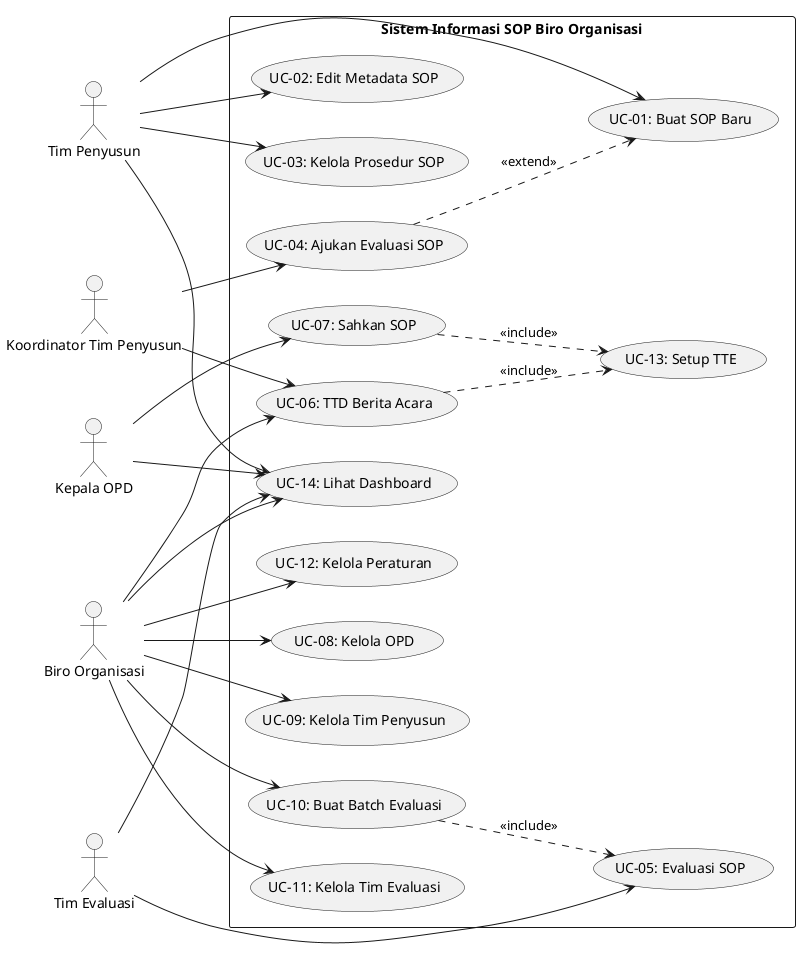

# BAB 3 — ANALISIS DAN PERANCANGAN SISTEM

## 3.1 Gambaran Umum Sistem

Sistem Informasi SOP Biro Organisasi adalah sistem berbasis web yang dirancang untuk mengelola siklus hidup Standard Operating Procedure (SOP) di lingkungan instansi pemerintah. Sistem ini memfasilitasi alur kerja berjenjang mulai dari penyusunan SOP oleh Tim Penyusun, evaluasi oleh Tim Evaluasi, verifikasi oleh Biro Organisasi, hingga pengesahan oleh Kepala OPD. Tujuan utama sistem adalah digitalisasi proses pengelolaan SOP yang sebelumnya manual menjadi terstruktur, teraudit, dan dapat dipantau secara real-time oleh seluruh pemangku kepentingan.

Sistem ini digunakan oleh empat aktor utama: Tim Penyusun (berada di bawah OPD masing-masing), Kepala OPD (pemimpin unit kerja), Tim Evaluasi (dibentuk oleh Biro Organisasi), dan Biro Organisasi (administrator sistem). Setiap aktor memiliki akses dan tanggung jawab yang berbeda sesuai peranannya dalam alur kerja SOP. Sistem menerapkan role-based access control untuk memastikan setiap pengguna hanya dapat mengakses fungsi yang menjadi kewenangannya.

Dalam konteks pelayanan publik, sistem ini menyelesaikan masalah koordinasi dan transparansi dalam penyusunan SOP antar unit kerja. Tanpa sistem ini, proses evaluasi dan verifikasi SOP memerlukan koordinasi manual yang rentan terhadap kehilangan jejak audit, ketidakkonsistenan status dokumen, dan kesulitan dalam memantau progres penyusunan SOP secara keseluruhan. Ruang lingkup sistem mencakup manajemen data master (OPD, Peraturan, Tim), penyusunan SOP dengan prosedur BPMN, evaluasi terjadwal SOP, penandatanganan elektronik Berita Acara, dan audit trail lengkap untuk setiap perubahan status SOP.

**Catatan:** Dokumen tunggal kebenaran (single source of truth) untuk schema database adalah:
- `docs/ERD-DESKRIPSI.md` — Deskripsi entitas dan relasi
- `docs/SCHEMA-CONSTRAINTS.md` — Constraint bisnis di luar Prisma

---

## 3.2 Identifikasi Aktor

| No | Aktor | Deskripsi | Hak Akses |
|----|-------|-----------|-----------|
| 1  | Tim Penyusun | Anggota tim yang ditugaskan oleh OPD untuk menyusun dokumen SOP. Setiap Tim Penyusun memiliki peran internal sebagai Koordinator atau Anggota. | Membuat dan mengelola SOP milik OPD-nya, mengisi metadata dan prosedur, mengajukan evaluasi, menandatangani Berita Acara (khusus Koordinator), melihat daftar SOP yang disusun, mengelola Peraturan OPD |
| 2  | Kepala OPD | Pimpinan unit kerja (Organisasi Perangkat Daerah) yang bertanggung jawab atas SOP yang diterbitkan oleh OPD-nya. | Memantau semua SOP milik OPD-nya, mengesahkan SOP yang telah diverifikasi (status Berlaku), menandatangani SOP secara elektronik |
| 3  | Tim Evaluasi | Anggota tim yang dibentuk Biro Organisasi untuk mengevaluasi kualitas SOP yang diajukan. | Mengevaluasi SOP yang ditugaskan, mengisi hasil evaluasi (SESUAI/TIDAK_SESUAI), mengirim hasil evaluasi ke Biro Organisasi |
| 4  | Biro Organisasi | Administrator sistem yang mengelola seluruh aspek pemerintahan SOP termasuk OPD, tim, dan proses evaluasi. | Mengelola data OPD, Tim Penyusun, Tim Evaluasi; membuat pengajuan evaluasi; menandatangani Berita Acara; memverifikasi hasil evaluasi; melihat grafik evaluasi tahunan |

**[INFERRED FROM CODE]** — Role internal "Koordinator" pada Tim Penyusun disimpulkan dari adanya fungsi `canTimPenyusunRunCoordinatorActions` dan `isKoordinatorTimPenyusunForCurrentSession` yang membatasi aksi tertentu hanya untuk koordinator.

**[INFERRED FROM CODE]** — Kepala OPD tidak memiliki halaman manajemen tim atau OPD, hanya pantauan dan pengesahan SOP, menunjukkan peran yang lebih pasif dalam operasional sistem.

**[CONSTRAINT FROM ERD]** — Setiap OPD hanya boleh memiliki 1 pengguna dengan peran `KEPALA_OPD` dan 1 pengguna dengan peran `KOORDINATOR_TIM_PENYUSUN` secara aktif. Constraint ini di-enforce di service layer dengan `SELECT FOR UPDATE` (lihat `docs/SCHEMA-CONSTRAINTS.md` [P2-D]).

---

## 3.3 Analisis Proses Bisnis

### 3.3.1 Proses Penyusunan SOP

**Deskripsi proses:** Tim Penyusun membuat dan menyusun dokumen SOP baru dengan mengikuti format baku yang mencakup metadata lengkap, dasar hukum, dan diagram prosedur. Proses ini merupakan awal dari siklus hidup SOP.

**Alur proses normal (happy path):**
1. Tim Penyusun mengakses halaman Manajemen SOP dan klik "Buat SOP Baru"
2. Sistem menampilkan dialog pembuatan SOP dengan form nomor SOP, judul, dan deskripsi
3. Tim Penyusun mengisi form dan sistem membuat SOP baru dengan status "Draft"
4. Tim Penyusun membuka detail SOP dan mengisi metadata (institution, PIC, section, warning, dll.)
5. Tim Penyusun menambahkan dasar hukum (law basis) yang menjadi landasan SOP
6. Tim Penyusun menyusun prosedur dalam bentuk flowchart dengan menambahkan langkah-langkah, pelaksana, mutu, dan output
7. Tim Penyusun menyimpan draft secara berkala dan sistem mencatat setiap perubahan
8. Tim Penyusun klik "Selesai Menyusun" dan status SOP berubah menjadi "Siap Dievaluasi"

**Alur alternatif:**
- Jika SOP mendapat hasil evaluasi "Perlu Perbaikan": SOP kembali ke status "Revisi dari Tim Evaluasi" dan Tim Penyusun harus memperbaiki sebelum mengajukan ulang
- Jika Koordinator Tim Penyusun mengajukan evaluasi batch: SOP yang dipilih berubah status menjadi "Diajukan Evaluasi" dan tidak dapat diedit hingga hasil evaluasi dikirim

**Kondisi awal:** Tim Penyusun telah ditugaskan ke OPD dan memiliki akun aktif dengan role `tim-penyusun`.

**Kondisi akhir:** SOP berstatus "Siap Dievaluasi" atau "Diajukan Evaluasi" dan siap masuk proses evaluasi oleh Tim Evaluasi.

---

### 3.3.2 Proses Evaluasi SOP

**Deskripsi proses:** Biro Organisasi membuat Pengajuan Evaluasi untuk SOP yang diajukan oleh Tim Penyusun, menugaskan Tim Evaluasi, dan Tim Evaluasi melakukan penilaian kualitas dokumen SOP. Proses ini memastikan SOP memenuhi standar baku sebelum diverifikasi.

**Alur proses normal (happy path):**
1. Biro Organisasi mengakses halaman Terjadwal Evaluasi & BA dan melihat daftar OPD dengan SOP yang siap dievaluasi
2. Biro Organisasi membuat Pengajuan Evaluasi baru dengan memilih SOP dari satu atau lebih OPD
3. Biro Organisasi menugaskan Tim Evaluasi ke pengajuan evaluasi tersebut
4. Sistem mengubah status pengajuan menjadi "Sedang Dievaluasi" dan status SOP menjadi "Sedang Dievaluasi"
5. Tim Evaluasi mengakses daftar evaluasi yang ditugaskan dan membuka detail SOP untuk dinilai
6. Tim Evaluasi mengisi hasil evaluasi per SOP dengan nilai "Sesuai" atau "Perlu Perbaikan" beserta catatan
7. Tim Evaluasi mengirim hasil evaluasi pengajuan dan sistem mengubah status pengajuan menjadi "Selesai Dievaluasi"
8. SOP dengan hasil "Sesuai" berstatus "Siap Diverifikasi", SOP dengan hasil "Perlu Perbaikan" berstatus "Revisi dari Tim Evaluasi"

**Alur alternatif:**
- Jika pengajuan evaluasi dibatalkan: Biro Organisasi dapat menonaktifkan pengajuan dan SOP kembali ke status sebelumnya
- Jika Tim Evaluasi meminta klarifikasi: Tim Evaluasi dapat menambahkan catatan evaluasi yang terlihat oleh Tim Penyusun

**Kondisi awal:** Terdapat SOP dengan status "DIAJUKAN_EVALUASI" dari Tim Penyusun.

**Kondisi akhir:** Pengajuan Evaluasi berstatus "SELESAI_DIEVALUASI" dengan semua SOP memiliki hasil evaluasi (SESUAI/TIDAK_SESUAI).

**[CONSTRAINT FROM SCHEMA]** Evaluasi MANDIRI tidak memiliki nilaiOPD, hanya evaluasi TERJADWAL yang memiliki nilai agregat OPD. Constraint ini di-enforce di service layer (lihat `docs/SCHEMA-CONSTRAINTS.md` [P1-B]).

---

### 3.3.3 Proses Verifikasi Berita Acara

**Deskripsi proses:** Setelah evaluasi selesai, Biro Organisasi dan Koordinator Tim Penyusun menandatangani Berita Acara evaluasi secara elektronik menggunakan TTE. Proses ini merupakan validasi formal bahwa evaluasi telah dilaksanakan sesuai prosedur.

**Alur proses normal (happy path):**
1. Biro Organisasi mengakses halaman TTD Elektronik dan melihat daftar Berita Acara yang siap ditandatangani
2. Biro Organisasi memilih BA dan memasukkan PIN TTE untuk verifikasi
3. Sistem memverifikasi PIN dan menandatangani BA dengan RiwayatTandaTangan untuk peran BIRO_ORGANISASI
4. Semua SOP dalam pengajuan evaluasi tersebut otomatis berstatus "Diverifikasi Biro Organisasi"
5. Koordinator Tim Penyusun mengakses halaman TTD Elektronik dan melihat BA yang telah diverifikasi Biro
6. Koordinator memasukkan PIN TTE dan menandatangani BA
7. Sistem mencatat RiwayatTandaTangan untuk peran KOORDINATOR_TIM_PENYUSUN
8. SOP dalam pengajuan evaluasi tersebut kini dapat disahkan oleh Kepala OPD

**Alur alternatif:**
- Jika PIN salah: Sistem menolak penandatanganan dan mencatat kegagalan audit
- Jika user belum verifikasi email: Sistem meminta verifikasi email sebelum dapat TTD

**Kondisi awal:** Pengajuan Evaluasi berstatus "SELESAI_DIEVALUASI" dengan semua SOP telah dinilai Tim Evaluasi.

**Kondisi akhir:** Berita Acara bertanda tangan lengkap (Biro + Koordinator) di tabel RiwayatTandaTangan dan SOP siap pengesahan.

**[CONSTRAINT FROM ERD]** 1 Pengajuan Evaluasi bisa punya 2 RiwayatTandaTangan (KOORDINATOR_TIM_PENYUSUN + BIRO_ORGANISASI untuk Berita Acara).
**[CONSTRAINT FROM SCHEMA]** BA hanya bisa ditandatangani setelah: Status = DIVERIFIKASI_BIRO, semua NilaiEvaluasi sudah diisi, dan belum pernah TTE (lihat `docs/SCHEMA-CONSTRAINTS.md`).

---

### 3.3.4 Proses Pengesahan SOP

**Deskripsi proses:** Kepala OPD mengesahkan SOP yang telah melalui proses verifikasi menjadi SOP yang berlaku resmi. Pengesahan dilakukan per SOP dalam pengajuan evaluasi yang telah ditandatangani Berita Acaranya.

**Alur proses normal (happy path):**
1. Kepala OPD mengakses halaman Pantau SOP dan melihat daftar SOP milik OPD-nya
2. Kepala OPD membuka detail SOP yang berstatus "DIVERIFIKASI_BIRO_ORGANISASI"
3. Sistem memverifikasi bahwa BA terkait telah ditandatangani oleh Koordinator dan Biro
4. Kepala OPD klik "Sahkan SOP" dan masukkan PIN TTE
5. Sistem memverifikasi PIN dan mengubah status SOP menjadi "BERLAKU"
6. Sistem mencatat RiwayatTandaTangan untuk peran KEPALA_OPD dengan sopDetailId
7. Sistem mencatat audit log pengesahan dengan timestamp dan identitas Kepala OPD
8. SOP kini resmi berlaku dan dapat diakses sebagai dokumen referensi

**Alur alternatif:**
- Jika SOP tidak masuk BA: Sistem menolak pengesahan dengan pesan "SOP harus masuk Berita Acara terlebih dahulu"
- Jika BA belum ditandatangani Koordinator: Sistem menolak pengesahan dengan pesan "BA harus ditandatangani Koordinator terlebih dahulu"

**Kondisi awal:** SOP berstatus "DIVERIFIKASI_BIRO_ORGANISASI" dan BA terkait telah ditandatangani oleh Biro dan Koordinator.

**Kondisi akhir:** SOP berstatus "BERLAKU" dan menjadi dokumen resmi OPD.

**Gap analisis:**
- **[IMPLEMENTED]** Fitur pencabutan SOP telah tersedia melalui transisi status `BERLAKU → DICABUT` (manual/administratif). SOP yang dicabut tetap tersimpan sebagai arsip dengan status "DICABUT".
- **[CONSTRAINT FROM ERD]** 1 SOP = maksimal 1 TTE di RiwayatTandaTangan (hanya KEPALA_OPD) (lihat `docs/ERD-DESKRIPSI.md`)
- **[CONSTRAINT FROM SCHEMA]** Status transisi valid: DIVERIFIKASI_BIRO_ORGANISASI → BERLAKU → DICABUT (terminal). BERLAKU dan DICABUT adalah terminal — tidak bisa diubah statusnya kecuali BERLAKU → DICABUT (lihat `docs/SCHEMA-CONSTRAINTS.md` [P0-D])

---

### 3.3.5 Proses Manajemen Data Master

**Deskripsi proses:** Biro Organisasi mengelola data master sistem termasuk OPD, Tim Penyusun, dan Tim Evaluasi. Tim Penyusun/Koordinator mengelola Peraturan milik OPD mereka. Data ini menjadi fondasi untuk seluruh operasional sistem.

**Alur proses normal (happy path):**
1. Biro Organisasi mengakses halaman Manajemen OPD/Tim; Tim Penyusun mengakses Manajemen Peraturan
2. User menambah, mengupdate, atau menonaktifkan data sesuai akses masing-masing
3. Sistem memvalidasi input dan menyimpan perubahan
4. Untuk Tim: sistem mencatat tanggal bergabung dan status aktif/nonaktif
5. Untuk OPD: sistem menghitung agregat jumlah SOP per OPD
6. Untuk Peraturan: sistem memastikan tidak ada duplikat dalam satu OPD

**Alur alternatif:**
- Jika OPD memiliki SOP aktif: Sistem memperingatkan sebelum menonaktifkan OPD
- Jika Tim Penyusun sedang menyusun SOP: Sistem mengizinkan nonaktifkan dengan catatan berakhirPada
- Jika Peraturan masih digunakan sebagai DasarHukum: Sistem menolak penghapusan

**Kondisi awal:** User login dengan role yang sesuai (Biro untuk OPD/Tim, Tim Penyusun/Koordinator untuk Peraturan).

**Kondisi akhir:** Data master terupdate dan konsisten di seluruh sistem.

**[CONSTRAINT FROM ERD]** Peraturan dikelola oleh Tim Penyusun OPD masing-masing (bukan Biro Organisasi).
**[CONSTRAINT FROM ERD]** Peraturan tidak memiliki tracking siapa yang input (data entry tidak perlu audit trail).
**[CONSTRAINT FROM ERD]** OPD, Pengguna mendukung soft-delete (`deletedAt`). Saat soft-delete, pastikan tidak ada pengajuan evaluasi aktif (lihat `docs/SCHEMA-CONSTRAINTS.md` [P1-G]).

---

## 3.4 Spesifikasi Use Case

### Use Case UC-01: Buat SOP Baru

| Field | Detail |
|-------|--------|
| ID | UC-01 |
| Nama | Buat SOP Baru |
| Aktor | Tim Penyusun |
| Deskripsi | Tim Penyusun membuat dokumen SOP baru dengan mengisi nomor SOP, judul, dan deskripsi |
| Kondisi Awal | Tim Penyusun login dan berada di halaman Manajemen SOP |
| Kondisi Akhir | SOP baru tercipta dengan status "DRAFT" |
| Trigger | Tim Penyusun klik tombol "Buat SOP Baru" |

**Alur Normal:**
1. Tim Penyusun klik tombol "Buat SOP Baru"
2. Sistem menampilkan dialog form dengan field nomor SOP, judul, deskripsi
3. Tim Penyusun mengisi form dan klik "Simpan"
4. Sistem memvalidasi input (nomor SOP unik, judul tidak kosong)
5. Sistem membuat SOP baru dengan status "DRAFT" dan timestamp pembuatan
6. Sistem mencatat audit log "BUAT_SOP" di LogAudit
7. Sistem mengarahkan Tim Penyusun ke halaman detail SOP untuk editing

**Alur Eksepsi:**
- Nomor SOP sudah ada: Sistem menampilkan pesan error "Nomor SOP sudah digunakan"
- Judul kosong: Sistem menampilkan pesan error "Judul wajib diisi"

**Catatan Analisis:**
- `[INFERRED FROM CODE]` — Validasi duplikasi nomor SOP tidak ditemukan di implementasi client, hanya asumsi requirement
- `[CONSTRAINT FROM ERD]` — SOP tidak bisa dihapus kalau semua DetailSOP sudah ada relasi `TandaTanganTTE` atau `NilaiEvaluasi` (Restrict)
- `[CONSTRAINT FROM ERD]` — 1 SOP bisa punya banyak DetailSOP (versi dokumen), Cascade delete (lihat `docs/ERD-DESKRIPSI.md`)

---

### Use Case UC-02: Edit Metadata SOP

| Field | Detail |
|-------|--------|
| ID | UC-02 |
| Nama | Edit Metadata SOP |
| Aktor | Tim Penyusun |
| Deskripsi | Tim Penyusun mengisi dan mengupdate metadata lengkap SOP termasuk institution, PIC, section, warning, dan equipment |
| Kondisi Awal | DetailSOP berstatus yang mengizinkan editing (belum DIAJUKAN_EVALUASI atau SEDANG_DIEVALUASI) |
| Kondisi Akhir | Metadata DetailSOP terupdate dan sistem mencatat audit log |
| Trigger | Tim Penyusun klik tombol "Edit Metadata" di detail SOP |

**Alur Normal:**
1. Tim Penyusun membuka detail SOP dan klik "Edit Metadata"
2. Sistem menampilkan dialog dengan form metadata (institution, PIC, section, warning, dll.)
3. Tim Penyusun mengisi form dan klik "Simpan"
4. Sistem memvalidasi input (field wajib terisi)
5. Sistem menyimpan metadata dan mencatat audit log "SIMPAN_DRAFT" di LogEditSOP dengan bagian METADATA
6. Sistem menampilkan notifikasi sukses

**Alur Eksepsi:**
- SOP tidak dapat diedit (status "Diajukan Evaluasi" atau lebih tinggi): Sistem menampilkan pesan "SOP sedang dalam evaluasi"

**Catatan Analisis:**
- `[INFERRED FROM CODE]` — Fungsi `canEditSop` menentukan status yang mengizinkan editing
- `[CONSTRAINT FROM ERD]` — DetailSOP adalah entitas yang menyimpan versi dokumen, bukan SOP (lihat `docs/ERD-DESKRIPSI.md`)
- `[CONSTRAINT FROM ERD]` — 1 DetailSOP bisa punya banyak LampiranTeks, DasarHukum, LangkahSOP, DiagramLayout
- `[CONSTRAINT FROM ERD]` — LogEditSOP mencatat audit trail kolaborasi Tim Penyusun dengan field `bagian` (enum BagianSOP)

---

### Use Case UC-03: Kelola Prosedur SOP

| Field | Detail |
|-------|--------|
| ID | UC-03 |
| Nama | Kelola Prosedur SOP |
| Aktor | Tim Penyusun |
| Deskripsi | Tim Penyusun membuat dan mengelola langkah-langkah prosedur SOP dalam bentuk flowchart dengan kegiatan, pelaksana, mutu, dan output |
| Kondisi Awal | DetailSOP berstatus yang mengizinkan editing |
| Kondisi Akhir | Prosedur SOP terupdate dengan langkah-langkah yang terstruktur |
| Trigger | Tim Penyusun klik "Edit Prosedur" di detail SOP |

**Alur Normal:**
1. Tim Penyusun klik "Edit Prosedur" di detail SOP
2. Sistem menampilkan editor prosedur dengan daftar langkah existing
3. Tim Penyusun tambah langkah baru dengan mengisi: nomor, kegiatan, pelaksana, mutu_kelengkapan, mutu_waktu, output, keterangan
4. Untuk langkah type "decision", Tim Penyusun menentukan next step untuk yes/no
5. Tim Penyusun simpan perubahan
6. Sistem menyimpan prosedur (LangkahSOP) dan mencatat audit log "SIMPAN_DRAFT" di LogEditSOP dengan bagian LANGKAH_SOP

**Alur Eksepsi:**
- Langkah decision tanpa next step: Sistem menampilkan pesan error

**Catatan Analisis:**
- `[INFERRED FROM CODE]` — Editor prosedur mendukung type "terminator", "task", "decision" dengan flowchart branching
- `[CONSTRAINT FROM ERD]` — 1 LangkahSOP terhubung ke 1 Pelaksana (wajib, termasuk START/END). Pelaksana wajib terdaftar di swimlane `DetailSOPPelaksana` (lihat `docs/ERD-DESKRIPSI.md` [P1-C])
- `[CONSTRAINT FROM ERD]` — 1 DetailSOP punya banyak Swimlanes (DetailSOPPelaksana) untuk daftar pelaksana di diagram
- `[CONSTRAINT FROM ERD]` — DiagramLayout, DiagramEdge, DiagramNodePosition menyimpan delta posisi manual dari auto-layout
- `[CONSTRAINT FROM SCHEMA]` — Service layer wajib hapus DiagramEdge + DiagramNodePosition sebelum DetailSOP di-delete (lihat `docs/SCHEMA-CONSTRAINTS.md` [P0-A])

---

### Use Case UC-04: Ajukan Evaluasi SOP

| Field | Detail |
|-------|--------|
| ID | UC-04 |
| Nama | Ajukan Evaluasi SOP |
| Aktor | Koordinator Tim Penyusun |
| Deskripsi | Koordinator Tim Penyusun mengajukan satu atau lebih SOP ke evaluasi Biro Organisasi |
| Kondisi Awal | DetailSOP berstatus "SIAP_DIEVALUASI" dan user adalah Koordinator Tim Penyusun |
| Kondisi Akhir | DetailSOP berstatus "DIAJUKAN_EVALUASI" dan masuk Pengajuan Evaluasi |
| Trigger | Koordinator klik "Ajukan / Kirim Ulang Evaluasi" |

**Alur Normal:**
1. Koordinator klik "Ajukan / Kirim Ulang Evaluasi" di halaman Manajemen SOP
2. Sistem menampilkan dialog dengan daftar SOP yang eligible (status "SIAP_DIEVALUASI")
3. Koordinator memilih satu atau lebih SOP dan klik "Kirim ke Evaluasi"
4. Sistem memverifikasi bahwa user adalah Koordinator
5. Sistem membuat atau update PengajuanEvaluasi dengan SOP terpilih
6. Sistem mengubah status SOP terpilih menjadi "DIAJUKAN_EVALUASI"
7. Sistem mencatat audit log "AJUKAN_EVALUASI" di LogEditSOP
8. Sistem menampilkan notifikasi sukses

**Alur Eksepsi:**
- User bukan Koordinator: Sistem menampilkan pesan "Hanya Koordinator Tim Penyusun yang dapat mengajukan evaluasi"
- Tidak ada SOP terpilih: Sistem menampilkan pesan "Pilih minimal satu SOP"

**Catatan Analisis:**
- `[GAP DETECTED]` — Tidak ada validasi bahwa SOP yang dipilih belum masuk pengajuan evaluasi lain
- `[CONSTRAINT FROM SCHEMA]` — Maks 1 pengajuan aktif per OPD per jenis (TERJADWAL/MANDIRI), di-enforce dengan SELECT FOR UPDATE (lihat `docs/SCHEMA-CONSTRAINTS.md` [P0-C])
- `[CONSTRAINT FROM SCHEMA]` — Status transisi valid: SIAP_DIEVALUASI → DIAJUKAN_EVALUASI → SEDANG_DIEVALUASI (lihat `docs/SCHEMA-CONSTRAINTS.md`)

---

### Use Case UC-05: Evaluasi SOP

| Field | Detail |
|-------|--------|
| ID | UC-05 |
| Nama | Evaluasi SOP |
| Aktor | Tim Evaluasi |
| Deskripsi | Tim Evaluasi menilai kualitas SOP yang ditugaskan dan mengisi hasil evaluasi (SESUAI/TIDAK_SESUAI) |
| Kondisi Awal | Pengajuan Evaluasi berstatus "SEDANG_DIEVALUASI" dan SOP ditugaskan ke Tim Evaluasi |
| Kondisi Akhir | SOP memiliki NilaiEvaluasi dan catatan dari Tim Evaluasi |
| Trigger | Tim Evaluasi membuka detail SOP dari daftar evaluasi |

**Alur Normal:**
1. Tim Evaluasi membuka halaman Evaluasi SOP dan memilih SOP yang akan dinilai
2. Sistem menampilkan detail SOP (metadata, prosedur, law basis)
3. Tim Evaluasi mengisi form hasil evaluasi: pilih "SESUAI" atau "TIDAK_SESUAI", isi catatan, isi rekomendasi
4. Tim Evaluasi simpan hasil evaluasi
5. Sistem menyimpan hasil evaluasi ke NilaiEvaluasi dalam pengajuan evaluasi
6. Sistem mencatat audit log "MULAI_EVALUASI" atau update NilaiEvaluasi

**Alur Eksepsi:**
- Pengajuan belum dimulai: Sistem menampilkan pesan "Evaluasi belum dimulai"

**Catatan Analisis:**
- `[CONSTRAINT FROM ERD]` — NilaiEvaluasi hasil: SESUAI / TIDAK_SESUAI (bukan "Sesuai/Perlu Perbaikan") (lihat `docs/ERD-DESKRIPSI.md`)
- `[CONSTRAINT FROM ERD]` — 1 NilaiEvaluasi punya version untuk optimistic locking, mencegah lost update saat 2 evaluator ubah nilai bersamaan
- `[CONSTRAINT FROM ERD]` — Tidak ada penugasan spesifik — semua evaluator bisa melihat semua SOP OPD dan mengisi nilainya
- `[CONSTRAINT FROM ERD]` — LogNilaiEvaluasi mencatat audit trail perubahan nilai (immutable)

---

### Use Case UC-06: TTD Berita Acara

| Field | Detail |
|-------|--------|
| ID | UC-06 |
| Nama | TTD Berita Acara |
| Aktor | Biro Organisasi, Koordinator Tim Penyusun |
| Deskripsi | Biro dan Koordinator menandatangani Berita Acara evaluasi menggunakan TTE dengan PIN |
| Kondisi Awal | Pengajuan Evaluasi berstatus "SELESAI_DIEVALUASI" dan user telah setup TTE |
| Kondisi Akhir | BA bertanda tangan di RiwayatTandaTangan dengan peran BIRO_ORGANISASI atau KOORDINATOR_TIM_PENYUSUN |
| Trigger | User klik "TTD BA" di halaman TTD Elektronik |

**Alur Normal:**
1. User membuka halaman TTD Elektronik dan memilih BA yang akan ditandatangani
2. Sistem menampilkan dialog TTD dengan form PIN
3. User memasukkan PIN dan klik "TTD"
4. Sistem memverifikasi PIN terhadap hash di KredensialTTE
5. Sistem mencatat RiwayatTandaTangan dengan timestamp dan document hash
6. Untuk Biro: sistem set status pengajuan → "DIVERIFIKASI_BIRO" dan SOP → "DIVERIFIKASI_BIRO_ORGANISASI"
7. Untuk Koordinator: sistem set status pengajuan → "DITANDATANGANI_KOORDINATOR"
8. Sistem mencatat audit log "TTD_BA_KOORDINATOR_TIM_PENYUSUN" di LogEditSOP
9. Sistem menampilkan notifikasi sukses

**Alur Eksepsi:**
- PIN salah: Sistem menampilkan pesan "PIN salah"
- User belum verifikasi email: Sistem menampilkan pesan "Verifikasi email terlebih dahulu"
- BA sudah ditandatangani: Sistem menampilkan pesan "BA sudah ditandatangani"

**Catatan Analisis:**
- `[CONSTRAINT FROM ERD]` — 1 PengajuanEvaluasi bisa punya 2 RiwayatTandaTangan (KOORDINATOR_TIM_PENYUSUN + BIRO_ORGANISASI) (lihat `docs/ERD-DESKRIPSI.md`)
- `[CONSTRAINT FROM SCHEMA]` — BA hanya bisa ditandatangani setelah: Status = DIVERIFIKASI_BIRO, semua NilaiEvaluasi sudah diisi, dan belum pernah TTE
- `[CONSTRAINT FROM ERD]` — XOR constraint: RiwayatTandaTangan harus tepat satu dari sopDetailId atau pengajuanEvaluasiId (lihat `docs/ERD-DESKRIPSI.md` [P1-A])

---

### Use Case UC-07: Sahkan SOP

| Field | Detail |
|-------|--------|
| ID | UC-07 |
| Nama | Sahkan SOP |
| Aktor | Kepala OPD |
| Deskripsi | Kepala OPD mengesahkan SOP yang telah diverifikasi menjadi SOP yang berlaku resmi |
| Kondisi Awal | DetailSOP berstatus "DIVERIFIKASI_BIRO_ORGANISASI" dan BA terkait telah ditandatangani Koordinator |
| Kondisi Akhir | DetailSOP berstatus "BERLAKU" |
| Trigger | Kepala OPD klik "Sahkan SOP" di detail SOP |

**Alur Normal:**
1. Kepala OPD membuka detail SOP dari halaman Pantau SOP
2. Sistem memverifikasi bahwa SOP eligible untuk pengesahan (status dan BA lengkap)
3. Kepala OPD klik "Sahkan SOP"
4. Sistem menampilkan dialog TTD dengan form PIN
5. Kepala OPD masukkan PIN dan klik "TTD"
6. Sistem memverifikasi PIN
7. Sistem mengubah status SOP menjadi "BERLAKU"
8. Sistem mencatat RiwayatTandaTangan untuk peran KEPALA_OPD dengan sopDetailId
9. Sistem mencatat audit log "SAHKAN_SOP" di LogEditSOP
10. Sistem menampilkan notifikasi sukses

**Alur Eksepsi:**
- BA belum ditandatangani Koordinator: Sistem menampilkan pesan "BA harus ditandatangani Koordinator terlebih dahulu"
- SOP tidak masuk BA: Sistem menampilkan pesan "SOP harus masuk Berita Acara"

**Catatan Analisis:**
- `[INFERRED FROM CODE]` — Fungsi `canKepalaOpdSignSop` memvalidasi eligibility pengesahan
- `[CONSTRAINT FROM ERD]` — 1 SOP = maksimal 1 TTE di RiwayatTandaTangan (hanya KEPALA_OPD) (lihat `docs/ERD-DESKRIPSI.md`)
- `[CONSTRAINT FROM SCHEMA]` — Status transisi valid: DIVERIFIKASI_BIRO_ORGANISASI → BERLAKU → DICABUT (terminal)
- `[CONSTRAINT FROM SCHEMA]` — BERLAKU dan DICABUT adalah terminal — tidak bisa diubah statusnya kecuali BERLAKU → DICABUT (lihat `docs/SCHEMA-CONSTRAINTS.md` [P0-D])

---

### Use Case UC-08: Kelola OPD

| Field | Detail |
|-------|--------|
| ID | UC-08 |
| Nama | Kelola OPD |
| Aktor | Biro Organisasi |
| Deskripsi | Biro Organisasi menambah, mengupdate, atau melihat daftar OPD |
| Kondisi Awal | Biro Organisasi login di halaman Manajemen OPD |
| Kondisi Akhir | Data OPD terupdate |
| Trigger | Biro Organisasi klik "Tambah OPD" atau edit OPD existing |

**Alur Normal:**
1. Biro Organisasi membuka halaman Manajemen OPD
2. Sistem menampilkan daftar OPD dengan agregat jumlah SOP
3. Biro Organisasi klik "Tambah OPD" atau edit OPD existing
4. Sistem menampilkan form dengan field nama OPD, kode OPD
5. Biro Organisasi isi form dan simpan
6. Sistem validasi dan simpan OPD
7. Sistem menampilkan notifikasi sukses

**Alur Eksepsi:**
- Kode OPD duplikat: Sistem menampilkan error

**Catatan Analisis:**
- `[GAP DETECTED]` — Tidak ada validasi kode OPD duplikat di client
- `[CONSTRAINT FROM ERD]` — OPD mendukung soft-delete (`deletedAt`) (lihat `docs/ERD-DESKRIPSI.md`)
- `[CONSTRAINT FROM ERD]` — 1 OPD bisa punya banyak Pengguna, SOP, Pelaksana, AnggotaTimPenyusun, PengajuanEvaluasi (Restrict delete)

---

### Use Case UC-09: Kelola Tim Penyusun

| Field | Detail |
|-------|--------|
| ID | UC-09 |
| Nama | Kelola Tim Penyusun |
| Aktor | Biro Organisasi |
| Deskripsi | Biro Organisasi menambah anggota Tim Penyusun ke OPD tertentu dengan role internal (Koordinator/Anggota) |
| Kondisi Awal | Biro Organisasi login di halaman Manajemen Tim Penyusun |
| Kondisi Akhir | AnggotaTimPenyusun tercipta dengan status "AKTIF" |
| Trigger | Biro Organisasi klik "Tambah Anggota Tim Penyusun" |

**Alur Normal:**
1. Biro Organisasi membuka halaman Manajemen Tim Penyusun
2. Sistem menampilkan daftar anggota Tim Penyusun per OPD
3. Biro Organisasi klik "Tambah Anggota"
4. Sistem menampilkan form dengan field: nama, NIP, jabatan, pangkat, email, nohp, OPD, role internal
5. Biro Organisasi isi form dan simpan
6. Sistem validasi dan simpan AnggotaTimPenyusun
7. Sistem menampilkan notifikasi sukses

**Alur Eksepsi:**
- NIP sudah ada: Sistem menampilkan error

**Catatan Analisis:**
- `[GAP DETECTED]` — Tidak ada validasi NIP duplikat di client
- `[CONSTRAINT FROM ERD]` — Unique: [userId, opdId] — 1 pengguna hanya bisa tercatat 1 kali per OPD (lihat `docs/ERD-DESKRIPSI.md`)
- `[CONSTRAINT FROM ERD]` — Status: AKTIF / NONAKTIF; berakhirPada opsional (null = masih aktif)
- `[CONSTRAINT FROM SCHEMA]` — Invariant: (status = AKTIF) ↔ (berakhirPada IS NULL) — selalu update keduanya bersamaan (lihat `docs/SCHEMA-CONSTRAINTS.md` [P1-F])

---

### Use Case UC-10: Buat Pengajuan Evaluasi

| Field | Detail |
|-------|--------|
| ID | UC-10 |
| Nama | Buat Pengajuan Evaluasi |
| Aktor | Biro Organisasi |
| Deskripsi | Biro Organisasi membuat pengajuan evaluasi dengan memilih SOP dari satu atau lebih OPD |
| Kondisi Awal | Terdapat SOP dengan status "DIAJUKAN_EVALUASI" |
| Kondisi Akhir | PengajuanEvaluasi tercipta dengan status "SEDANG_DIEVALUASI" |
| Trigger | Biro Organisasi klik "Buat Pengajuan Evaluasi" |

**Alur Normal:**
1. Biro Organisasi membuka halaman Terjadwal Evaluasi & BA
2. Sistem menampilkan daftar OPD dengan SOP yang siap dievaluasi
3. Biro Organisasi pilih SOP untuk dimasukkan pengajuan
4. Biro Organisasi klik "Buat Pengajuan"
5. Sistem membuat PengajuanEvaluasi dengan SOP terpilih
6. Sistem mengubah status SOP menjadi "SEDANG_DIEVALUASI"
7. Sistem menampilkan notifikasi sukses

**Alur Eksepsi:**
- Tidak ada SOP terpilih: Sistem menampilkan error

**Catatan Analisis:**
- `[CONSTRAINT FROM ERD]` — PengajuanEvaluasi adalah entitas yang menggantikan konsep "batch" atau "terjadwal"
- `[CONSTRAINT FROM ERD]` — Jenis: TERJADWAL / MANDIRI; TERJADWAL punya nilaiOPD, MANDIRI harus NULL (lihat `docs/ERD-DESKRIPSI.md` [P1-B])
- `[CONSTRAINT FROM ERD]` — Status lifecycle: MENUNGGU_EVALUASI → SEDANG_DIEVALUASI → SELESAI_DIEVALUASI → DIVERIFIKASI_BIRO → DITANDATANGANI_KOORDINATOR → SELESAI
- `[CONSTRAINT FROM SCHEMA]` — Optimistic locking via field version untuk mencegah race condition (lihat `docs/SCHEMA-CONSTRAINTS.md` [P0-E])
- `[CONSTRAINT FROM SCHEMA]` — Maks 1 pengajuan aktif per OPD per jenis, di-enforce dengan SELECT FOR UPDATE (lihat `docs/SCHEMA-CONSTRAINTS.md` [P0-C])

---

## 3.5 Diagram Use Case

---

## 3.6 Spesifikasi Kebutuhan Fungsional

| ID | Kebutuhan Fungsional | Prioritas | Use Case Terkait |
|----|----------------------|-----------|-----------------|
| F-01 | Sistem harus dapat membuat SOP baru dengan status awal DRAFT | Tinggi | UC-01 |
| F-02 | Sistem harus dapat menyimpan metadata lengkap SOP (institution, PIC, section, warning, equipment) | Tinggi | UC-02 |
| F-03 | Sistem harus dapat mengelola dasar hukum (law basis) SOP via tabel junction DasarHukum | Tinggi | UC-02 |
| F-04 | Sistem harus dapat menyimpan prosedur SOP dalam bentuk langkah-langkah terstruktur (LangkahSOP) | Tinggi | UC-03 |
| F-05 | Sistem harus dapat mendukung flowchart branching pada prosedur (decision yes/no) | Tinggi | UC-03 |
| F-06 | Sistem harus dapat menugaskan pelaksana ke setiap langkah prosedur | Tinggi | UC-03 |
| F-07 | Sistem harus dapat mengubah status DetailSOP dari DRAFT → SIAP_DIEVALUASI | Tinggi | UC-01, UC-03 |
| F-08 | Sistem harus dapat mengajukan evaluasi SOP (hanya Koordinator Tim Penyusun) | Tinggi | UC-04 |
| F-09 | Sistem harus dapat membuat Pengajuan Evaluasi SOP per OPD (TERJADWAL/MANDIRI) | Tinggi | UC-10 |
| F-10 | Sistem harus dapat menugaskan Tim Evaluasi ke pengajuan evaluasi | Tinggi | UC-10 |
| F-11 | Sistem harus dapat mengubah status SOP menjadi SEDANG_DIEVALUASI saat pengajuan aktif | Tinggi | UC-10 |
| F-12 | Sistem harus dapat menyimpan hasil evaluasi SOP (SESUAI/TIDAK_SESUAI) di NilaiEvaluasi | Tinggi | UC-05 |
| F-13 | Sistem harus dapat mengirim hasil evaluasi pengajuan dan update status SOP | Tinggi | UC-05 |
| F-14 | Sistem harus dapat menampilkan daftar SOP eligible untuk evaluasi | Sedang | UC-04 |
| F-15 | Sistem harus dapat memverifikasi PIN TTE sebelum penandatanganan | Tinggi | UC-06 |
| F-16 | Sistem harus dapat menandatangani Berita Acara dengan TTE (Biro Organisasi) di RiwayatTandaTangan | Tinggi | UC-06 |
| F-17 | Sistem harus dapat menandatangani Berita Acara dengan TTE (Koordinator Tim Penyusun) di RiwayatTandaTangan | Tinggi | UC-06 |
| F-18 | Sistem harus dapat mengubah status SOP menjadi DIVERIFIKASI_BIRO_ORGANISASI setelah TTD BA | Tinggi | UC-06 |
| F-19 | Sistem harus dapat memvalidasi eligibility pengesahan SOP oleh Kepala OPD | Tinggi | UC-07 |
| F-20 | Sistem harus dapat mengubah status SOP menjadi BERLAKU setelah pengesahan | Tinggi | UC-07 |
| F-21 | Sistem harus dapat menambah, mengupdate, dan menonaktifkan data OPD | Tinggi | UC-08 |
| F-22 | Sistem harus dapat menghitung agregat jumlah SOP per OPD | Sedang | UC-08 |
| F-23 | Sistem harus dapat menambah anggota Tim Penyusun dengan role internal (Koordinator/Anggota) | Tinggi | UC-09 |
| F-24 | Sistem harus dapat menonaktifkan anggota Tim Penyusun dengan mencatat berakhirPada | Tinggi | UC-09 |
| F-25 | Sistem harus dapat menambah dan mengelola anggota Tim Evaluasi | Tinggi | UC-11 |
| F-26 | Sistem harus dapat menambah, mengupdate, dan mencabut Peraturan | Tinggi | UC-12 |
| F-27 | Sistem harus dapat menampilkan grafik evaluasi tahunan per OPD | Sedang | UC-14 |
| F-28 | Sistem harus dapat menampilkan dashboard role-based dengan navigasi sesuai akses | Tinggi | UC-14 |
| F-29 | Sistem harus dapat mencatat audit log untuk setiap perubahan status SOP di LogEditSOP | Tinggi | Semua UC |
| F-30 | Sistem harus dapat menampilkan riwayat status dan komentar SOP | Sedang | UC-14 |
| F-31 | Sistem harus dapat memfilter SOP berdasarkan status, OPD, dan tanggal | Sedang | UC-14 |
| F-32 | Sistem harus dapat menampilkan notifikasi toast untuk setiap aksi sukses/error | Sedang | Semua UC |
| F-33 | Sistem harus dapat setup profil TTE (NIP, nama, jabatan, PIN) di KredensialTTE | Tinggi | UC-13 |
| F-34 | Sistem harus dapat memverifikasi email user sebelum dapat TTD | Tinggi | UC-13 |
| F-35 | Sistem harus dapat menyimpan document hash untuk setiap TTD TTE | Tinggi | UC-06, UC-07 |
| F-36 | Sistem harus dapat menerapkan optimistic locking pada NilaiEvaluasi untuk mencegah lost update | Tinggi | UC-05 |

**[CONSTRAINT FROM ERD]** LogEditSOP adalah audit trail kolaborasi Tim Penyusun dengan field `bagian` (METADATA, LANGKAH_SOP, LAMPIRAN_TEKS, DASAR_HUKUM, PELAKSANA, DIAGRAM, SOP_TERKAIT). LogAudit tidak ada di schema ERD — yang ada adalah LogEditSOP dan LogNilaiEvaluasi (lihat `docs/ERD-DESKRIPSI.md`).

---

## 3.7 Spesifikasi Kebutuhan Non-Fungsional

| ID | Kategori | Spesifikasi | Dasar Analisis |
|----|----------|-------------|----------------|
| NF-01 | Keamanan | Sistem harus menerapkan role-based access control untuk semua route | Route guard `requireRoleBeforeLoad` di setiap route |
| NF-02 | Keamanan | Sistem harus menyimpan role user di persistent storage (localStorage) | Zustand persist middleware di `app-store.ts` |
| NF-03 | Keamanan | Sistem harus memvalidasi PIN TTE sebelum penandatanganan dokumen | Form PIN di komponen TTE |
| NF-04 | Keamanan | Sistem harus hash PIN TTE (demo mode: client-side hash) | Type `TTEProfile` dengan field `pinHash` |
| NF-05 | Performa | Sistem harus menampilkan loading state saat navigasi route | `pendingComponent` di route definition |
| NF-06 | Performa | Sistem harus menerapkan pagination untuk daftar data besar (SOP, OPD, Tim) | Komponen `Table.Pagination` di semua halaman list |
| NF-07 | Performa | Sistem harus menerapkan lazy loading untuk route TanStack Router | File-based routing dengan code splitting otomatis |
| NF-08 | Usabilitas | Sistem harus menampilkan feedback toast untuk setiap aksi user | Hook `useToast` dan komponen `GlobalToast` |
| NF-09 | Usabilitas | Sistem harus menampilkan empty state saat data tidak ditemukan | Komponen `EmptyState` di semua halaman list |
| NF-10 | Usabilitas | Sistem harus menampilkan status badge dengan warna berbeda per status | Komponen `StatusBadge` dengan variant warna |
| NF-11 | Usabilitas | Sistem harus menerapkan responsive layout untuk mobile/tablet | Tailwind CSS dengan breakpoint sm, md, lg |
| NF-12 | Keandalan | Sistem harus mencatat audit log untuk setiap perubahan SOP di LogEditSOP | Type `LogEditSOP` dengan field `bagian` dan `entityId` |
| NF-13 | Keandalan | Sistem harus menyimpan jejak audit dengan timestamp ISO 8601 | Field `createdAt: string` di LogEditSOP |
| NF-14 | Keandalan | Sistem harus menampilkan error boundary saat terjadi crash di route | `errorComponent` di root route |
| NF-15 | Maintainabilitas | Sistem harus memiliki halaman admin untuk mengelola data master | Halaman Manajemen OPD, Tim, Peraturan |
| NF-16 | Maintainabilitas | Sistem harus dapat melacak lastEditedBy dan lastEditedAt DetailSOP | Field di `SOPDaftarItem` |
| NF-17 | Usabilitas | Sistem harus menampilkan filter advanced (status, tanggal, peraturan) | Komponen `useDaftarSOPFilters` |
| NF-18 | Keamanan | Sistem harus mencegah editing SOP saat status tidak mengizinkan | Fungsi `canEditSop` sebagai guard |
| NF-19 | Keamanan | Sistem harus mencegah pengesahan SOP jika BA belum lengkap | Fungsi `canKepalaOpdSignSop` sebagai guard |
| NF-20 | Keandalan | Sistem harus menyimpan document hash untuk setiap TTD TTE di RiwayatTandaTangan | Field `documentHash` di `TTESignaturePayload` |
| NF-21 | Keandalan | Sistem harus menerapkan optimistic locking untuk NilaiEvaluasi | Field `version` di NilaiEvaluasi untuk mencegah lost update |
| NF-22 | Keamanan | Sistem harus membatasi 1 KEPALA_OPD dan 1 KOORDINATOR_TIM_PENYUSUN per OPD | Constraint di-enforce dengan SELECT FOR UPDATE (`docs/SCHEMA-CONSTRAINTS.md` [P2-D]) |
| NF-23 | Keamanan | Sistem harus membatasi 1 pengajuan aktif per OPD per jenis | Constraint di-enforce dengan SELECT FOR UPDATE (`docs/SCHEMA-CONSTRAINTS.md` [P0-C]) |
| NF-24 | Keandalan | Sistem harus mendukung soft-delete untuk OPD dan Pengguna | Field `deletedAt` dengan middleware filter |
| NF-25 | Keandalan | Sistem harus mencegah transisi status SOP yang tidak valid | Trigger database + service layer guard (VALID_TRANSITIONS) |

---

## 3.8 Analisis Gap dan Rekomendasi

### GAP-01: ~~Tidak Ada Fitur Pencabutan SOP~~ — SELESAI

**Status:** ✅ **SUDAH DIIMPLEMENTASI**

**Deskripsi:** Fitur pencabutan SOP telah tersedia melalui transisi status `BERLAKU → DICABUT` yang diimplementasikan di service layer (`detail-sop.service.ts`) dengan validasi status transition guard. SOP yang dicabut tetap tersimpan sebagai arsip dengan status "DICABUT".

**Implementasi:** Endpoint `PATCH /detail-sop/:id/status` dengan body `{ "status": "DICABUT" }` dapat digunakan untuk mencabut SOP yang telah berlaku.

---

### GAP-02: Tidak Ada Validasi Pengajuan Duplikat

**Kategori:** Keamanan / Fungsional

**Deskripsi:** Sistem tidak memvalidasi apakah SOP yang akan diajukan evaluasi sudah masuk pengajuan evaluasi lain yang masih aktif.

**Dampak:** SOP dapat masuk ke multiple pengajuan evaluasi, menyebabkan inkonsistensi data dan kebingungan dalam tracking.

**Rekomendasi:** Tambahkan validasi di fungsi `confirmAjukanEvaluasiBulk` untuk mengecek apakah SOP sudah ada di PengajuanEvaluasi dengan status "SEDANG_DIEVALUASI" atau "SELESAI_DIEVALUASI".

**Prioritas:** Sedang

**Dasar dari SCHEMA:** Constraint "Double Submit PengajuanEvaluasi" membatasi maks 1 pengajuan aktif per OPD per jenis, di-enforce dengan SELECT FOR UPDATE (lihat `docs/SCHEMA-CONSTRAINTS.md` [P0-C]).

---

## Ringkasan Gap

| Kategori | Total Gap | Resolved |
|----------|-----------|----------|
| Fungsional | 1 | ✅ 1 |
| Keamanan | 1 | ❌ 0 |

**Total Gap Ditemukan: 2** (Kritis: 0, Tinggi: 0, Sedang: 2, Rendah: 0)

---

## Penutup

Dokumen Analisis Sistem ini mendokumentasikan hasil reverse-engineering dari kode frontend Sistem Informasi SOP Biro Organisasi. Sistem telah mengimplementasikan alur kerja inti dengan baik, termasuk role-based access control, workflow status SOP, evaluasi batch, TTD elektronik, dan audit trail.

**Catatan Penting:** Dokumen ini telah diselaraskan dengan single source of truth schema database:
- `docs/ERD-DESKRIPSI.md` — Deskripsi entitas dan relasi (legenda delete behavior, constraint FK)
- `docs/SCHEMA-CONSTRAINTS.md` — Constraint bisnis di luar Prisma (optimistic locking, unique constraint, invariant)

Hanya gap yang terdokumentasi di ERD atau SCHEMA-CONSTRAINTS yang dimasukkan dalam analisis ini. Gap-gap lain (notifikasi, export, preview BA, reset PIN, admin role, deadline/SLA) tidak dimasukkan karena tidak ada dalam schema database.

**Perubahan utama dari penyelarasan:**
1. Terminologi: "VerifikasiBatch" → "PengajuanEvaluasi", "terjadwal" → "pengajuan", "Batch Evaluasi" → "Pengajuan Evaluasi"
2. Status menggunakan format uppercase konsisten: DRAFT, SIAP_DIEVALUASI, BERLAKU, DICABUT, dll.
3. TTE disimpan di tabel RiwayatTandaTangan (bukan field isVerified/isSignedByKoordinator)
4. DetailSOP adalah entitas versi dokumen, bukan SOP
5. Constraint optimistic locking pada NilaiEvaluasi via field version ([P0-E])
6. Constraint 1 Kepala OPD + 1 Koordinator per OPD di-enforce di service layer ([P2-D])
7. LogAudit → LogEditSOP (audit trail kolaborasi Tim Penyusun dengan field `bagian`)
8. Hasil evaluasi: "Sesuai/Perlu Perbaikan" → "SESUAI/TIDAK_SESUAI"
9. Penambahan constraint references: [P0-A], [P0-B], [P0-C], [P0-D], [P0-E], [P1-A], [P1-B], [P1-C], [P1-D], [P1-E], [P1-F], [P1-G], [P2-A], [P2-B], [P2-C], [P2-D], [P2-E], [P2-F], [P2-H], [P3-A], [P3-B]

Dokumen ini siap digunakan sebagai dasar untuk:
1. Pengembangan backend API (Phase 2+)
2. Penulisan skripsi/tugas akhir Bab 3
3. Dokumentasi use case untuk pengujian sistem
4. Referensi improvement roadmap v2.0

---

**Disusun oleh:** Principal System Analyst
**Tanggal:** 31 Maret 2026
**Revisi:** 1 April 2026 (diselaraskan dengan ERD & Schema Constraints)
**Versi Dokumen:** 1.3
