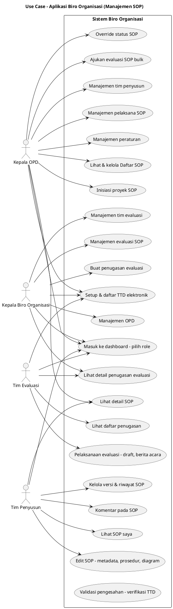
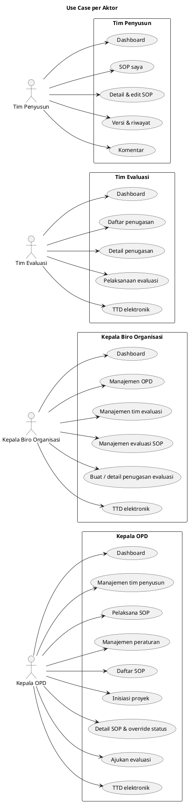
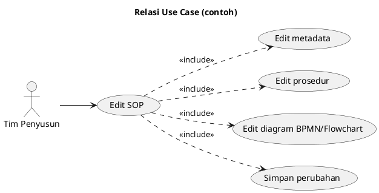

# Review Kode Client & Diagram Use Case

Dokumen ini berisi **review kode** folder `client/` dari sudut pandang Software Engineer dan Sistem Analis, serta **diagram use case** aplikasi Biro Organisasi (manajemen SOP).

---

## 1. Review Kode Client (Software Engineer & Sistem Analis)

### 1.1 Arsitektur & Stack

| Aspek | Ringkasan |
|-------|-----------|
| **Framework** | React 19, TypeScript, Vite 7 |
| **Routing** | TanStack Router (file-based), route tree ter-generate |
| **State** | Zustand (app, peraturan, evaluasi, penugasan, sop-status) + persist di localStorage untuk role & sebagian data |
| **UI** | Tailwind CSS 4, Radix UI, Lucide React |
| **Struktur** | Routes → Pages → Components; logic di `lib/` (stores, hooks, types, seed, services) |

**Kelebihan:** Pemisahan route/page/component jelas, konstanta route dan role terpusat, role-based layout konsisten.

### 1.2 Keamanan & Akses

- **Role-based access:** Setiap area (Kepala OPD, Kepala Biro, Tim Evaluasi, Tim Penyusun) dilindungi di `beforeLoad` route layout; jika role tidak sesuai, redirect ke `/` dengan `?denied=...`.
- **Keterbatasan:** Autentikasi berbasis role di client (pilih role di landing); tidak ada token/session/API auth. Untuk produksi perlu backend auth dan validasi role di server.

### 1.3 Data & Integrasi Backend

- **Saat ini:** Tidak ada pemanggilan HTTP API. Data dari **seed** (`lib/seed/*`) dan **Zustand stores** (sebagian persist).
- **Service layer:** `lib/services/sop-preview.ts` mengembalikan data dari seed; siap diganti ke API nanti.
- **Rekomendasi:** Tambah layer API client (fetch/axios) dan ganti sumber data di hooks/stores dari seed ke response API; pertahankan struktur hook agar halaman tidak banyak berubah.

### 1.4 Kualitas Kode

- **Types:** TypeScript dipakai konsisten; tipe SOP, evaluasi, peraturan, dll. didefinisikan di `lib/types/`.
- **Reuse:** Komponen UI (Button, Dialog, DataTable, FormField, dll.) dan layout (RoleLayout, PageHeader) dipakai seragam.
- **Hooks:** Custom hooks (`useDaftarSOPData`, `useDetailSOPMetadata`, `useKomentar`, dll.) memisahkan logic dari UI dan memudahkan penggantian sumber data.
- **Perhatian:** Sebagian halaman cukup besar (banyak state lokal); pertimbangkan pemecahan ke sub-komponen atau reducer jika bertambah kompleks.

### 1.5 Fitur Utama yang Tercakup

- **Tim Penyusun:** Daftar SOP saya, detail & edit SOP (metadata, prosedur, diagram BPMN/flowchart, versi, komentar).
- **Kepala OPD:** Manajemen tim penyusun, pelaksana SOP, peraturan, daftar SOP, inisiasi proyek, detail SOP, override status, ajukan evaluasi, TTD elektronik.
- **Tim Evaluasi:** Penugasan evaluasi, detail penugasan, pelaksanaan evaluasi (draft, berita acara), TTD elektronik.
- **Kepala Biro Organisasi:** Manajemen OPD, tim evaluasi, manajemen evaluasi SOP (buat, daftar, detail), TTD elektronik.
- **Validasi:** Halaman verifikasi TTD berhasil dan validasi pengesahan.

---

## 2. Diagram Use Case

Diagram use case berikut menggambarkan **aktor** (pengguna sistem) dan **use case** (fitur) dalam batas sistem **Aplikasi Biro Organisasi**.

### 2.1 Diagram Utama (Semua Aktor)

### 2.2 Diagram per Aktor (Ringkas)

### 2.3 Relasi Include/Extend (Contoh)

---

## 3. Tabel Mapping Route → Use Case

| Route (path) | Aktor | Use Case |
|--------------|--------|----------|
| `/` | Semua | Masuk ke dashboard (pilih role) |
| `/tim-penyusun/sop-saya` | Tim Penyusun | Lihat SOP saya |
| `/tim-penyusun/detail-sop/$id` | Tim Penyusun | Detail & edit SOP, versi, komentar |
| `/kepala-opd/daftar-sop` | Kepala OPD | Lihat & kelola daftar SOP, ajukan evaluasi |
| `/kepala-opd/initiate-proyek/$id` | Kepala OPD | Inisiasi proyek SOP |
| `/kepala-opd/detail-sop/$id` | Kepala OPD | Lihat detail SOP, override status |
| `/kepala-opd/manajemen-tim-penyusun` | Kepala OPD | Manajemen tim penyusun |
| `/kepala-opd/pelaksana-sop` | Kepala OPD | Manajemen pelaksana SOP |
| `/kepala-opd/manajemen-peraturan` | Kepala OPD | Manajemen peraturan |
| `/kepala-opd/ttd-elektronik` | Kepala OPD | Setup & daftar TTD elektronik |
| `/kepala-biro-organisasi/manajemen-opd` | Kepala Biro Organisasi | Manajemen OPD |
| `/kepala-biro-organisasi/manajemen-tim-evaluasi` | Kepala Biro Organisasi | Manajemen tim evaluasi |
| `/kepala-biro-organisasi/manajemen-evaluasi-sop` | Kepala Biro Organisasi | Manajemen evaluasi SOP |
| `/kepala-biro-organisasi/manajemen-evaluasi-sop/buat` | Kepala Biro Organisasi | Buat penugasan evaluasi |
| `/kepala-biro-organisasi/manajemen-evaluasi-sop/detail/$id` | Kepala Biro Organisasi | Detail penugasan evaluasi |
| `/kepala-biro-organisasi/ttd-elektronik` | Kepala Biro Organisasi | TTD elektronik |
| `/tim-evaluasi/penugasan` | Tim Evaluasi | Daftar penugasan |
| `/tim-evaluasi/penugasan/detail/$id` | Tim Evaluasi | Detail penugasan |
| `/tim-evaluasi/pelaksanaan/$id` | Tim Evaluasi | Pelaksanaan evaluasi |
| `/tim-evaluasi/ttd-elektronik` | Tim Evaluasi | TTD elektronik |
| `/validasi/ttd/berhasil` | Sistem/Publik | Verifikasi TTD berhasil |
| `/validasi/pengesahan/$id` | Sistem/Publik | Validasi pengesahan |

---

*Dokumen ini dihasilkan dari review kode di folder `client/` dan mapping fitur ke use case. Diagram PlantUML dapat di-render di [PlantUML Online](https://www.plantuml.com/plantuml/uml/), VS Code (ekstensi PlantUML), atau viewer yang mendukung PlantUML.*
