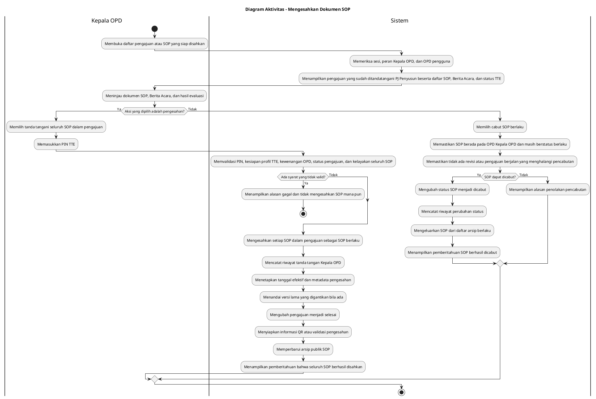

# Diagram Aktivitas: Kepala OPD - Mengesahkan Dokumen SOP

Sumber use case: `UC-13` pada [`../usecase.md`](../usecase.md).

## Metadata

| Elemen | Deskripsi |
| :--- | :--- |
| Use case | Mengesahkan Dokumen SOP |
| Aktor utama | Kepala OPD |
| Nomor kebutuhan fungsional | 18, 19, 21 |
| Tujuan | Menjelaskan proses Kepala OPD menandatangani seluruh SOP dalam pengajuan, menerbitkan SOP berlaku, memperbarui arsip publik, dan menangani pencabutan bila diperlukan. |

## PlantUML

