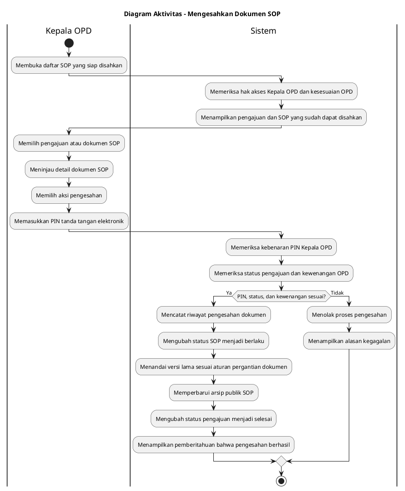

# Diagram Aktivitas: Kepala OPD - Mengesahkan Dokumen SOP

Sumber use case: `UC-13` pada [`../usecase.md`](../usecase.md).

## Metadata

| Elemen | Deskripsi |
| :--- | :--- |
| Use case | Mengesahkan Dokumen SOP |
| Aktor utama | Kepala OPD |
| Nomor kebutuhan fungsional | 18 |
| Tujuan | Menjelaskan proses Kepala OPD dalam mengesahkan SOP agar dokumen dapat diberlakukan dan ditampilkan pada arsip publik. |

## PlantUML

