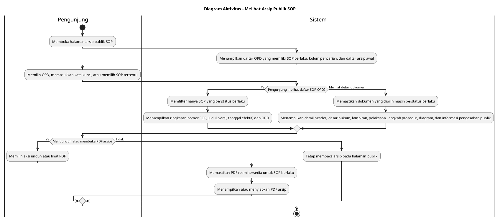

# Diagram Aktivitas: Pengunjung - Melihat Arsip Publik SOP

Sumber use case: `UC-19` pada [`../../usecase.md`](../../usecase.md).

## Metadata

| Elemen | Deskripsi |
| :--- | :--- |
| Use case | Melihat Arsip Publik SOP |
| Aktor utama | Pengunjung |
| Nomor kebutuhan fungsional | 22, 21 |
| Tujuan | Menjelaskan akses publik tanpa login untuk melihat OPD, daftar SOP berlaku, detail dokumen, preview, dan PDF arsip. |

## PlantUML

