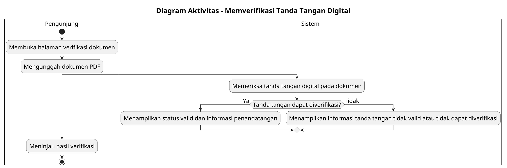

# Diagram Aktivitas: Pengunjung - Memverifikasi Tanda Tangan Digital

Sumber use case: `UC-21` pada [`../../usecase.md`](../../usecase.md).

## Metadata

| Elemen | Deskripsi |
| :--- | :--- |
| Use case | Memverifikasi Tanda Tangan Digital |
| Aktor utama | Pengunjung |
| Nomor kebutuhan fungsional | 24 |
| Tujuan | Menggambarkan proses pengunjung memverifikasi tanda tangan digital pada dokumen PDF. |

## PlantUML

