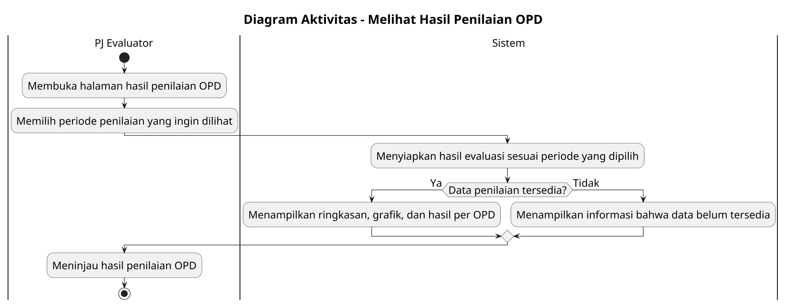

# Diagram Aktivitas: PJ Evaluator - Melihat Hasil Penilaian OPD

Sumber use case: `UC-04` pada [`../../usecase.md`](../../usecase.md).

## Metadata

| Elemen | Deskripsi |
| :--- | :--- |
| Use case | Melihat Hasil Penilaian OPD |
| Aktor utama | PJ Evaluator |
| Nomor kebutuhan fungsional | 20 |
| Tujuan | Menggambarkan proses PJ Evaluator melihat ringkasan dan perbandingan hasil evaluasi OPD. |

## PlantUML

