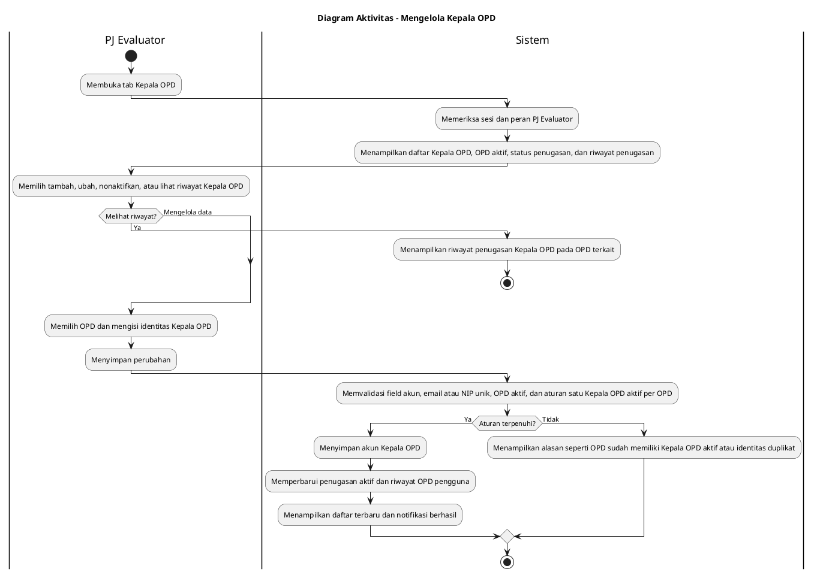

# Diagram Aktivitas: PJ Evaluator - Mengelola Kepala OPD

Sumber use case: `UC-07` pada [`../../usecase.md`](../../usecase.md).

## Metadata

| Elemen | Deskripsi |
| :--- | :--- |
| Use case | Mengelola Kepala OPD |
| Aktor utama | PJ Evaluator |
| Nomor kebutuhan fungsional | 4 |
| Tujuan | Menjelaskan proses PJ Evaluator menetapkan Kepala OPD aktif, memperbarui data, dan melihat riwayat penugasan. |

## PlantUML

