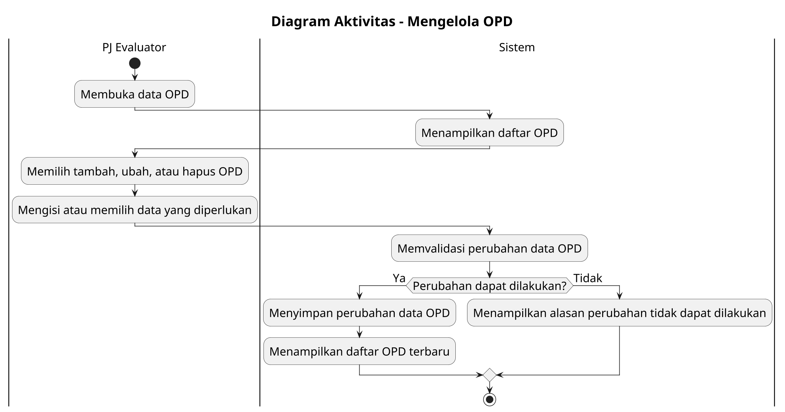

# Diagram Aktivitas: PJ Evaluator - Mengelola OPD

Sumber use case: `UC-05` pada [`../../usecase.md`](../../usecase.md).

## Metadata

| Elemen | Deskripsi |
| :--- | :--- |
| Use case | Mengelola OPD |
| Aktor utama | PJ Evaluator |
| Nomor kebutuhan fungsional | 1 |
| Tujuan | Menggambarkan proses PJ Evaluator menambah, mengubah, atau menghapus data OPD. |

## PlantUML

