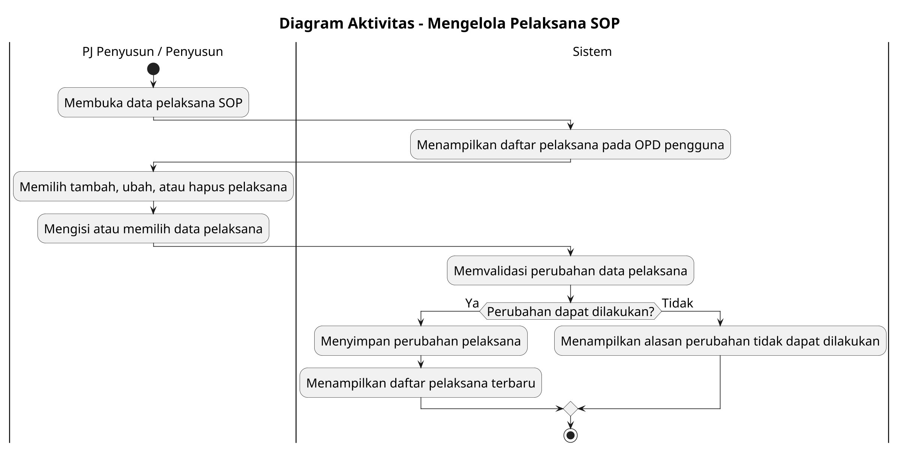

# Diagram Aktivitas: PJ Penyusun/Penyusun - Mengelola Pelaksana SOP

Sumber use case: `UC-17` pada [`../../usecase.md`](../../usecase.md).

## Metadata

| Elemen | Deskripsi |
| :--- | :--- |
| Use case | Mengelola Pelaksana SOP |
| Aktor utama | PJ Penyusun, Penyusun |
| Nomor kebutuhan fungsional | 6 |
| Tujuan | Menggambarkan proses PJ Penyusun atau Penyusun mengelola daftar pelaksana SOP pada OPD. |

## PlantUML

