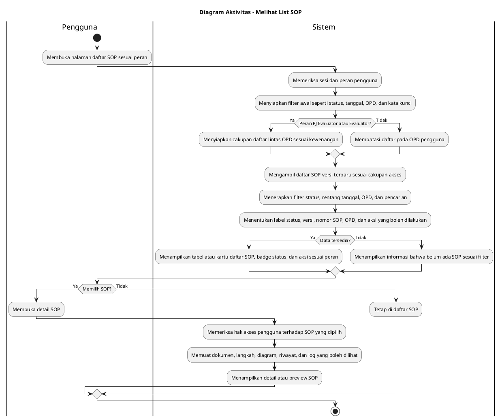

# Diagram Aktivitas: Seluruh Pengguna - Melihat List SOP

Sumber use case: `UC-03` pada [`../../usecase.md`](../../usecase.md).

## Metadata

| Elemen | Deskripsi |
| :--- | :--- |
| Use case | Melihat List SOP |
| Aktor utama | PJ Evaluator, Evaluator, Kepala OPD, PJ Penyusun, Penyusun |
| Nomor kebutuhan fungsional | Tidak memiliki nomor tersendiri |
| Tujuan | Menjelaskan proses pengguna melihat daftar SOP sesuai peran, OPD, filter status, dan akses detail. |

## PlantUML

