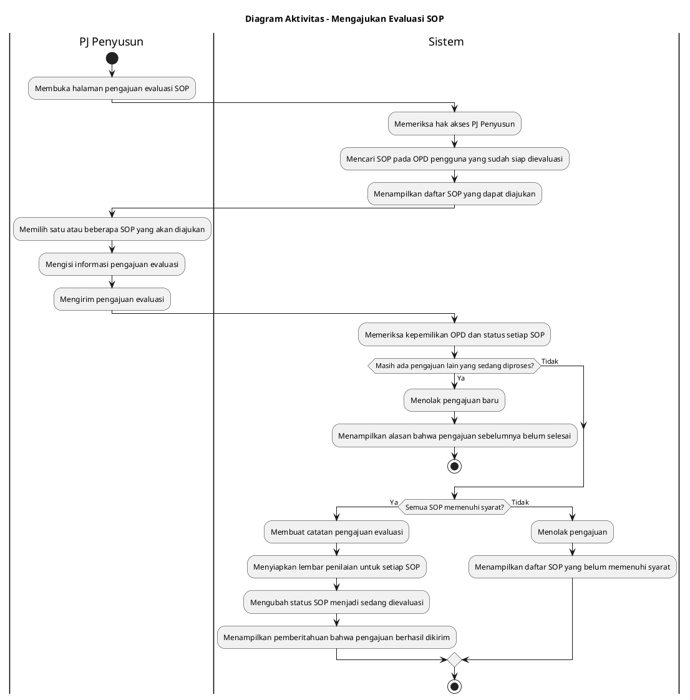

# Diagram Aktivitas: PJ Penyusun - Mengajukan Evaluasi SOP

Sumber use case: `UC-14` pada [`../usecase.md`](../usecase.md).

## Metadata

| Elemen | Deskripsi |
| :--- | :--- |
| Use case | Mengajukan Evaluasi SOP |
| Aktor utama | PJ Penyusun |
| Nomor kebutuhan fungsional | 12 |
| Tujuan | Menjelaskan proses PJ Penyusun dalam memilih SOP yang sudah siap dan mengajukannya kepada evaluator untuk dinilai. |

## PlantUML

