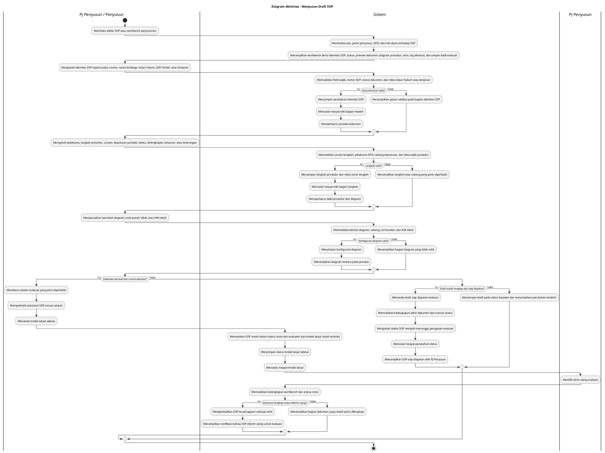

# Diagram Aktivitas: PJ Penyusun/Penyusun - Menyusun Draft SOP

Sumber use case: `UC-15` pada [`../usecase.md`](../usecase.md).

## Metadata

| Elemen | Deskripsi |
| :--- | :--- |
| Use case | Menyusun Draft SOP |
| Aktor utama | PJ Penyusun, Penyusun |
| Nomor kebutuhan fungsional | 10, 11, 13, 14 |
| Tujuan | Menjelaskan proses penyusunan draft SOP pada workbench, penyimpanan perubahan, riwayat edit, tindak lanjut revisi evaluator, dan penandaan dokumen siap diajukan. |

## PlantUML

