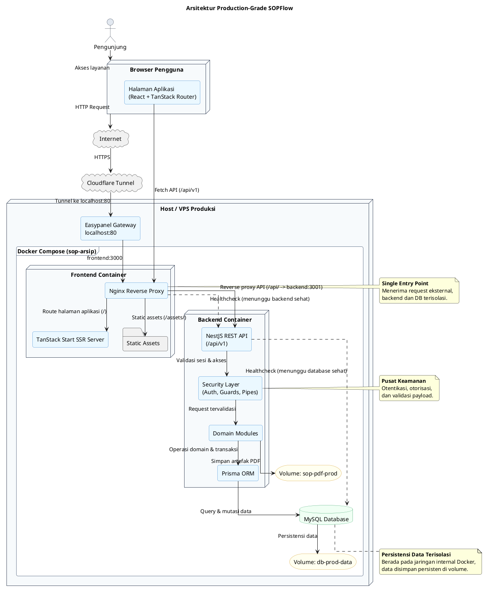
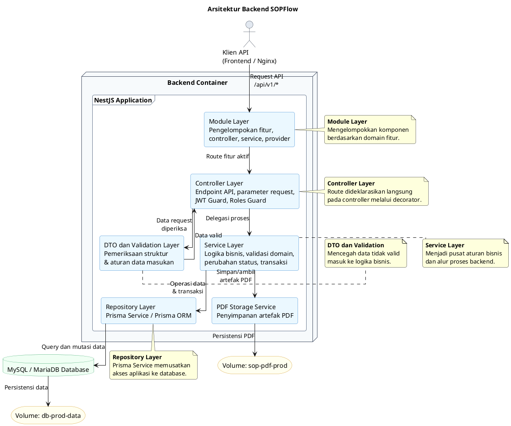
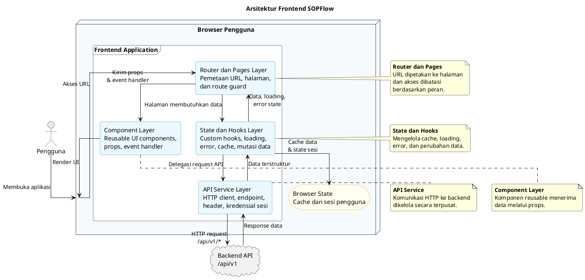

# Arsitektur Sistem

## 1. Gambaran Umum Arsitektur

SOPFlow dirancang sebagai aplikasi web berbasis arsitektur client-server. Pada arsitektur ini, frontend berperan sebagai antarmuka pengguna yang menyediakan halaman kerja untuk setiap aktor, sedangkan backend berperan sebagai penyedia layanan aplikasi, validasi proses bisnis, pengelolaan autentikasi, serta penghubung antara aplikasi dan basis data. Pemisahan tersebut membuat tanggung jawab sistem menjadi lebih jelas karena proses penyajian tampilan, pengelolaan status antarmuka, dan komunikasi API berada pada sisi client, sedangkan aturan bisnis utama, otorisasi, transaksi data, serta integritas domain dikendalikan pada sisi server.

Secara umum, sistem terdiri atas tiga komponen utama. Komponen pertama adalah frontend berbasis React yang dibangun menggunakan Vite, TanStack Router, TanStack Query, Zustand, dan Tailwind CSS. Komponen ini menangani navigasi, manajemen sesi pada sisi klien, pemanggilan API, serta penyajian fitur berdasarkan peran pengguna. Komponen kedua adalah backend berbasis NestJS yang menyediakan REST API dengan prefix `/api` dan versioning URI melalui `/api/v1`. Komponen ini memuat modul-modul domain seperti autentikasi, master data, SOP, evaluasi, tanda tangan elektronik, dan arsip publik. Komponen ketiga adalah basis data MySQL yang diakses backend menggunakan Prisma ORM.

Pada lingkungan produksi, sistem dijalankan di Easypanel menggunakan Docker Compose dengan tiga layanan utama, yaitu `frontend`, `backend`, dan `db`. Cloudflare Tunnel masuk melalui gateway Easypanel pada host port 80, lalu Easypanel meneruskan domain ke port internal `frontend:3000`. Nginx pada container frontend meneruskan request `/api/` ke `backend:3001`, sedangkan request halaman aplikasi diteruskan ke server frontend pada port internal 4173. Backend tidak dipublikasikan langsung ke host dan hanya diekspos pada jaringan internal Docker. Basis data MySQL juga berada pada jaringan internal yang sama sehingga akses data hanya dilakukan melalui backend.

Struktur tersebut menunjukkan bahwa sistem menerapkan pola aplikasi web berlapis. Lapisan presentasi berada pada frontend, lapisan layanan aplikasi berada pada backend, dan lapisan persistensi berada pada MySQL. Pemisahan lapisan ini penting karena setiap perubahan pada tampilan tidak harus mengubah struktur penyimpanan data, sedangkan perubahan aturan bisnis dapat dikendalikan pada backend tanpa menduplikasi logika kritis pada client.

```text
Pengguna
  -> Browser
  -> Frontend React / TanStack Start
  -> Nginx reverse proxy
  -> Backend NestJS REST API
  -> Prisma ORM
  -> MySQL
```

Diagram berikut menggambarkan arsitektur lengkap sistem pada lingkungan produksi. Diagram ini menempatkan frontend sebagai pintu masuk utama, backend sebagai lapisan layanan aplikasi, dan MySQL sebagai lapisan penyimpanan data. Pada konfigurasi production, Cloudflare hanya mengakses gateway Easypanel port 80 dan Easypanel meneruskan request ke frontend port internal 3000. Backend dan basis data berada pada jaringan internal Docker sehingga tidak diakses langsung oleh pengguna.



Secara arsitektural, diagram tersebut menunjukkan bahwa sistem menggunakan pendekatan reverse proxy. Semua request dari browser masuk ke Nginx pada container frontend. Request halaman aplikasi diteruskan ke server SSR TanStack Start, sedangkan request API dengan path `/api/` diteruskan ke backend NestJS. Dengan demikian, frontend dan API dapat disajikan melalui satu origin produksi. Pendekatan ini membantu menyederhanakan konfigurasi cookie, CORS, dan akses pengguna karena browser tidak perlu mengetahui alamat internal backend.

Backend NestJS berada di belakang Nginx dan hanya dapat diakses melalui jaringan internal Docker. Backend menjalankan autentikasi, otorisasi, validasi request, dan aturan bisnis domain. Setelah request dinyatakan valid, backend menggunakan Prisma ORM untuk menjalankan query dan transaksi pada MySQL. Artefak PDF SOP disimpan pada volume khusus, sedangkan data relasional disimpan pada volume MySQL. Pemakaian volume membuat data tetap persisten meskipun container diperbarui atau dibuat ulang.

Pola ini dapat dikategorikan sebagai arsitektur production-grade karena memiliki pemisahan komponen yang jelas, isolasi jaringan internal, reverse proxy sebagai pintu masuk, health check antarservice, persistensi data melalui volume, serta pemusatan validasi dan keamanan pada backend. Namun, aspek operasional seperti konfigurasi HTTPS, backup basis data, monitoring, dan strategi pemulihan masih perlu dilengkapi sesuai kebutuhan deployment yang digunakan.

## 5.1.2 Implementasi Pengkodean Backend

Backend diimplementasikan menggunakan arsitektur berlapis (*layered architecture*) untuk memisahkan tanggung jawab antarbagian sistem, sehingga proses pengelolaan titik akhir API (*endpoint*), validasi, logika bisnis, dan akses data dapat dikelola secara lebih terstruktur. Pemisahan ini memastikan bahwa sistem memiliki tingkat kohesi yang tinggi dan ketergantungan yang rendah (*high cohesion and loose coupling*), yang mempermudah pemeliharaan sistem. Sistem ini dikembangkan menggunakan kerangka kerja *NestJS* yang secara bawaan mendukung pola injeksi dependensi (*dependency injection*) dan pembagian arsitektur berbasis modul.

### 5.1.2.1 Arsitektur Backend

Berbeda dengan pola pengembangan tradisional yang sering memisahkan *route* sebagai lapisan mandiri, *NestJS* mengintegrasikan pendefinisian rute di dalam *Controller* menggunakan dekorator. Secara keseluruhan, arsitektur *backend* pada sistem ini terdiri dari beberapa lapisan utama:

a. **Module Layer**: Lapisan ini berfungsi mengelompokkan komponen-komponen (seperti *controller*, *service*, dan *provider*) yang memiliki kesamaan domain fungsional menjadi satu kesatuan. Pengelompokan ini mempermudah pengelolaan dependensi.
b. **Controller Layer**: Lapisan ini bertugas menerima permintaan HTTP dari antarmuka pengguna, mendeklarasikan *endpoint* rute melalui dekorator (seperti `@Get`, `@Post`), dan mengekstrak parameter dari permintaan. Lapisan ini juga mengamankan sistem melalui *RolesGuard* yang membatasi akses peran (seperti PJ Evaluator atau Penyusun) dan menggunakan autentikasi *JSON Web Token* (JWT). *Controller* tidak memuat logika bisnis rumit; tugas utamanya adalah mengarahkan permintaan ke *Service Layer*.
c. **DTO & Validation Pipe Layer**: Sebelum permintaan masuk ke proses lebih lanjut, data divalidasi oleh lapisan ini. Lapisan ini menggunakan *Data Transfer Object* (DTO) untuk memvalidasi kelengkapan data masuk dan memastikan struktur input sesuai standar (misalnya validasi PIN TTE atau kelengkapan data dokumen SOP).
d. **Service Layer**: Lapisan ini menjadi pusat logika bisnis aplikasi. Segala aturan komputasi, pengecekan kelayakan akses berdasarkan OPD, dan perubahan status dokumen (seperti transisi dari status *DRAFT* menjadi *SEDANG_DIEVALUASI*) dieksekusi di sini. Hal ini memastikan konsistensi logika sebelum disimpan.
e. **Repository Layer (Prisma Service)**: Lapisan ini bertanggung jawab mengabstraksi operasi komunikasi basis data menggunakan *Prisma ORM*. Pemisahan ini memberikan manfaat teknis yang signifikan; ketika terdapat perubahan skema tabel di masa depan, penyesuaian kueri cukup dilakukan pada lapisan *repository* ini tanpa merusak logika di lapisan *service* maupun *controller*.

Kode PlantUML berikut menyesuaikan penjelasan arsitektur backend pada laporan, yaitu module sebagai pengelompokan fitur, controller sebagai penerima request, DTO dan validation pipe sebagai pemeriksa data masukan, service sebagai pengelola logika bisnis, serta repository layer melalui Prisma Service sebagai penghubung ke basis data.



### 5.1.2.2 Potongan Kode

Untuk merepresentasikan kompleksitas domain sistem, contoh berikut menampilkan potongan kode implementasi pada fitur pengajuan evaluasi SOP untuk setiap layernya.

**a. Layer Module (`pengajuan-evaluasi.module.ts`)**  
Modul ini mendaftarkan *controller* dan *service* secara bersamaan agar terhubung dalam ekosistem injeksi dependensi sistem.

```typescript
@Module({
  controllers: [PengajuanEvaluasiController],
  providers: [PengajuanEvaluasiService, PrismaService],
})
export class PengajuanEvaluasiModule {}
```

**b. Layer Controller (`pengajuan-evaluasi.controller.ts`)**  
*Controller* berfungsi murni sebagai pintu gerbang (*endpoint*) yang divalidasi dengan aturan peran (hanya *PJ Penyusun*).

```typescript
@Controller('pengajuan-evaluasi')
@UseGuards(JwtAuthGuard, RolesGuard)
export class PengajuanEvaluasiController {
  constructor(private readonly pengajuanService: PengajuanEvaluasiService) {}

  @Post()
  @Roles(Role.PJ_PENYUSUN)
  async submitEvaluasi(@Body() dto: CreatePengajuanDto, @Req() req) {
    return this.pengajuanService.submit(dto, req.user);
  }
}
```

**c. Layer DTO & Validation (`create-pengajuan.dto.ts`)**  
Lapisan validasi memastikan bahwa struktur *array* `sopIds` benar-benar dikirimkan klien sebelum menyentuh logika *service*.

```typescript
export class CreatePengajuanDto {
  @IsArray()
  @IsNotEmpty()
  sopIds: string[];
}
```

**d. Layer Service (`pengajuan-evaluasi.service.ts`)**  
Logika bisnis utama berjalan di sini, melakukan validasi OPD, memastikan tidak ada pengajuan lain yang berjalan, serta memproses transaksi perubahan status.

```typescript
@Injectable()
export class PengajuanEvaluasiService {
  constructor(private readonly prisma: PrismaService) {}

  async submit(dto: CreatePengajuanDto, user: UserPayload) {
    const hasActive = await this.prisma.pengajuanEvaluasi.findFirst({
      where: { opdId: user.opdId, status: 'AKTIF' }
    });
    if (hasActive) throw new ConflictException('Masih ada pengajuan aktif.');

    return this.prisma.$transaction(async (tx) => {
      const pengajuan = await tx.pengajuanEvaluasi.create({
        data: { opdId: user.opdId, status: 'AKTIF' }
      });
      await tx.detailSOP.updateMany({
        where: { id: { in: dto.sopIds }, status: 'DRAFT' },
        data: { status: 'SEDANG_DIEVALUASI' }
      });
      return pengajuan;
    });
  }
}
```

**e. Layer Repository (`prisma.service.ts`)**  
Lapisan abstraksi basis data yang memusatkan koneksi basis data ORM MySQL agar kueri terisolasi dengan aman.

```typescript
@Injectable()
export class PrismaService extends PrismaClient implements OnModuleInit {
  async onModuleInit() {
    await this.$connect();
  }
}
```

## 5.1.3 Implementasi Pengkodean Frontend

Implementasi antarmuka klien menggunakan *React* berpedoman pada pola aplikasi satu halaman (*Single Page Application*). Sistem ini mengatur pembagian kode ke dalam hierarki komponen yang reaktif terhadap perubahan data.

### 5.1.3.1 Arsitektur Frontend

Untuk mendukung proses kerja pengelolaan SOP yang kompleks dan saling terkait, aplikasi *frontend* dibangun dengan pemisahan lapisan fungsional sebagai berikut:

a. **Router & Pages Layer**: Menggunakan `TanStack Router` untuk memetakan URL ke halaman fisik (*page*). Lapisan ini bertugas melakukan validasi akses berbasis peran (*Route Guard*) sebelum halaman dimuat, misalnya menolak akses pengunjung yang tidak memiliki hak pada halaman evaluator.
b. **State & Hooks Layer**: Lapisan ini bertugas mengelola proses pengambilan data secara asinkron dari *backend* dan menyimpannya ke memori peramban (*caching*). Dengan *custom hooks* berbasis `TanStack Query`, halaman antarmuka dipisahkan dari kompleksitas siklus data (*loading*, *error*, dan mutasi perubahan data).
c. **API Service Layer**: Lapisan ini mengabstraksi komunikasi antarmuka jaringan. Segala permintaan *fetch* ke *backend* melewati abstraksi ini agar pengaturan *header*, kredensial sesi *cookie* JWT, serta mekanisme pengulangan otomatis saat gagal, dapat dikelola dari satu tempat.
d. **Component Layer**: Berisi entitas visual antarmuka pengguna yang bisa digunakan ulang (*reusable UI*). Komponen-komponen ini bersifat murni hanya menyajikan data yang diterimanya dari halaman (*props*) tanpa harus melakukan kueri secara independen, seperti tabel data atau penampil formulir.

Kode PlantUML berikut menyesuaikan penjelasan arsitektur *frontend* pada laporan, yaitu router dan pages sebagai pengatur halaman, state dan hooks sebagai pengelola data antarmuka, API service sebagai penghubung ke backend, serta component layer sebagai penyusun tampilan.



### 5.1.3.2 Potongan Kode

Contoh berikut menunjukkan sinkronisasi antarlapisan *frontend* untuk menampilkan daftar evaluasi SOP oleh aktor Evaluator.

**a. Layer Router & Pages (`client/src/routes/evaluator/evaluasi/index.tsx` & `client/src/pages/evaluator/evaluasi/DaftarSOPEvaluasi.tsx`)**  
Lapisan *router* dan *page* mengikat komponen antarmuka menjadi sebuah halaman utuh yang dilindungi peran evaluator.

```tsx
// File: client/src/routes/evaluator/evaluasi/index.tsx
import { createFileRoute } from '@tanstack/react-router'
import { DaftarSOPEvaluasi } from '@/pages/evaluator/evaluasi/DaftarSOPEvaluasi'

export const Route = createFileRoute('/evaluator/evaluasi/')({
  validateSearch: parseEvaluasiIndexSearch,
  component: DaftarSOPEvaluasi,
})
```

```tsx
// File: client/src/pages/evaluator/evaluasi/DaftarSOPEvaluasi.tsx
import { usePengajuanEvaluasiRingkas } from '@/api/evaluasi'
import { EvaluasiPengajuanGroupedList } from '@/components/evaluasi/evaluasi-pengajuan-grouped-list'
import { ListPageLayout } from '@/components/layout/ListPageLayout'

export function DaftarSOPEvaluasi() {
  const { data, isLoading } = usePengajuanEvaluasiRingkas(ringkasParams)
  const items = data?.items ?? []
  
  return (
    <ListPageLayout title="Evaluasi SOP">
      <EvaluasiPengajuanGroupedList
        rows={items}
        isLoading={isLoading}
      />
    </ListPageLayout>
  )
}
```

**b. Layer State & Hooks (`client/src/api/evaluasi-queries.ts`)**  
*Hook* khusus untuk memanggil lapisan *service*, memproses *loading state*, dan mengelola *cache* antarmuka.

```typescript
import { useQuery } from "@tanstack/react-query";
import { evaluasiApi } from "@/api/evaluasi-client";
import { queryKeys } from "@/config/query-keys";

export function usePengajuanEvaluasiRingkas(
  params: EvaluasiRingkasQueryParams & { enabled?: boolean },
) {
  const enabled = params.enabled ?? true;
  return useQuery({
    queryKey: queryKeys.evaluasiRingkas(params as Record<string, unknown>),
    queryFn: () => evaluasiApi.findRingkas(params),
    enabled,
  });
}
```

**c. Layer API Service (`client/src/api/evaluasi-client.ts`)**  
Abstraksi untuk komunikasi jaringan ke *backend* menggunakan klien HTTP terpusat.

```typescript
import { apiClient, buildQueryString } from '@/lib/api/api-client'

export const evaluasiApi = {
  findRingkas: (params?: EvaluasiRingkasQueryParams) =>
    unwrapEvaluasiEnvelope(
      apiClient.get<ApiSuccessResponse<PengajuanEvaluasiRingkasPage>>(
        `/evaluasi/ringkas${buildEvaluasiRingkasQueryString(params ?? {})}`,
      ),
    ),
}
```

**d. Layer Component (`client/src/components/evaluasi/evaluasi-pengajuan-grouped-list.tsx`)**  
Komponen presentasional yang menyajikan properti data dari halaman ke dalam bentuk antarmuka visual tabel dengan fitur *grouping* (pengelompokan berdasarkan OPD).

```tsx
import { ExpandableGroupedTable } from '@/components/data/expandable-grouped-table'
import { Table } from '@/components/ui/data-table'

export function EvaluasiPengajuanGroupedList({ rows, isLoading }) {
  // ... groupedByOpd logic ...

  return (
    <ExpandableGroupedTable
      groups={groupedByOpd}
      getGroupId={(group) => group.opdId}
      renderGroupTitle={(group) => group.opdNama}
      isLoading={isLoading}
      renderRows={(group) => (
        <Table.Table>
          <thead>
            <Table.HeadRow>
              <Table.Th>Jenis</Table.Th>
              <Table.Th>Status pengajuan</Table.Th>
              <Table.Th>Tanggal</Table.Th>
              <Table.Th>Progres</Table.Th>
              <Table.Th align="center">Aksi</Table.Th>
            </Table.HeadRow>
          </thead>
          <tbody>
            {/* Iterasi data SOP per grup */}
          </tbody>
        </Table.Table>
      )}
    />
  )
}
```

Analisis: Gambar 5.5 menjelaskan alur di mana halaman antarmuka mendelegasikan tugas pengambilan dan pengelolaan siklus data (*loading*, *error*, *success*) kepada *hook* fungsional `useEvaluasiListQuery`. Hal ini membebaskan komponen visual dari kode pemrograman asinkron yang rumit. Komponen tabel `DataTable` kemudian ditugaskan secara eksklusif untuk menangani proses penyajian (*rendering*) baris dokumen sesuai aturan kolom `EvaluasiSopColumns`, yang mengikat antarmuka secara erat dengan kebutuhan bisnis sistem evaluasi.
