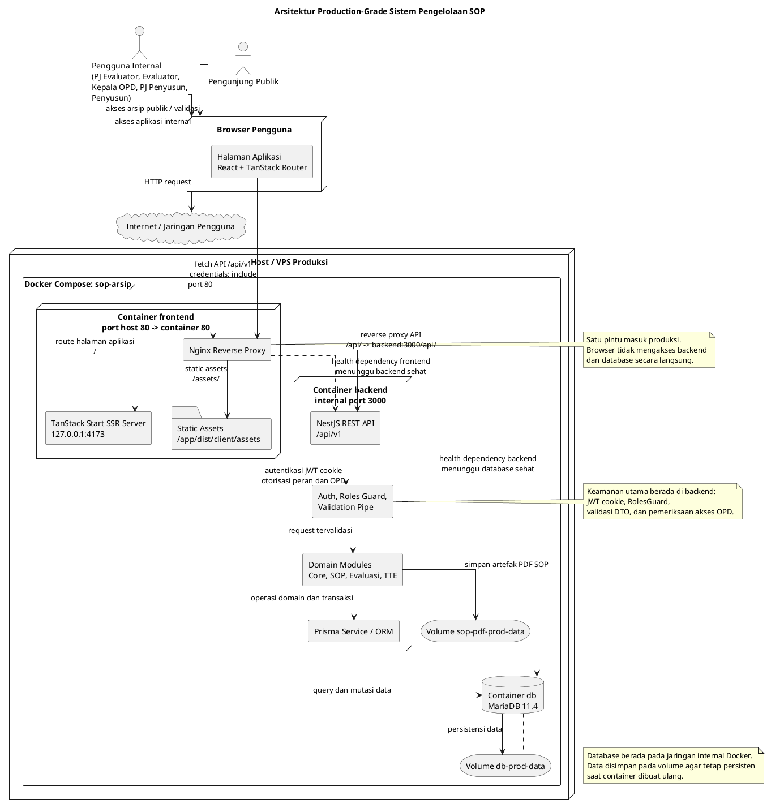

# Arsitektur Sistem

## 1. Gambaran Umum Arsitektur

Sistem Pengelolaan SOP Biro Organisasi dirancang sebagai aplikasi web berbasis arsitektur client-server. Pada arsitektur ini, frontend berperan sebagai antarmuka pengguna yang menyediakan halaman kerja untuk setiap aktor, sedangkan backend berperan sebagai penyedia layanan aplikasi, validasi proses bisnis, pengelolaan autentikasi, serta penghubung antara aplikasi dan basis data. Pemisahan tersebut membuat tanggung jawab sistem menjadi lebih jelas karena proses penyajian tampilan, pengelolaan status antarmuka, dan komunikasi API berada pada sisi client, sedangkan aturan bisnis utama, otorisasi, transaksi data, serta integritas domain dikendalikan pada sisi server.

Secara umum, sistem terdiri atas tiga komponen utama. Komponen pertama adalah frontend berbasis React yang dibangun menggunakan Vite, TanStack Router, TanStack Query, Zustand, dan Tailwind CSS. Komponen ini menangani navigasi, manajemen sesi pada sisi klien, pemanggilan API, serta penyajian fitur berdasarkan peran pengguna. Komponen kedua adalah backend berbasis NestJS yang menyediakan REST API dengan prefix `/api` dan versioning URI melalui `/api/v1`. Komponen ini memuat modul-modul domain seperti autentikasi, master data, SOP, evaluasi, tanda tangan elektronik, dan arsip publik. Komponen ketiga adalah basis data MariaDB yang diakses backend menggunakan Prisma ORM.

Pada lingkungan produksi, sistem dijalankan menggunakan Docker Compose dengan tiga layanan utama, yaitu `frontend`, `backend`, dan `db`. Layanan frontend berada di depan sebagai titik masuk HTTP pada port 80. Nginx pada container frontend meneruskan request `/api/` ke backend NestJS, sedangkan request halaman aplikasi diteruskan ke server frontend pada port internal 4173. Backend tidak dipublikasikan langsung ke host dan hanya diekspos pada jaringan internal Docker. Basis data MariaDB juga berada pada jaringan internal yang sama sehingga akses data hanya dilakukan melalui backend.

Struktur tersebut menunjukkan bahwa sistem menerapkan pola aplikasi web berlapis. Lapisan presentasi berada pada frontend, lapisan layanan aplikasi berada pada backend, dan lapisan persistensi berada pada MariaDB. Pemisahan lapisan ini penting karena setiap perubahan pada tampilan tidak harus mengubah struktur penyimpanan data, sedangkan perubahan aturan bisnis dapat dikendalikan pada backend tanpa menduplikasi logika kritis pada client.

```text
Pengguna
  -> Browser
  -> Frontend React / TanStack Start
  -> Nginx reverse proxy
  -> Backend NestJS REST API
  -> Prisma ORM
  -> MariaDB
```

Diagram berikut menggambarkan arsitektur lengkap sistem pada lingkungan produksi. Diagram ini menempatkan frontend sebagai pintu masuk utama, backend sebagai lapisan layanan aplikasi, dan MariaDB sebagai lapisan penyimpanan data. Pada konfigurasi produksi, hanya layanan frontend yang dipublikasikan ke host melalui port 80. Backend dan basis data berada pada jaringan internal Docker sehingga tidak diakses langsung oleh pengguna.



Secara arsitektural, diagram tersebut menunjukkan bahwa sistem menggunakan pendekatan reverse proxy. Semua request dari browser masuk ke Nginx pada container frontend. Request halaman aplikasi diteruskan ke server SSR TanStack Start, sedangkan request API dengan path `/api/` diteruskan ke backend NestJS. Dengan demikian, frontend dan API dapat disajikan melalui satu origin produksi. Pendekatan ini membantu menyederhanakan konfigurasi cookie, CORS, dan akses pengguna karena browser tidak perlu mengetahui alamat internal backend.

Backend NestJS berada di belakang Nginx dan hanya dapat diakses melalui jaringan internal Docker. Backend menjalankan autentikasi, otorisasi, validasi request, dan aturan bisnis domain. Setelah request dinyatakan valid, backend menggunakan Prisma ORM untuk menjalankan query dan transaksi pada MariaDB. Artefak PDF SOP disimpan pada volume khusus, sedangkan data relasional disimpan pada volume MariaDB. Pemakaian volume membuat data tetap persisten meskipun container diperbarui atau dibuat ulang.

Pola ini dapat dikategorikan sebagai arsitektur production-grade karena memiliki pemisahan komponen yang jelas, isolasi jaringan internal, reverse proxy sebagai pintu masuk, health check antarservice, persistensi data melalui volume, serta pemusatan validasi dan keamanan pada backend. Namun, aspek operasional seperti konfigurasi HTTPS, backup basis data, monitoring, dan strategi pemulihan masih perlu dilengkapi sesuai kebutuhan deployment yang digunakan.

## 2. Arsitektur Backend

Backend sistem dibangun menggunakan NestJS. Kerangka kerja ini menggunakan konsep modul, controller, service, repository, guard, pipe, dan dependency injection. Struktur tersebut mendukung pemisahan tanggung jawab secara sistematis. Controller menerima request HTTP dan menerjemahkannya menjadi pemanggilan layanan aplikasi. Service menjalankan aturan bisnis dan validasi domain. Repository berhubungan langsung dengan Prisma untuk membaca dan menulis data. Guard digunakan untuk membatasi akses berdasarkan autentikasi dan peran pengguna, sedangkan pipe digunakan untuk validasi dan transformasi data masukan.

### 2.1 Struktur Modul Backend

Modul utama backend didefinisikan pada `AppModule`. Modul ini menggabungkan modul umum, konfigurasi, logging, Prisma, serta modul-modul domain. Modul domain backend dapat dikelompokkan menjadi empat bagian besar, yaitu modul inti, modul SOP, modul evaluasi, dan modul tanda tangan elektronik.

Modul inti terdiri atas `AuthModule`, `OpdModule`, `PenggunaModule`, `EvaluatorModule`, `KepalaOpdModule`, `PenyusunModule`, dan `PeraturanModule`. Kelompok modul ini mengelola autentikasi, akun pengguna, peran, OPD, evaluator, kepala OPD, penyusun, dan referensi peraturan. Modul SOP terdiri atas `SopCatalogModule`, `SopPublicModule`, `SopProsedurModule`, `SopDiagramModule`, dan `PelaksanaModule`. Kelompok ini menangani pembuatan SOP, pengelolaan header, langkah prosedur, diagram, pelaksana, versi dokumen, serta arsip publik. Modul evaluasi terdiri atas `EvaluasiNilaiModule`, `PengajuanEvaluasiModule`, `PengajuanEvaluasiDetailModule`, `EvaluasiWorkspaceModule`, `EvaluasiUmpanBalikModule`, dan `EvaluasiGrafikModule`. Kelompok ini menangani pengajuan evaluasi, penilaian SOP, tindak lanjut revisi, ruang kerja evaluasi, umpan balik, dan grafik evaluasi. Modul tanda tangan elektronik terdiri atas `TteSharedModule`, `TteProfilModule`, `TtePenandatangananModule`, `TteVerifikasiModule`, dan `TteCoreModule`.

Pembagian modul tersebut menunjukkan bahwa backend tidak disusun berdasarkan halaman antarmuka, tetapi berdasarkan domain bisnis. Pendekatan ini sesuai untuk sistem SOP karena proses utama sistem melibatkan status dokumen, alur evaluasi, pengesahan, dan arsip yang saling berhubungan. Dengan pengelompokan domain, aturan mengenai SOP tidak tersebar pada halaman frontend, tetapi dipusatkan pada layanan backend yang relevan.

### 2.2 Lapisan Controller, Service, dan Repository

Setiap fitur utama backend mengikuti pola berlapis. Controller menangani endpoint HTTP, dekorator Swagger, validasi parameter route, dan pembatasan peran. Sebagai contoh, controller pada modul katalog SOP menyediakan endpoint untuk menampilkan daftar SOP, membuat SOP, memperbarui header, mengubah status, membuat versi baru, mencabut SOP, dan mengambil riwayat versi. Controller tidak menyimpan aturan bisnis secara langsung, tetapi meneruskan permintaan ke service.

Service menjalankan logika aplikasi. Pada modul katalog SOP, service memeriksa akses OPD, memvalidasi status SOP yang dapat diedit, memeriksa kelengkapan dokumen sebelum SOP diajukan ke evaluasi, mengatur transisi status, serta menangani konflik seperti nomor SOP yang sudah digunakan. Service juga menerjemahkan kondisi teknis menjadi respons domain, misalnya `ConflictException`, `ForbiddenException`, atau `NotFoundException`.

Repository menjadi lapisan akses data. Repository menggunakan Prisma untuk mengambil data dari tabel terkait, menjalankan transaksi, membuat relasi, memperbarui status, dan mengembalikan data mentah yang kemudian dipetakan oleh service atau mapper. Pemisahan repository membuat query basis data tidak bercampur dengan pengambilan keputusan bisnis.

Pola ini dapat diringkas sebagai berikut.

```text
Controller
  -> menerima request HTTP
  -> memvalidasi parameter dasar
  -> menerapkan guard peran

Service
  -> menjalankan aturan bisnis
  -> memeriksa akses OPD dan status dokumen
  -> mengatur transaksi domain

Repository
  -> menjalankan query Prisma
  -> membaca dan menulis data ke MariaDB
```

### 2.3 Konfigurasi Global Backend

Backend menggunakan `ConfigModule` secara global dengan validasi environment. File environment dibaca dari pola `.env.{NODE_ENV}.local` dan `.env`. Validasi ini berfungsi untuk memastikan konfigurasi penting seperti koneksi basis data, port, origin publik, dan konfigurasi lain tersedia sebelum aplikasi berjalan. Backend juga menggunakan Winston sebagai sistem logging melalui `nest-winston`.

Pada saat bootstrap, backend mengaktifkan beberapa konfigurasi global. Pertama, backend menggunakan prefix global `api`, sehingga semua endpoint aplikasi berada di bawah path `/api`. Kedua, backend mengaktifkan versioning berbasis URI dengan versi default `1`, sehingga endpoint digunakan dalam bentuk `/api/v1`. Ketiga, backend menerapkan validation pipe global untuk memvalidasi request DTO. Keempat, backend mengaktifkan CORS dengan credential agar browser dapat mengirim cookie sesi ke backend. Kelima, Swagger dapat diaktifkan berdasarkan konfigurasi untuk menyediakan dokumentasi API pada path `/docs`.

Backend juga mengatur batas ukuran body request melalui konstanta `JSON_BODY_LIMIT` dan `URLENCODED_BODY_LIMIT`. Pengaturan ini diperlukan karena sistem memproses dokumen, konfigurasi diagram, serta data SOP yang dapat berisi struktur cukup besar. Selain itu, backend melakukan pemeriksaan ketersediaan port sebelum server berjalan agar aplikasi tidak berjalan pada port yang salah.

### 2.4 Autentikasi dan Otorisasi

Autentikasi backend menggunakan JWT yang dikirim melalui cookie. Implementasi guard autentikasi menggunakan strategi Passport JWT melalui `JwtAuthGuard`. Setelah pengguna terautentikasi, informasi pengguna tersedia pada request dalam bentuk payload akses. Payload ini kemudian digunakan service untuk memeriksa peran dan akses OPD pengguna.

Otorisasi berbasis peran dilakukan menggunakan dekorator `@Roles(...)` dan `RolesGuard`. Guard ini membaca metadata peran yang diizinkan pada controller atau method. Jika endpoint mensyaratkan peran tertentu, pengguna yang tidak memiliki peran tersebut akan ditolak. Peran utama sistem meliputi `PJ_EVALUATOR`, `EVALUATOR`, `KEPALA_OPD`, `PJ_PENYUSUN`, dan `PENYUSUN`.

Selain otorisasi berbasis peran, backend juga menerapkan pembatasan berbasis OPD. Pembatasan ini penting karena beberapa peran hanya boleh mengakses data OPD miliknya sendiri, sedangkan evaluator dan PJ evaluator memiliki ruang akses yang lebih luas untuk kebutuhan evaluasi. Dengan demikian, keamanan backend tidak hanya ditentukan oleh peran, tetapi juga oleh konteks organisasi pengguna.

### 2.5 Model Data dan Persistensi

Persistensi data menggunakan MariaDB dengan Prisma ORM. Prisma diinisialisasi melalui `PrismaService` yang menggunakan adapter MariaDB. Konfigurasi koneksi mencakup host, port, user, password, nama database, batas koneksi, timeout koneksi, dan opsi pengambilan public key.

Skema data utama terdiri atas model pengguna, OPD, riwayat OPD pengguna, peraturan, SOP, detail SOP, lampiran, dasar hukum, SOP terkait, langkah SOP, pelaksana, konfigurasi diagram SOP, pengajuan evaluasi, nilai evaluasi, log nilai, dokumen TTE, dan riwayat tanda tangan. Model-model ini menunjukkan bahwa sistem tidak hanya menyimpan dokumen SOP sebagai satu entitas tunggal, tetapi memecahnya menjadi komponen yang lebih terstruktur. Pemecahan ini diperlukan agar sistem dapat mengelola versi, langkah prosedur, pelaksana, diagram, status evaluasi, dan legalisasi secara lebih terkontrol.

Pada domain SOP, entitas `SOP` berperan sebagai header atau identitas utama, sedangkan `DetailSOP` menyimpan versi dokumen. Pendekatan ini memungkinkan satu SOP memiliki lebih dari satu versi. Status seperti `DRAFT`, `SEDANG_DISUSUN`, `SEDANG_DIEVALUASI`, `REVISI_DARI_EVALUATOR`, `BERLAKU`, `DIGANTIKAN`, dan `DICABUT` dikendalikan pada detail SOP. Dengan model tersebut, versi yang sudah berlaku dapat tetap disimpan sebagai riwayat ketika versi baru dibuat dan disahkan.

Pada domain evaluasi, `PengajuanEvaluasi` menjadi wadah proses evaluasi, sedangkan `NilaiEvaluasi` mencatat hasil penilaian untuk setiap SOP dalam pengajuan. Struktur ini memungkinkan satu pengajuan berisi beberapa SOP. Sistem juga menyimpan `LogNilaiEvaluasi` untuk mencatat perubahan penilaian. Pada domain TTE, `DokumenTte` menyimpan dokumen yang ditandatangani, sedangkan `RiwayatTandaTangan` mencatat pengguna dan peran yang melakukan tanda tangan.

### 2.6 Alur Bisnis Backend

Alur bisnis backend diawali dari autentikasi pengguna. Setelah login, pengguna memperoleh sesi melalui cookie. Ketika pengguna mengakses fitur yang membutuhkan autentikasi, backend memvalidasi cookie tersebut dan menentukan peran pengguna. Setelah itu, endpoint yang diakses akan memeriksa apakah peran dan akses OPD pengguna sesuai dengan operasi yang diminta.

Pada proses penyusunan SOP, backend menerima data pembuatan SOP dari penyusun atau PJ penyusun. Server membuat `SOP` dan `DetailSOP` versi awal dengan status `DRAFT`. Setelah dokumen diisi, server memvalidasi kelengkapan sebelum status diubah menjadi `MENUNGGU_PENGAJUAN_EVALUASI`. Pengajuan evaluasi kemudian dibuka oleh PJ penyusun. Server membuat `PengajuanEvaluasi`, membuat baris `NilaiEvaluasi` untuk setiap SOP, dan mengubah status SOP menjadi `SEDANG_DIEVALUASI`.

Pada proses evaluasi, evaluator atau PJ evaluator memberi hasil `SESUAI` atau `PERLU_PERBAIKAN`. Jika hasilnya `PERLU_PERBAIKAN`, backend mengubah status SOP menjadi `REVISI_DARI_EVALUATOR` dan membuka tindak lanjut. Setelah penyusun memperbaiki dokumen dan PJ penyusun mengirim ulang, SOP kembali ke jalur evaluasi. Pengajuan hanya dapat diselesaikan jika semua SOP bernilai `SESUAI`.

Pada proses pengesahan, backend mengatur tanda tangan berjenjang. PJ evaluator menandatangani berita acara terlebih dahulu. Setelah itu, PJ penyusun menandatangani berita acara yang sama. Setelah kedua tahap tersebut selesai, Kepala OPD mengesahkan SOP. Pada tahap akhir ini, backend mengubah SOP menjadi `BERLAKU`, mengisi tanggal efektif, menyelesaikan pengajuan, dan mengganti versi lama jika ada.

### 2.7 API Publik dan API Terproteksi

Backend membedakan endpoint publik dan endpoint terproteksi. Endpoint terproteksi digunakan untuk pekerjaan internal seperti pengelolaan SOP, pengajuan evaluasi, penilaian, manajemen OPD, manajemen pengguna, dan tanda tangan. Endpoint ini mensyaratkan autentikasi serta peran tertentu.

Endpoint publik digunakan untuk arsip SOP dan validasi tanda tangan. Arsip publik hanya menampilkan SOP berstatus `BERLAKU`. Data internal seperti log audit, catatan evaluasi, riwayat nilai, dan pengajuan tidak dipublikasikan. Pemisahan ini memperjelas batas antara informasi yang boleh diakses masyarakat umum dan informasi yang hanya boleh diakses oleh pengguna internal.

## 3. Arsitektur Frontend

Frontend sistem dibangun menggunakan React dan TypeScript. Aplikasi menggunakan TanStack Router untuk routing berbasis file, TanStack Query untuk pengelolaan data asynchronous, Zustand untuk state autentikasi, serta Tailwind CSS untuk styling. Struktur frontend menunjukkan bahwa aplikasi tidak hanya berupa halaman statis, tetapi merupakan antarmuka kerja berbasis peran dengan banyak interaksi, formulir, validasi, dan sinkronisasi data dengan backend.

### 3.1 Struktur Routing dan Halaman

Routing frontend menggunakan TanStack Router. Route utama berada pada `client/src/routes`. Root route mengatur struktur dokumen HTML, provider global, error boundary, not found page, global toast, query client, dan guard autentikasi awal. Root route juga menentukan halaman publik yang dapat diakses tanpa login, yaitu halaman utama, login, arsip publik, dan validasi.

Route internal dikelompokkan berdasarkan peran pengguna. Route `pj-evaluator` memuat halaman pengelolaan OPD, penyusun, evaluator, evaluasi, grafik evaluasi, dan profil. Route `evaluator` memuat halaman evaluasi dan profil evaluator. Route `kepala-opd` memuat halaman pemantauan SOP, pengajuan, detail SOP, dan profil. Route `penyusun` memuat halaman SOP, detail SOP, pelaksana, peraturan, profil, dan berita acara untuk PJ penyusun. Route publik `arsip` dan `validasi` digunakan oleh pengunjung tanpa autentikasi.

Pengelompokan route berdasarkan peran membuat navigasi frontend sesuai dengan tanggung jawab pengguna. Selain itu, guard pada root route dan helper `requireRoles` memastikan pengguna diarahkan ke halaman yang sesuai dengan status autentikasi dan perannya.

### 3.2 Manajemen State dan Sesi

Frontend menggunakan Zustand untuk menyimpan state autentikasi pengguna. Store autentikasi menyimpan informasi pengguna seperti id, email, nama, peran, OPD, NIP, jabatan, pangkat, dan status TTE. Token tidak disimpan pada `localStorage`; token sesi dikendalikan backend melalui HttpOnly cookie. Local storage hanya digunakan untuk menyimpan data user yang diperlukan frontend agar tampilan dapat menyesuaikan peran pengguna.

Karena token berada pada cookie HttpOnly dan tidak dapat dibaca JavaScript, frontend menyediakan fungsi sinkronisasi sesi melalui endpoint `/auth/me`. Fungsi ini digunakan untuk mengisi ulang state pengguna dari cookie ketika aplikasi dimuat atau ketika route membutuhkan autentikasi. Jika sesi tidak valid, frontend menghapus state pengguna dan mengarahkan pengguna ke halaman login.

Pendekatan ini membagi tanggung jawab sesi secara jelas. Backend mengendalikan token dan validitas sesi, sedangkan frontend hanya menyimpan representasi pengguna yang diperlukan untuk pengalaman navigasi dan tampilan.

### 3.3 Komunikasi API

Frontend berkomunikasi dengan backend melalui `apiClient`. Pada lingkungan development, base URL API diarahkan ke `http://localhost:3000/api/v1`. Pada lingkungan produksi, base URL menggunakan path relatif `/api/v1` karena Nginx frontend meneruskan request `/api` ke backend.

`apiClient` membungkus fungsi `fetch` untuk request `GET`, `POST`, `PATCH`, `PUT`, dan `DELETE`. Semua request dikirim dengan `credentials: include`, sehingga cookie sesi dapat dikirim ke backend. Client juga mengatur header `Content-Type`, mendukung request `FormData`, membaca token CSRF dari meta tag jika tersedia, menerapkan timeout request, dan mengubah respons error menjadi `ApiError`.

Jika request internal menerima respons `401`, frontend mencoba melakukan refresh token melalui `/auth/refresh`. Selama proses refresh berjalan, request lain dimasukkan ke antrean agar tidak terjadi banyak refresh token secara bersamaan. Jika refresh berhasil, request yang tertunda dijalankan ulang. Jika refresh gagal, frontend menghapus sesi dan mengarahkan pengguna ke halaman login. Mekanisme ini menunjukkan bahwa frontend dirancang untuk menangani sesi yang kedaluwarsa tanpa langsung memutus pekerjaan pengguna, tetapi tetap mengembalikan pengguna ke login jika sesi tidak dapat dipulihkan.

### 3.4 Pengelolaan Data Asynchronous

TanStack Query digunakan untuk mengelola data dari API. Konfigurasi `QueryClient` menetapkan `staleTime` default lima menit, mematikan refetch otomatis saat window focus, dan membatasi retry. Error dengan status 400 sampai 499 tidak diulang karena biasanya berkaitan dengan validasi, otorisasi, atau konflik domain. Mutasi tidak diulang otomatis agar operasi tulis seperti perubahan SOP, penilaian, atau tanda tangan tidak dikirim dua kali tanpa kontrol pengguna.

Penggunaan TanStack Query membuat frontend dapat memisahkan data server dari state lokal. Data server seperti daftar SOP, detail SOP, pengajuan evaluasi, dan arsip publik dikelola sebagai query. Aksi seperti membuat SOP, mengubah status, menyimpan prosedur, memberi nilai evaluasi, atau menandatangani dokumen dikelola sebagai mutation. Setelah mutation berhasil, cache dapat diperbarui atau diinvalidasi agar tampilan tetap konsisten dengan data backend.

### 3.5 Komponen Antarmuka dan Fitur Domain

Frontend memiliki komponen UI umum seperti button, dialog, form field, data table, pagination, tabs, toast, badge, empty state, error boundary, dan layout. Komponen-komponen ini digunakan ulang pada berbagai halaman agar tampilan dan perilaku aplikasi konsisten.

Selain komponen umum, frontend memiliki komponen domain. Pada domain SOP, terdapat komponen pratinjau dokumen, dokumen PDF, tabel SOP, editor prosedur, panel detail SOP, dan diagram SOP. Pada domain evaluasi, terdapat komponen daftar pengajuan, stepper alur evaluasi, badge status, dan halaman detail evaluasi. Pada domain TTE, terdapat dialog PIN, signature block, dan halaman validasi. Pada domain arsip publik, terdapat komponen sidebar OPD, tabel SOP arsip, panel pratinjau, dan workspace arsip.

Struktur ini menunjukkan bahwa frontend membedakan antara komponen umum dan komponen domain. Komponen umum menangani kebutuhan antarmuka yang berulang, sedangkan komponen domain menangani kebutuhan spesifik proses bisnis SOP, evaluasi, tanda tangan, dan arsip.

### 3.6 Penyajian Halaman Berdasarkan Peran

Frontend menyesuaikan akses halaman berdasarkan peran pengguna. Setelah login, pengguna diarahkan ke area kerja yang relevan. PJ evaluator dapat mengakses halaman manajemen OPD, penyusun, evaluator, evaluasi, dan grafik. Evaluator berfokus pada evaluasi SOP. Kepala OPD berfokus pada pemantauan, pengajuan, dan pengesahan SOP. Penyusun dan PJ penyusun berfokus pada penyusunan SOP, pengelolaan pelaksana, peraturan, serta tindak lanjut berita acara.

Pembagian halaman berdasarkan peran ini mendukung prinsip least privilege pada sisi antarmuka. Namun demikian, pembatasan frontend tidak menjadi satu-satunya mekanisme keamanan. Semua operasi penting tetap divalidasi ulang pada backend melalui JWT, roles guard, dan pemeriksaan akses OPD.

## 4. Alur Data Sistem

Alur data dimulai saat pengguna mengakses aplikasi melalui browser. Frontend memuat halaman sesuai route yang diminta. Jika halaman membutuhkan autentikasi, frontend memastikan state pengguna sudah terhidrasi dan mencoba menyinkronkan sesi dari cookie melalui endpoint `/auth/me`. Jika sesi valid, halaman dimuat. Jika tidak valid, pengguna diarahkan ke login.

Ketika pengguna melakukan aksi, frontend mengirim request ke backend melalui `apiClient`. Request dikirim ke `/api/v1` dengan cookie sesi. Nginx meneruskan request `/api/` ke backend. Backend menerima request pada controller, menjalankan guard autentikasi dan otorisasi, memvalidasi DTO, lalu meneruskan proses ke service. Service memeriksa aturan bisnis dan memanggil repository untuk membaca atau menulis data melalui Prisma. Prisma kemudian menjalankan operasi pada MariaDB.

Setelah operasi selesai, backend mengembalikan respons terstruktur ke frontend. Frontend memperbarui cache TanStack Query, memperbarui state lokal bila diperlukan, lalu menampilkan hasil kepada pengguna. Pada operasi yang gagal, backend mengirim status dan pesan error. Frontend mengubah respons tersebut menjadi pesan yang dapat ditampilkan pada UI.

```text
Browser
  -> Route frontend
  -> apiClient
  -> /api/v1 endpoint
  -> Controller NestJS
  -> Guard dan Validation Pipe
  -> Service domain
  -> Repository
  -> Prisma
  -> MariaDB
```

## 5. Arsitektur Deployment

Deployment produksi menggunakan `docker-compose.prod.yml` dengan tiga service. Service `db` menggunakan image MariaDB 11.4 dan menyimpan data pada volume `db-prod-data`. Service `backend` dibangun dari folder `server`, menjalankan migrasi Prisma, seed database, lalu menjalankan aplikasi NestJS pada mode produksi. Service ini menyimpan artefak PDF SOP pada volume `sop-pdf-prod-data`. Service `frontend` dibangun dari folder `client` dan membuka port 80 ke host.

Pada container frontend, aplikasi dibangun sebagai TanStack Start dengan server SSR. Nginx melayani aset statis pada `/assets/`, meneruskan request halaman ke server frontend internal pada `127.0.0.1:4173`, dan meneruskan request `/api/` ke backend pada `backend:3000`. Dengan pola ini, browser hanya berinteraksi dengan satu origin utama. Hal tersebut menyederhanakan konfigurasi produksi karena API dan halaman frontend berada di bawah host yang sama.

Backend memiliki health check pada `/api/health`, sedangkan frontend memiliki health check pada root path. Docker Compose mengatur dependensi agar backend menunggu database sehat, dan frontend menunggu backend sehat. Mekanisme ini membantu memastikan container berjalan dalam urutan yang sesuai.

## 6. Aspek Keamanan dan Integritas

Keamanan sistem didukung oleh beberapa mekanisme. Pertama, autentikasi menggunakan JWT berbasis cookie sehingga token akses tidak perlu disimpan secara eksplisit oleh JavaScript. Kedua, backend menggunakan guard peran untuk membatasi endpoint berdasarkan peran pengguna. Ketiga, backend memeriksa akses OPD agar pengguna tidak mengakses data organisasi yang tidak menjadi kewenangannya. Keempat, validation pipe dan DTO digunakan untuk memvalidasi data masukan sebelum masuk ke service.

Integritas data juga dijaga melalui model data dan aturan domain. Beberapa aturan penting meliputi keunikan email dan NIP pengguna, keunikan nomor SOP, keunikan versi detail SOP pada satu header SOP, pembatasan status SOP yang dapat diedit, pembatasan pengajuan aktif, serta urutan tanda tangan berita acara. Selain itu, dokumen bisnis menyebutkan adanya invariant dan trigger database untuk menjaga kondisi tertentu, seperti maksimal satu SOP berstatus `BERLAKU` pada satu header SOP dan validitas relasi antarbagian SOP.

Pada frontend, keamanan didukung melalui route guard dan sinkronisasi sesi. Namun, pembatasan frontend bersifat pendukung. Validasi utama tetap berada di backend karena backend merupakan pihak yang memutuskan apakah operasi dapat dilakukan dan apakah data boleh diubah.

## 7. Kesesuaian Arsitektur dengan Kebutuhan Sistem

Arsitektur sistem ini sesuai dengan kebutuhan aplikasi pengelolaan SOP karena proses bisnisnya memiliki banyak status, peran, dan alur persetujuan. Backend yang modular memungkinkan setiap domain dikelola secara terpisah tetapi tetap dapat saling berinteraksi. Frontend berbasis route per peran memudahkan pengguna menjalankan tugas sesuai tanggung jawabnya. Basis data relasional mendukung kebutuhan relasi yang kuat antara pengguna, OPD, SOP, pengajuan evaluasi, nilai evaluasi, dan dokumen tanda tangan.

Pemisahan antara arsip publik dan fitur internal juga sesuai dengan karakter sistem. Masyarakat atau pengunjung hanya dapat melihat SOP yang sudah berlaku, sedangkan pengguna internal dapat menjalankan proses penyusunan, evaluasi, revisi, tanda tangan, dan pengesahan. Dengan demikian, arsitektur tidak hanya mendukung fungsi teknis aplikasi, tetapi juga mencerminkan batas akses dan alur kerja organisasi.

## 8. Catatan Bagian yang Perlu Dilengkapi

Berdasarkan kode dan dokumen yang tersedia, penjelasan arsitektur sudah dapat disusun dari struktur implementasi. Namun, terdapat beberapa bagian yang masih dapat dilengkapi jika laporan tugas akhir membutuhkan bukti visual atau spesifikasi operasional yang lebih formal.

Pertama, diagram deployment formal dapat ditambahkan untuk menunjukkan hubungan antara browser, Nginx, server SSR frontend, backend NestJS, dan MariaDB. Kedua, diagram komponen backend dapat ditambahkan untuk memperlihatkan relasi antar modul seperti core, SOP, evaluasi, dan TTE. Ketiga, diagram komponen frontend dapat ditambahkan untuk memperlihatkan hubungan antara route, page, komponen domain, API client, TanStack Query, dan Zustand. Keempat, detail spesifikasi server produksi seperti kapasitas VPS, konfigurasi domain, SSL, strategi backup database, dan kebijakan pemulihan bencana belum ditemukan pada kode yang dibaca sehingga perlu dilengkapi jika menjadi bagian dari pembahasan infrastruktur.

## 9. Penjelasan Singkat Perbaikan Struktur dan Alur

Pembahasan disusun dari gambaran umum menuju rincian teknis agar alurnya mudah diikuti. Bagian awal menjelaskan bentuk arsitektur secara umum, kemudian dilanjutkan dengan backend karena backend menjadi pusat aturan bisnis dan integritas data. Setelah itu, pembahasan diarahkan ke frontend sebagai lapisan presentasi dan interaksi pengguna. Bagian berikutnya menjelaskan alur data, deployment, keamanan, dan kesesuaian arsitektur dengan kebutuhan sistem. Urutan tersebut digunakan agar pembahasan tidak hanya berupa daftar teknologi, tetapi juga menunjukkan hubungan antara komponen, alur kerja, dan kebutuhan sistem pengelolaan SOP.
