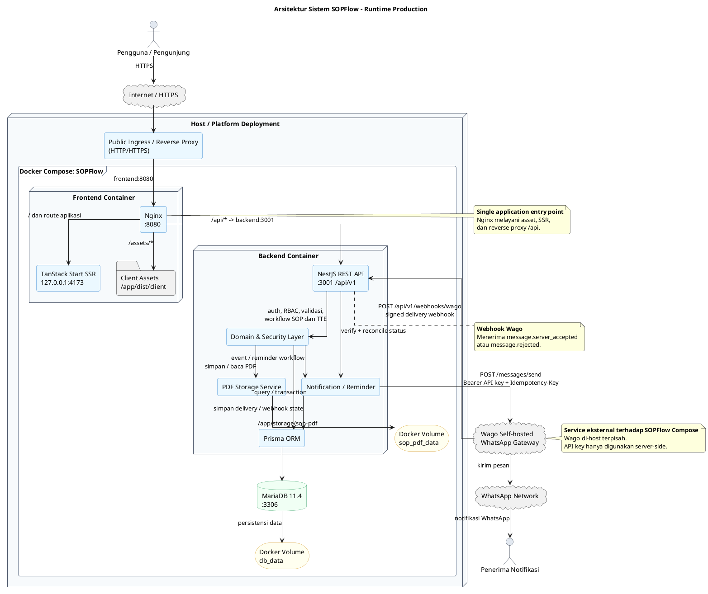
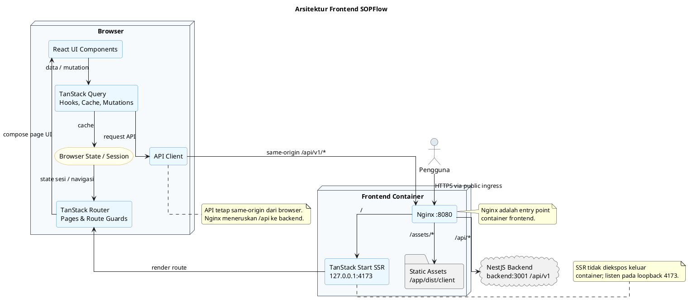
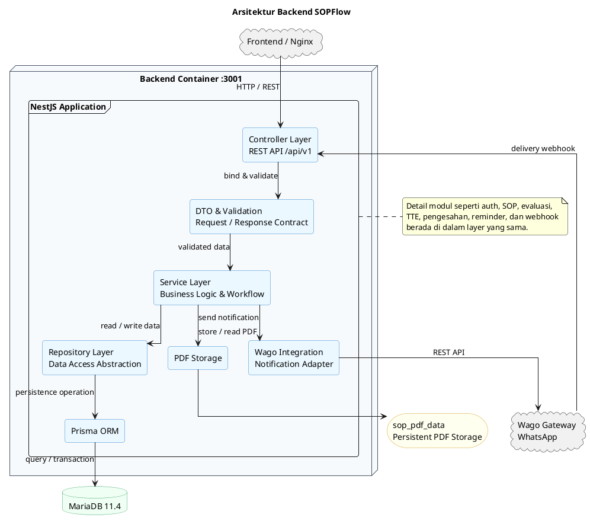
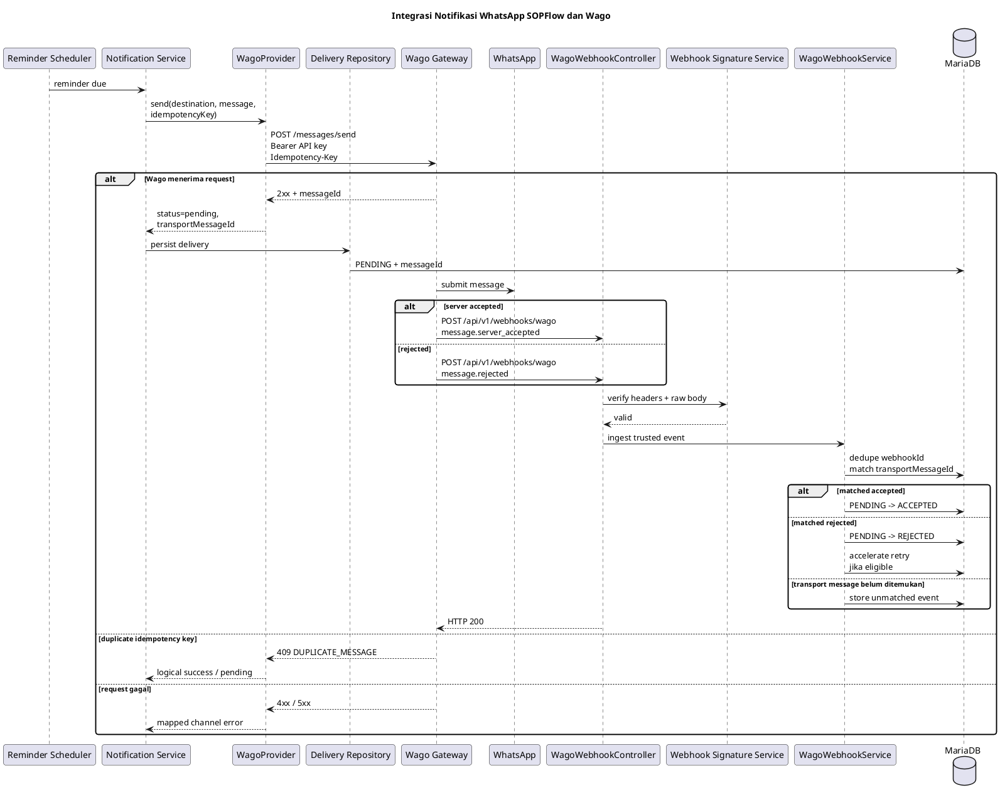

# Arsitektur Sistem SOPFlow

Dokumen ini menggambarkan arsitektur implementasi SOPFlow berdasarkan codebase dan deployment Docker yang aktif saat ini. Diagram PlantUML pada dokumen ini menjadi dokumentasi arsitektur yang harus ikut diperbarui ketika topologi runtime, storage, atau integrasi eksternal berubah.

## Gambaran umum

SOPFlow adalah aplikasi berbasis web dengan tiga service utama pada Docker Compose: `frontend`, `backend`, dan `db`. Wago berjalan sebagai gateway WhatsApp self-hosted terpisah dan diintegrasikan dari backend.

Alur runtime utama:

```text
Browser
  |
  | HTTPS / public ingress
  v
Reverse proxy / platform ingress
  |
  v
Frontend Nginx :8080
  | \
  |  \ / -> TanStack Start SSR :4173
  |
  +---- /api -> NestJS Backend :3001
                    |
                    +--> Prisma -> MariaDB :3306
                    |
                    +--> persistent PDF storage
                    |
                    +--> Wago self-hosted
                           |
                           +--> WhatsApp
                           |
                           +--> signed delivery webhook -> SOPFlow
```

Port di atas adalah port internal container/service. Pengguna publik tidak perlu membuka port `8080`, `4173`, `3001`, atau `3306` secara langsung. Public ingress/reverse proxy menangani HTTP/HTTPS dan meneruskan traffic ke service frontend.

### Diagram arsitektur sistem



Diagram tersebut menggambarkan boundary runtime aktif. Wago tidak menjadi container di `compose.yml` SOPFlow; Wago adalah gateway terpisah yang diakses backend melalui `WAGO_BASE_URL`.

## Frontend

Frontend menggunakan React, Vite, dan TanStack Start. Production image menjalankan Nginx pada port internal `8080` dan server SSR TanStack Start pada loopback `127.0.0.1:4173`.

- Nginx berjalan sebagai user non-root.
- `/assets/` dilayani langsung dari bundle client.
- `/api/` diteruskan ke `backend:3001`.
- route aplikasi selain `/api/` dan `/assets/` diteruskan ke TanStack Start SSR pada `127.0.0.1:4173`.
- frontend tidak membutuhkan Linux capability `NET_BIND_SERVICE` karena bind pada port `8080`, bukan privileged port `80`.
- browser berinteraksi melalui hostname publik yang ditangani reverse proxy/platform deployment.

### Diagram arsitektur frontend



## Backend

Backend menggunakan NestJS/TypeScript dan berjalan pada port internal `3001` pada Compose production. Pada level arsitektur, backend ditampilkan sebagai layered application agar diagram menjelaskan pemisahan tanggung jawab tanpa masuk ke detail setiap modul bisnis.

Lapisan utama backend:

- **Controller** menerima request HTTP dan mengekspos endpoint REST;
- **DTO & Validation** mendefinisikan kontrak data request/response serta validasi input;
- **Service** menjalankan business logic dan workflow aplikasi;
- **Repository** mengabstraksikan akses data dari business logic;
- **Prisma ORM** menjadi implementasi akses persistence ke MariaDB;
- **Wago Integration** menghubungkan service backend dengan gateway WhatsApp eksternal;
- **PDF Storage** menangani penyimpanan artefak PDF pada persistent volume.

Detail autentikasi, workflow SOP, reminder, webhook, retry, dan mekanisme delivery Wago merupakan detail implementasi di dalam layer tersebut dan tidak ditampilkan pada diagram backend tingkat tinggi.

Backend menjalankan Prisma migration sebelum start production melalui `pnpm prisma migrate deploy`.

### Diagram arsitektur backend



Diagram backend ini sengaja berhenti pada boundary layer aplikasi. Detail internal integrasi Wago tetap dijelaskan pada bagian **Notifikasi** agar diagram arsitektur utama tetap mudah dibaca.

## Database

Database menggunakan MariaDB 11.4 pada Compose, port internal `3306`.

Volume `db_data` menyimpan data database secara persisten. Database tidak perlu dipublikasikan ke internet pada deployment normal.

Prisma menjadi lapisan akses database aplikasi. Constraint/invariant pada migration merupakan bagian dari kontrak persistence production.

## PDF dan TTE storage

PDF hasil proses signing tidak disimpan di MinIO/S3 pada implementasi sekarang. Backend menggunakan filesystem persistent:

```text
/app/storage/sop-pdf
```

Compose memasang Docker volume:

```text
sop_pdf_data -> /app/storage/sop-pdf
```

Database menyimpan data domain, credential/metadata TTE yang diperlukan, serta informasi untuk menghubungkan signature dengan workflow. Artefak PDF tetap berada pada persistent storage backend.

Detail TTE dijelaskan pada:

- `docs/detail_workflow_dan_teknis_tte.md`
- `docs/tanda_tangan_elektronik_dan_ca.md`

## Notifikasi

### In-app

Reminder in-app dijalankan oleh scheduler backend dan tidak memerlukan provider eksternal.

### WhatsApp melalui Wago

Provider aktif adalah `WagoProvider`. SOPFlow dan Wago mempunyai dua arah integrasi yang berbeda:

1. **Outbound command** — SOPFlow mengirim pesan ke Wago melalui `POST /messages/send`.
2. **Inbound delivery event** — Wago mengirim webhook bertanda tangan ke `POST /api/v1/webhooks/wago`.

Outbound request menggunakan:

- `Authorization: Bearer <WAGO_API_KEY>`;
- `Content-Type: application/json`;
- `Idempotency-Key` untuk logical reminder occurrence;
- payload `to` dan `text`.

Konfigurasi utama:

- `WAGO_BASE_URL` kosong + `WAGO_API_KEY` kosong: outbound WhatsApp nonaktif;
- keduanya terisi: outbound WhatsApp aktif;
- hanya salah satu terisi: konfigurasi invalid dan backend menolak startup;
- `WAGO_REQUEST_TIMEOUT_MS`: timeout request outbound;
- `WAGO_WEBHOOK_SECRET`: secret minimal 32 karakter untuk memverifikasi webhook Wago ketika receiver webhook dikonfigurasi.

Recipient policy tidak disimpan ulang atau dikelola oleh SOPFlow. Nomor receiver harus di-allow secara manual pada Wago. SOPFlow tidak mencoba membypass policy Wago.

Setiap logical reminder occurrence membawa `Idempotency-Key` yang stabil selama retry. Respons Wago `DUPLICATE_MESSAGE` untuk key occurrence yang sama diperlakukan sebagai logical success agar timeout/retry transport tidak menggandakan pesan.

Setelah outbound request diterima Wago, `WagoProvider` menyimpan `messageId` transport sebagai delivery berstatus pending. Wago kemudian dapat mengirim salah satu event:

- `message.server_accepted` dengan status `accepted`;
- `message.rejected` dengan status `rejected` dan optional error code.

Receiver webhook:

- memerlukan `Webhook-Id`, `Webhook-Timestamp`, `Webhook-Signature`, dan `X-Wago-Event`;
- memverifikasi signature terhadap raw request body;
- memvalidasi envelope event;
- mendeduplikasi `Webhook-Id`;
- mencocokkan event dengan transport `messageId`;
- menyimpan event unmatched secara durable agar dapat direkonsiliasi;
- mengubah delivery `PENDING` menjadi `ACCEPTED` atau `REJECTED`;
- dapat mempercepat jadwal retry untuk rejection yang eligible.

### Diagram integrasi Wago



Suite integration Evolution API lama bukan bagian dari source module notifikasi aktif. Integrasi aktif adalah Wago.

## Deployment Docker Compose

Service pada `compose.yml`:

### `db`

- image: MariaDB 11.4;
- volume: `db_data`;
- healthcheck database;
- hanya dibutuhkan oleh backend.

### `backend`

- build dari `server/Dockerfile`;
- internal port/expose `3001`;
- menunggu database healthy;
- menjalankan Prisma migration lalu NestJS;
- volume `sop_pdf_data` untuk artefak PDF;
- `cap_drop: ALL` dan `no-new-privileges`;
- menggunakan `WAGO_BASE_URL`, `WAGO_API_KEY`, `WAGO_WEBHOOK_SECRET`, dan `WAGO_REQUEST_TIMEOUT_MS` bila integrasi WhatsApp dikonfigurasi.

### `frontend`

- build dari `client/Dockerfile`;
- Nginx internal `8080`;
- TanStack Start SSR internal `127.0.0.1:4173`;
- menunggu backend healthy;
- `cap_drop: ALL`;
- tidak membutuhkan `cap_add`.

Wago di-host sebagai service/gateway terpisah. SOPFlow membutuhkan base URL Wago dan API key untuk outbound. Untuk delivery webhook, endpoint SOPFlow harus dapat dijangkau Wago dan kedua service harus memiliki webhook secret yang sesuai. Secret dan API key tidak boleh dimasukkan ke bundle frontend.

## Reverse proxy dan MyPaas

Pada deployment melalui platform seperti MyPaas, reverse proxy/public ingress menerima request publik pada HTTP/HTTPS dan mengarahkan hostname aplikasi ke internal frontend port `8080`.

Dengan demikian:

- port publik tetap mengikuti ingress/reverse proxy, umumnya `80/443`;
- target aplikasi frontend di dalam deployment adalah `8080`;
- backend `3001` dan database `3306` tidak perlu diekspos sebagai public application port;
- `/api/v1/webhooks/wago` tetap dapat dicapai melalui hostname publik SOPFlow dan diteruskan oleh Nginx ke backend.

## Security boundary

Secret berikut tidak boleh di-hardcode atau dicommit:

- password database;
- JWT secret dan refresh secret;
- `TTE_ENCRYPTION_SECRET`;
- `WAGO_API_KEY`;
- `WAGO_WEBHOOK_SECRET`.

Auth menggunakan cookie/JWT sesuai implementasi backend. CORS production harus menggunakan origin eksplisit karena request authenticated memakai credentials.

Wago API key hanya digunakan untuk request **SOPFlow -> Wago**. Webhook secret digunakan untuk memverifikasi request **Wago -> SOPFlow**; keduanya memiliki fungsi dan trust boundary yang berbeda.

Private key TTE berada di dalam P12 personal pengguna pada model internal SOPFlow. Untuk production pemerintah yang membutuhkan sertifikat resmi, rekomendasi arsitekturnya adalah integrasi PSrE/BSrE sehingga custody private key tidak berada di aplikasi ini.

## CI dan testing

CI utama memeriksa server dan client melalui typecheck, lint, unit test, build, serta critical Playwright journeys. Dokumentasi integration test aktual ada pada `docs/integration-test.md`.

Dokumen laporan test yang memuat jumlah test/coverage adalah snapshot historis pada commit/run tertentu. Status branch terkini harus dilihat dari CI commit tersebut.

## Komponen yang tidak merupakan arsitektur aktif

Dokumentasi lama pernah menyebut beberapa komponen berikut, tetapi komponen tersebut bukan bagian dari runtime SOPFlow saat ini:

- PostgreSQL;
- S3/MinIO;
- Evolution API notification module;
- HSM/KMS production;
- OCSP/TSA eksternal;
- PSrE/BSrE integration.

Komponen production-grade TTE tersebut dapat menjadi pengembangan lanjutan dan tidak boleh digambarkan sebagai fitur yang sudah diimplementasikan.
