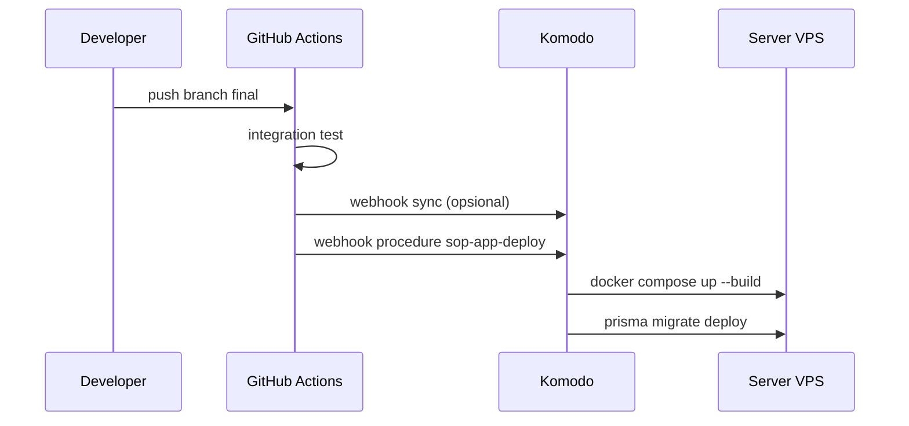

# Deploy otomatis dengan Komodo

Alur produksi: **push ke `final`** → GitHub Actions (tes + webhook) → Komodo deploy + migrasi. Tidak perlu klik deploy manual di dashboard.

## Alur otomatis



## Setup sekali (±15 menit)

### 1. Komodo di VPS

Ikuti [Quickstart Komodo](https://komo.do/docs/quickstart): Core + Periphery, server terdaftar sebagai **`server-prod`** (atau ubah `server` di `komodo/stack.toml`).

Set di environment Core:

- `KOMODO_WEBHOOK_SECRET` — string acak (dipakai GitHub + Komodo)

### 2. GitHub di Komodo

**Settings → Git Providers** → hubungkan akun **howlil**.

### 3. Variables di **Komodo**

**Cara cepat** (dari `.env` lokal, tidak masuk Git):

```powershell
python scripts/env-to-komodo.py
```

Lalu **Settings → Variables → Toml** → paste isi `komodo/variables.local.toml` → Save.

Alternatif: salin blok `[secrets]` dari `komodo/secrets-core.snippet.toml` ke `core.config.toml` / `periphery.config.toml` di VPS, lalu restart.

Hanya kunci yang dipakai `stack.toml` (`[[DB_PASSWORD]]`, dll.) yang di-generate. Frontend & URL verifikasi QR tidak perlu variable Komodo.

### 4. Resource Sync (satu kali)

**New → Resource Sync** → impor isi [`komodo/bootstrap.toml`](../komodo/bootstrap.toml)  
atau salin konfigurasi dari [`komodo/resource-sync.toml`](../komodo/resource-sync.toml).

Jalankan **Sync** sekali → Stack `sop-app` + Procedure `sop-app-deploy` terbuat dari repo.

### 5. Secret di GitHub repo

**Settings → Secrets and variables → Actions**:

| Secret | Nilai |
|--------|--------|
| `KOMODO_WEBHOOK_SECRET` | Sama dengan di Komodo Core |
| `KOMODO_PROCEDURE_WEBHOOK_URL` | Dari UI procedure → Webhooks, branch `final` |
| `KOMODO_SYNC_WEBHOOK_URL` | Opsional: Resource Sync → Webhooks → `/sync` |

Contoh URL procedure:

```text
https://<HOST_KOMODO>/listener/github/procedure/sop-app-deploy/final
```

Contoh URL sync:

```text
https://<HOST_KOMODO>/listener/github/sync/sop-app-resources/sync
```

Setelah ini, **setiap push ke `final`** menjalankan workflow [`.github/workflows/cd.yml`](../.github/workflows/cd.yml):

1. Integration test  
2. Sync definisi Komodo (jika `KOMODO_SYNC_WEBHOOK_URL` di-set)  
3. Trigger deploy + migrasi  

## File penting

| File | Peran |
|------|--------|
| `.github/workflows/cd.yml` | CI/CD GitHub — memicu Komodo |
| `scripts/trigger-komodo-github-webhook.sh` | Kirim payload + signature ke listener |
| `komodo/stack.toml` | Definisi stack (GitOps) |
| `komodo/procedure.toml` | Deploy + `prisma migrate` |
| `komodo/resource-sync.toml` | Sync TOML dari repo |
| `.env` | Hanya untuk uji lokal (`docker compose`) |

## Uji lokal (tanpa Komodo)

```powershell
docker compose -f docker-compose.prod.yml --env-file .env up --build -d
docker compose -f docker-compose.prod.yml exec -T backend pnpm prisma migrate deploy
```

## Troubleshooting

| Masalah | Solusi |
|---------|--------|
| Workflow gagal "Secrets not set" | Isi `KOMODO_PROCEDURE_WEBHOOK_URL` + `KOMODO_WEBHOOK_SECRET` |
| Webhook 401/403 | Secret harus identik di GitHub dan Komodo |
| Deploy tidak jalan | Procedure & stack harus ada (jalankan Resource Sync sekali) |
| Branch salah | Hanya **`final`** yang memicu CD |

## Referensi

- [Webhooks](https://komo.do/docs/automate/webhooks)
- [Sync Resources](https://komo.do/docs/automate/sync-resources)
- [Procedures](https://komo.do/docs/automate/procedures)
