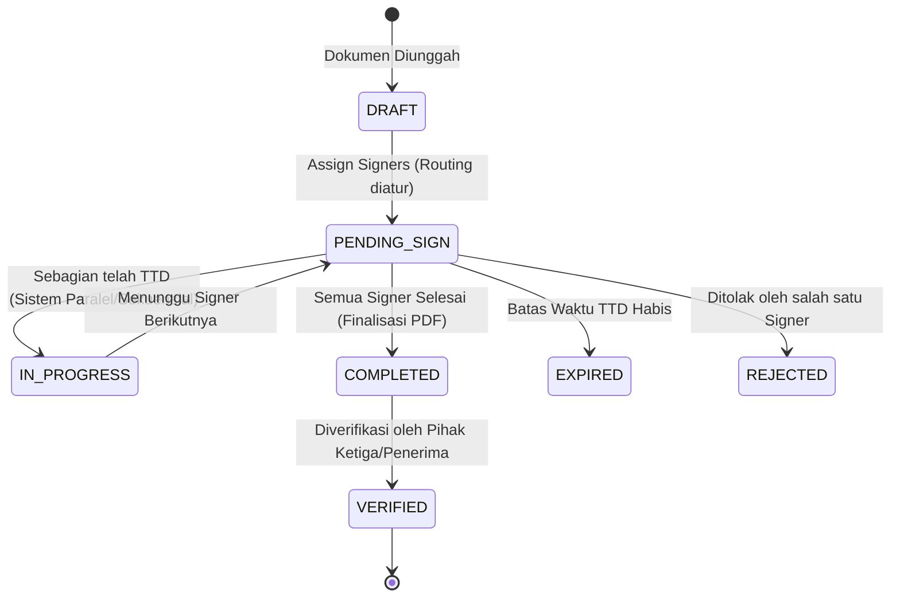

# Dokumentasi Lanjutan: Detail Workflow dan Spesifikasi Teknis TTE

Dokumen ini merupakan penjabaran mendalam (Deep-Dive) dari proses bisnis operasional (Workflow) dan implementasi teknis tingkat rendah (Spesifikasi API, payload JSON, topologi, dan siklus hidup) untuk membangun/mengintegrasikan sistem Tanda Tangan Elektronik dengan Certificate Authority (CA).

---

## 1. Detail Workflow (Siklus Hidup Dokumen)

Sistem TTE yang handal harus mengelola "State" (status) dari setiap dokumen secara ketat. Berikut adalah pemetaan siklus hidup dari sebuah dokumen sejak diunggah hingga diverifikasi.

### A. State Diagram Dokumen


### B. Penjelasan Workflow Operasional
1.  **Preparation (DRAFT):** Pengguna sebagai *Uploader/Initiator* mengunggah file PDF. Pada tahap ini, *Initiator* memetakan letak visual tanda tangan (mengatur koordinat X, Y, dan halaman) serta menentukan urutan/alur (misal: "Sekretaris harus TTD dahulu, baru Direktur Utama").
2.  **Notification (PENDING_SIGN):** Sistem mengirimkan notifikasi (Email / Push Notification App) yang berisi *Deep Link* aman ke masing-masing pihak (Signer).
3.  **Authentication & Consent:**
    *   Signer membuka tautan dan melakukan login.
    *   Sistem secara sinkronus melakukan pengecekan ke CA (via API) untuk memvalidasi apakah sertifikat elektronik Signer tersebut aktif (belum dicabut / *Revoked*).
    *   Signer menekan tombol **"Tanda Tangani"** dan aplikasi memunculkan prompt untuk memasukkan *Faktor Autentikasi Ke-2 (2FA)*, seperti PIN 6 digit atau OTP ke WhatsApp/SMS. 
    *   **Catatan Hukum:** Pemasukan OTP/PIN ini berfungsi sebagai bukti *Consent* (Persetujuan sadar/Niat hukum) bahwa individu tersebut bermaksud menyetujui isi dokumen.
4.  **Signing Execution:** Aplikasi mengambil *Hash* dokumen dan mengeksekusi API Sign ke CA. (Penjelasan payload API ada di Bab 2).
5.  **Completion (COMPLETED):** Setelah seluruh pihak menandatangani, aplikasi mengunci struktur PDF dengan menyuntikkan *Time Stamp Token* (TSA) agar waktu terverifikasi. Dokumen *Signed PDF* kemudian siap diunduh (atau dikirim otomatis via email).

---

## 2. Spesifikasi Teknis & Interaksi API (Low-Level)

Untuk membangun sistem ini, Backend Aplikasi Anda (*App Server*) harus berkomunikasi dengan API milik Penyelenggara Sertifikasi Elektronik (CA / PSrE). Berikut adalah gambaran payload teknisnya.

### A. API Registration & e-KYC (Penerbitan Sertifikat)
Ini adalah proses mendaftarkan identitas digital (X.509) untuk pertama kali. 

**1. Request Payload (App Server -> API CA):**
```json
POST /api/v1/ca/register
Content-Type: application/json
Authorization: Bearer {API_KEY_PERUSAHAAN}

{
  "user": {
    "nik": "3171234567890123",
    "fullName": "Budi Santoso",
    "email": "budi.santoso@perusahaan.com",
    "phone": "+628123456789",
    "biometricData": "base64_encoded_liveness_video_or_selfie...",
    "idCardImage": "base64_encoded_ktp_image..."
  },
  "certificateProfile": "Class 3 - Individual"
}
```

**2. Response Payload (CA -> App Server):**
```json
{
  "status": "SUCCESS",
  "certificateId": "CERT-2023-99881122",
  "validFrom": "2023-10-01T00:00:00Z",
  "validTo": "2024-10-01T00:00:00Z",
  "message": "Identity verified via Dukcapil. KeyPair generated safely in HSM."
}
```
*Catatan:* Pada tahap ini, *Private Key* tidak pernah dikembalikan ke App Server, melainkan diamankan dalam ruang tertutup di dalam HSM (Hardware Security Module) milik CA.

### B. API Signing (Proses Kriptografi)
Demi privasi data, **dokumen asli (PDF) DILARANG keras dikirim ke CA**. Aplikasi hanya mengirimkan jejak digital/sidik jari (*Hash Value*) dari dokumen tersebut.

**1. Persiapan Hashing oleh App Server (Lokal):**
```python
# Pseudo-code Hashing menggunakan Python
import hashlib

file_bytes = read_file_as_bytes("kontrak_kerja.pdf")
hash_value = hashlib.sha256(file_bytes).digest()
hash_hex = hash_value.hex()
# Hasil contoh: "e3b0c44298fc1c149afbf4c8996fb92427ae41e4649b934ca495991b7852b855"
```

**2. Request Payload (App Server -> API Sign CA):**
```json
POST /api/v1/ca/sign
Content-Type: application/json

{
  "certificateId": "CERT-2023-99881122",
  "passphraseOrOTP": "908172", 
  "hashAlgorithm": "SHA-256",
  "documentHash": "e3b0c44298fc1c149afbf4c8996fb92427ae41e4649b934ca495991b7852b855"
}
```

**3. Eksekusi Kritis di Dalam HSM CA:**
*   API CA memvalidasi nilai OTP/PIN (`908172`). Jika benar, CA memberikan mandat ke HSM.
*   HSM memanggil *Private Key* yang terhubung dengan identitas `CERT-2023-99881122`.
*   HSM melakukan operasi matematika enkripsi (algoritma RSA 2048-bit atau ECDSA) terhadap nilai `documentHash`. Hasilnya disebut *Cipher Text* / *Digital Signature*.

**4. Response Payload (CA -> App Server):**
```json
{
  "status": "SUCCESS",
  "digitalSignature": "Base64_Encoded_Encrypted_Hash_Block...",
  "timestampToken": "Base64_RFC3161_Token_From_NTP_Server..." 
}
```

**5. Penggabungan/Pembentukan PDF Akhir (PAdES):**
App Server menerima respons di atas, dan menggunakan modul manipulasi PDF (contoh: iText, PDFBox) untuk menyuntikkan (inject) data ke metadata file PDF asli.
*   Ke dalam file PDF tersebut dimasukkan *Cryptographic Message Syntax* (CMS/PKCS#7) yang berisi 3 hal utama:
    1. The `digitalSignature` (Data yang dari CA).
    2. Sertifikat X.509 Publik milik penandatangan (Agar nanti Adobe Reader bisa memverifikasi).
    3. The `timestampToken` (Sebagai pengesahan waktu).

### C. Protokol Verifikasi Teknis (OCSP - Online Certificate Status Protocol)
Saat pihak penerima membuka file PDF menggunakan **Adobe Acrobat Reader**, Adobe tidak sekadar mengecek struktur matematis, tetapi akan diam-diam menembak API milik CA (secara background) untuk mengecek legalitas sertifikat.
1.  **OCSP Request:** Adobe mengekstrak Sertifikat X.509 dari PDF, mencari URL OCSP di dalamnya, lalu menembak: *"Apakah Sertifikat dengan Serial 0x12345ABC ini masih hidup?"*
2.  **OCSP Response:** Server CA merespons secara real-time. 
    *   Jika respons `status: good`, Adobe menampilkan **Tanda Centang Hijau** (Signature Valid).
    *   Jika respons `status: revoked` (karena user melaporkan HP/akunnya diretas sehingga CA mencabut sertifikatnya), Adobe menampilkan **Silang Merah** (Signature Invalid).

---

## 3. Topologi Infrastruktur dan Keamanan

Bagaimana arsitektur jaringan secara fisik (atau Cloud) agar sistem TTE diakui keamanannya?

```mermaid
graph TD
    UserClient[Web Browser / Mobile App] -- HTTPS (TLS 1.3) --> AppGateway(API Gateway Perusahaan)
    AppGateway --> AppService(Document Signing Service)
    
    subgraph Internal Network (Perusahaan Anda)
        AppService -- Local / VPC --> Database[(PostgreSQL - Meta Dokumen & Audit Trail)]
        AppService -- Local / VPC --> ObjectStorage[(S3 / MinIO - Encrypted PDF)]
    end
    
    subgraph CA / PSrE Network (Highly Secured Zone)
        AppService -- mTLS / IPSEC VPN --> CA_API[CA Endpoint API]
        CA_API --> KMS_HSM[Hardware Security Module - FIPS 140-2 Level 3]
        CA_API --> CA_DB[(CA Directory & Revocation DB)]
        CA_API --> TSA[Time Stamping Server (NTP Sync Nasional)]
    end
```

### Analisis Komponen Topologi:
1.  **Jalur Koneksi Perusahaan <-> CA (mTLS / VPN):** Komunikasi antara App Service dan API CA sangat rentan. Oleh karena itu, koneksi ini biasanya tidak hanya dilindungi TLS biasa, melainkan **Mutual TLS (mTLS)** di mana server perusahaan dan server CA saling memberikan sertifikat SSL khusus untuk membuktikan identitas masing-masing sebelum terhubung, atau dipisahkan lewat jalur *Leased Line/IPSec VPN*.
2.  **KMS/HSM (Hardware Security Module):** HSM bukan server biasa. Ini adalah perangkat keras baja tebal standar militer (*FIPS 140-2 Level 3/4*). Jika ada orang mencoba membongkar cangkang HSM secara fisik atau memanipulasi tegangannya untuk mencuri *Private Key*, sensor internal (tamper-response) akan secara otomatis **menghanguskan/menghapus secara permanen (Zeroization)** seluruh data di dalamnya.
3.  **Audit Trail Database:** Semua aktivitas di App Service (Jam berapa user akses, IP address berapa, perangkat apa, OTP dikirim kemana) wajib dicatat dalam *Immutable Audit Log* sebagai pendukung bukti validitas niat TTE (*Intention to Sign*) di pengadilan.
