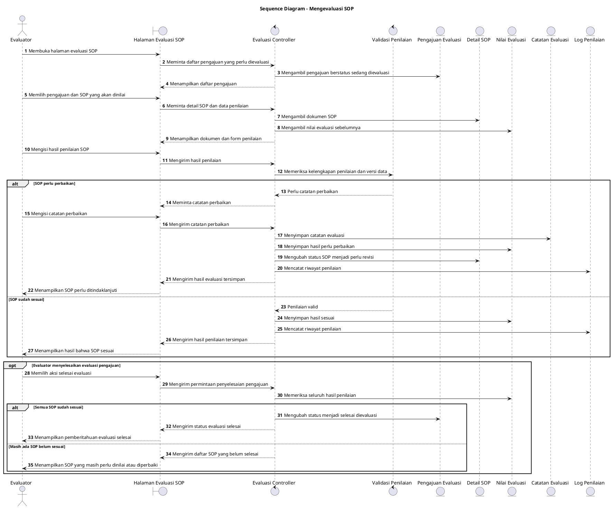

# Sequence Diagram: Evaluator - Mengevaluasi SOP

Sumber use case: `UC-11` pada [`../usecase.md`](../usecase.md).

## Metadata

| Elemen | Deskripsi |
| :--- | :--- |
| Use case | Mengevaluasi SOP |
| Aktor utama | Evaluator |
| Nomor kebutuhan fungsional | 15 |
| Tujuan | Menggambarkan proses evaluator memeriksa SOP, menyimpan hasil penilaian, dan menyelesaikan evaluasi pengajuan. |

## PlantUML

