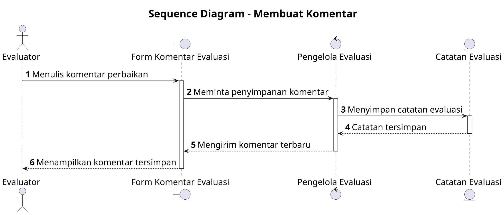

# Sequence Diagram: Evaluator - Membuat Komentar

Sumber use case: `UC-12` pada [`../../usecase.md`](../../usecase.md).

## Metadata

| Elemen | Deskripsi |
| :--- | :--- |
| Use case | Membuat Komentar |
| Aktor utama | Evaluator |
| Nomor kebutuhan fungsional | 16 |
| Tujuan | Menggambarkan interaksi evaluator dan sistem saat memberikan catatan perbaikan pada hasil evaluasi SOP. |

## PlantUML

