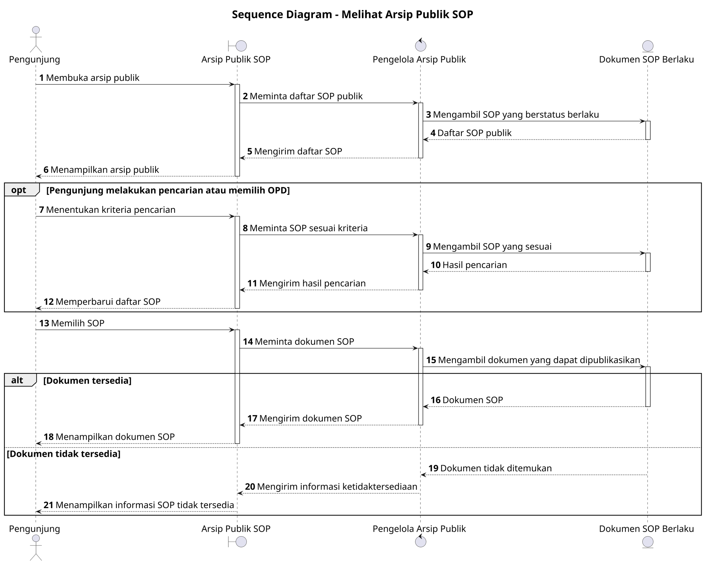

# Sequence Diagram: Pengunjung - Melihat Arsip Publik SOP

Sumber use case: `UC-19` pada [`../../usecase.md`](../../usecase.md).

## Metadata

| Elemen | Deskripsi |
| :--- | :--- |
| Use case | Melihat Arsip Publik SOP |
| Aktor utama | Pengunjung |
| Nomor kebutuhan fungsional | 22 |
| Tujuan | Menggambarkan interaksi pengunjung dan sistem saat mencari serta melihat SOP yang tersedia pada arsip publik. |

## PlantUML

