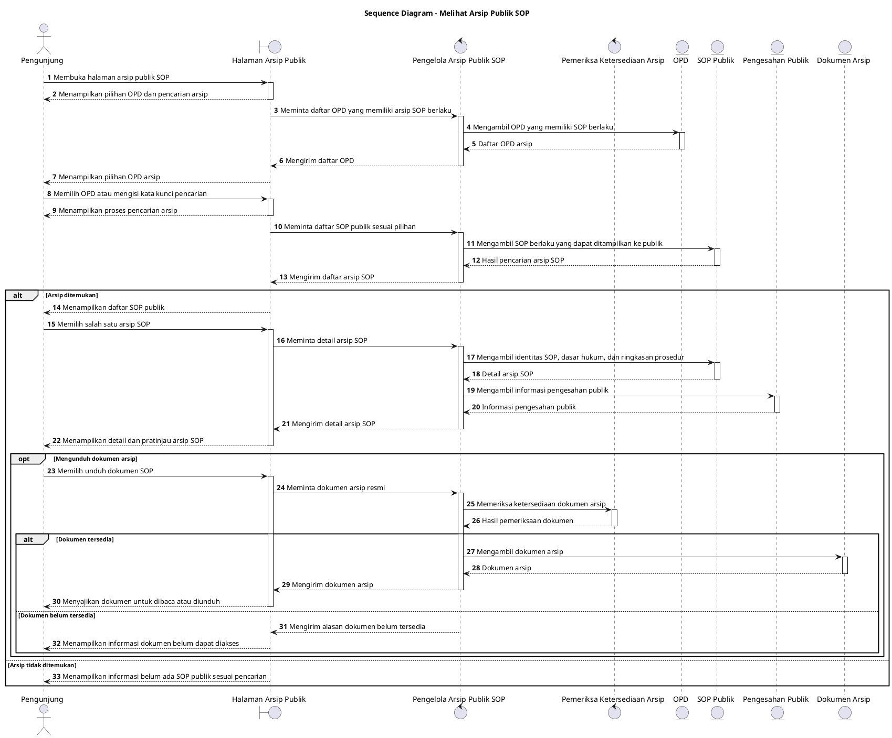

# Sequence Diagram: Pengunjung - Melihat Arsip Publik SOP

Sumber use case: `UC-19` pada [`../../usecase.md`](../../usecase.md).

## Metadata

| Elemen | Deskripsi |
| :--- | :--- |
| Use case | Melihat Arsip Publik SOP |
| Aktor utama | Pengunjung |
| Nomor kebutuhan fungsional | 22, 21 |
| Tujuan | Menggambarkan proses pengunjung tanpa login melihat OPD, mencari SOP berlaku, membuka detail, dan mengakses dokumen digital arsip. |

## PlantUML

