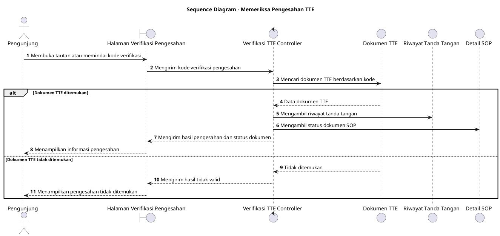

# Sequence Diagram: Pengunjung - Memeriksa Pengesahan TTE

Sumber use case: `UC-20` pada [`../../usecase.md`](../../usecase.md).

## Metadata

| Elemen | Deskripsi |
| :--- | :--- |
| Use case | Memeriksa Pengesahan TTE |
| Aktor utama | Pengunjung |
| Nomor kebutuhan fungsional | 23 |
| Tujuan | Menggambarkan proses pemeriksaan pengesahan tanda tangan elektronik melalui tautan atau kode verifikasi. |

## PlantUML

