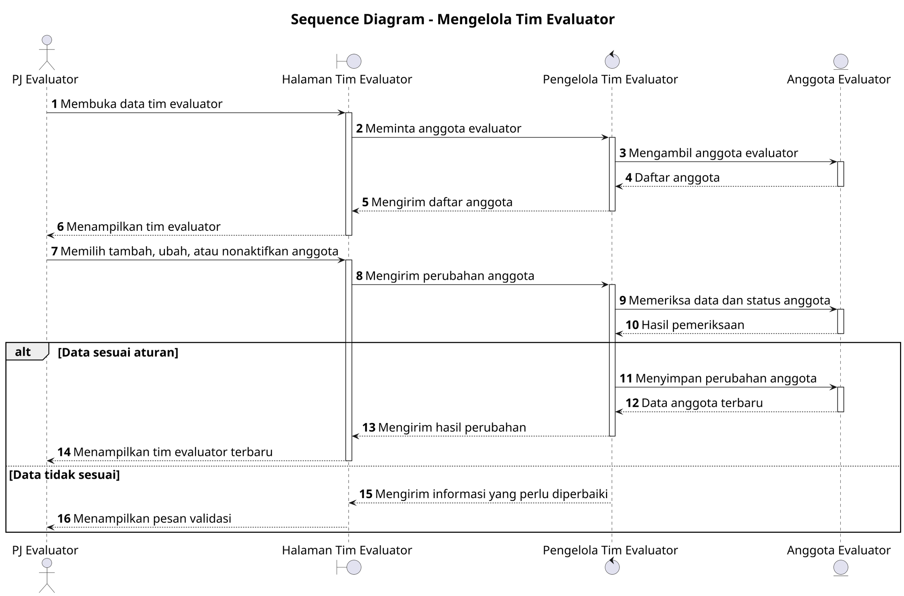

# Sequence Diagram: PJ Evaluator - Mengelola Tim Evaluator

Sumber use case: `UC-06` pada [`../../usecase.md`](../../usecase.md).

## Metadata

| Elemen | Deskripsi |
| :--- | :--- |
| Use case | Mengelola Tim Evaluator |
| Aktor utama | PJ Evaluator |
| Nomor kebutuhan fungsional | 2 |
| Tujuan | Menggambarkan interaksi PJ Evaluator dan sistem saat mengelola anggota tim evaluator. |

## PlantUML

