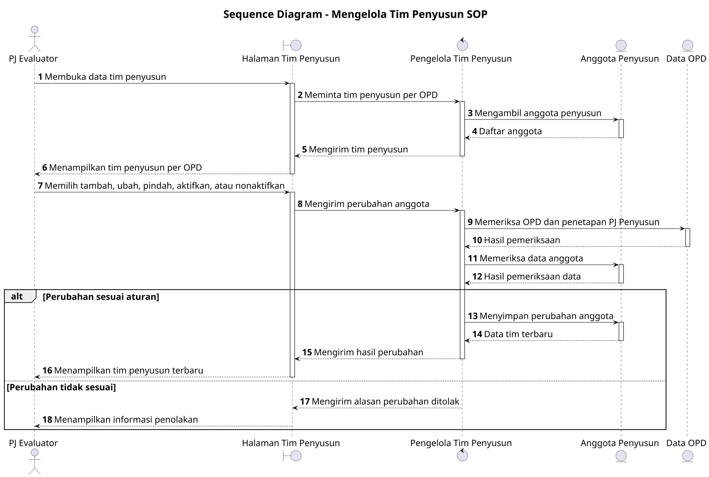

# Sequence Diagram: PJ Evaluator - Mengelola Tim Penyusun SOP

Sumber use case: `UC-08` pada [`../../usecase.md`](../../usecase.md).

## Metadata

| Elemen | Deskripsi |
| :--- | :--- |
| Use case | Mengelola Tim Penyusun SOP |
| Aktor utama | PJ Evaluator |
| Nomor kebutuhan fungsional | 3 |
| Tujuan | Menggambarkan interaksi PJ Evaluator dan sistem saat mengelola PJ Penyusun dan anggota Penyusun pada OPD. |

## PlantUML

