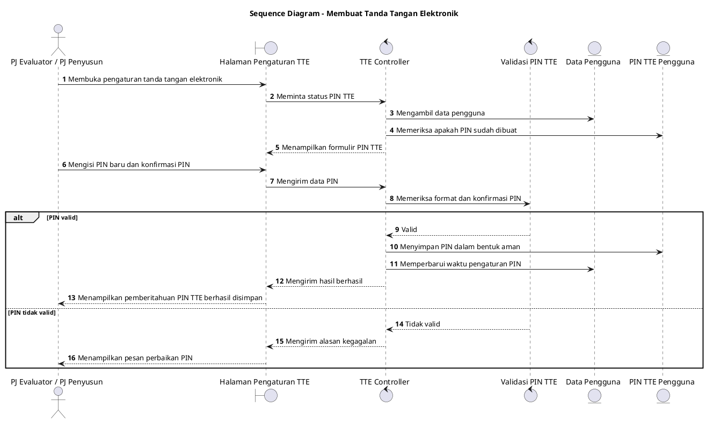

# Sequence Diagram: PJ Evaluator/PJ Penyusun - Membuat Tanda Tangan Elektronik

Sumber use case: `UC-09` pada [`../../usecase.md`](../../usecase.md).

## Metadata

| Elemen | Deskripsi |
| :--- | :--- |
| Use case | Membuat Tanda Tangan Elektronik |
| Aktor utama | PJ Evaluator, PJ Penyusun |
| Nomor kebutuhan fungsional | 9 |
| Tujuan | Menggambarkan proses pembuatan atau perubahan PIN tanda tangan elektronik. |

## PlantUML

