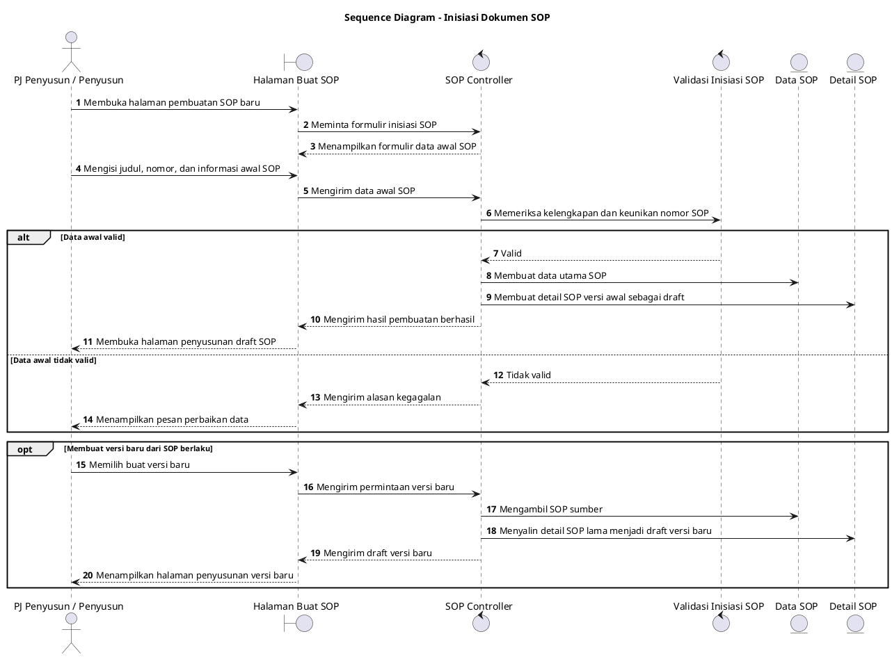

# Sequence Diagram: PJ Penyusun/Penyusun - Inisiasi Dokumen SOP

Sumber use case: `UC-16` pada [`../../usecase.md`](../../usecase.md).

## Metadata

| Elemen | Deskripsi |
| :--- | :--- |
| Use case | Inisiasi Dokumen SOP |
| Aktor utama | PJ Penyusun, Penyusun |
| Nomor kebutuhan fungsional | 10 |
| Tujuan | Menggambarkan proses pembuatan wadah awal dokumen SOP sebelum penyusunan draft. |

## PlantUML

