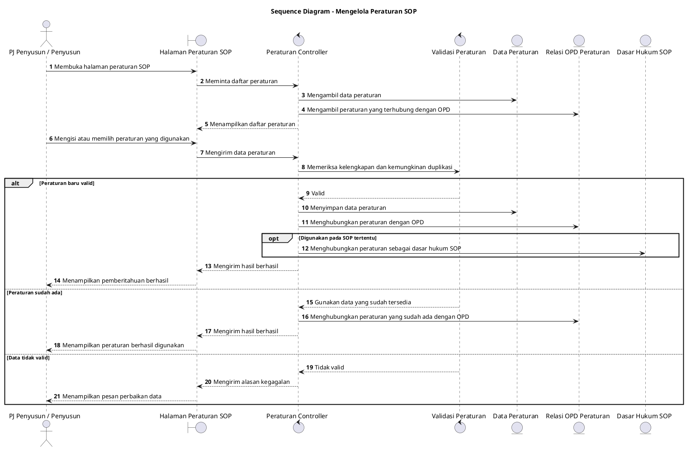

# Sequence Diagram: PJ Penyusun/Penyusun - Mengelola Peraturan SOP

Sumber use case: `UC-18` pada [`../../usecase.md`](../../usecase.md).

## Metadata

| Elemen | Deskripsi |
| :--- | :--- |
| Use case | Mengelola Peraturan SOP |
| Aktor utama | PJ Penyusun, Penyusun |
| Nomor kebutuhan fungsional | 5 |
| Tujuan | Menggambarkan proses pengelolaan peraturan sebagai dasar hukum SOP. |

## PlantUML

