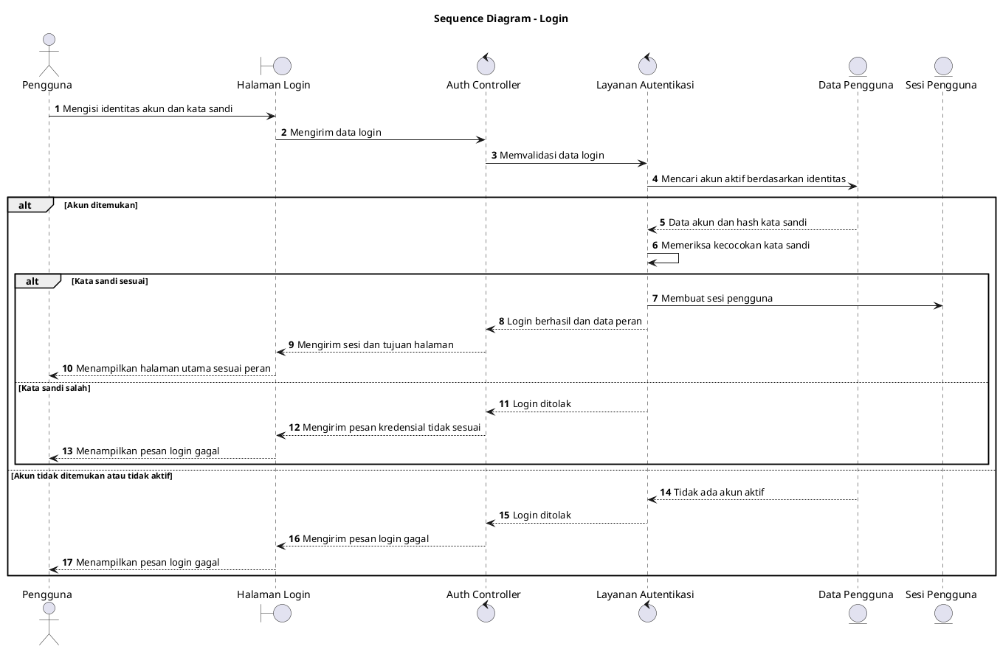

# Sequence Diagram: Seluruh Pengguna - Login

Sumber use case: `UC-01` pada [`../../usecase.md`](../../usecase.md).

## Metadata

| Elemen | Deskripsi |
| :--- | :--- |
| Use case | Login |
| Aktor utama | PJ Evaluator, Evaluator, Kepala OPD, PJ Penyusun, Penyusun |
| Nomor kebutuhan fungsional | 7 |
| Tujuan | Menggambarkan proses pengguna masuk ke sistem dan memperoleh sesi sesuai peran. |

## PlantUML

