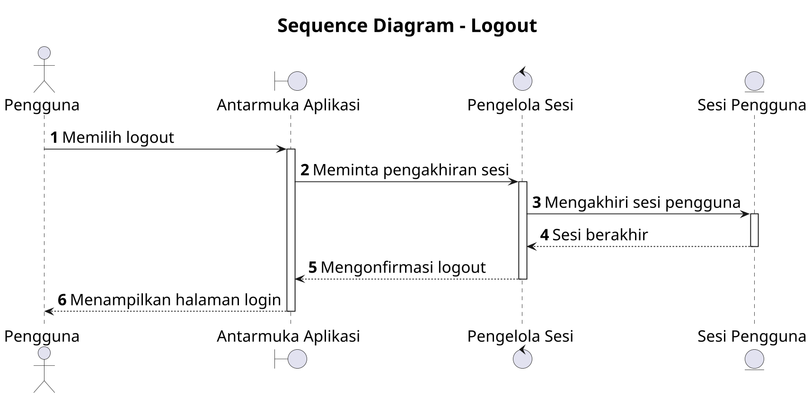

# Sequence Diagram: Seluruh Pengguna - Logout

Sumber use case: `UC-02` pada [`../../usecase.md`](../../usecase.md).

## Metadata

| Elemen | Deskripsi |
| :--- | :--- |
| Use case | Logout |
| Aktor utama | PJ Evaluator, Evaluator, Kepala OPD, PJ Penyusun, Penyusun |
| Nomor kebutuhan fungsional | — |
| Tujuan | Menggambarkan interaksi pengguna dan sistem saat mengakhiri sesi penggunaan aplikasi. |

## PlantUML

