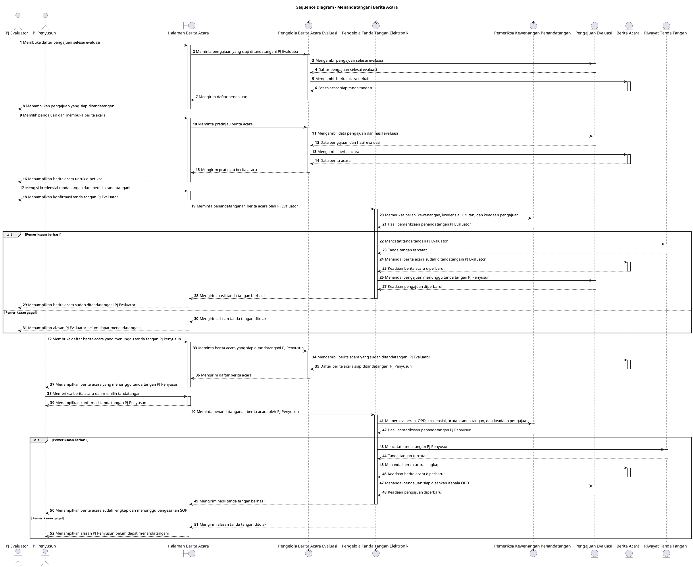

# Sequence Diagram: PJ Evaluator/PJ Penyusun - Menandatangani Berita Acara

Sumber use case: `UC-10` pada [`../usecase.md`](../usecase.md).

## Metadata

| Elemen | Deskripsi |
| :--- | :--- |
| Use case | Menandatangani Berita Acara |
| Aktor utama | PJ Evaluator, PJ Penyusun |
| Nomor kebutuhan fungsional | 17 |
| Tujuan | Menggambarkan penandatanganan Berita Acara secara berurutan oleh PJ Evaluator dan PJ Penyusun, termasuk pemeriksaan kewenangan penandatangan dan umpan balik ke masing-masing aktor. |

## PlantUML

