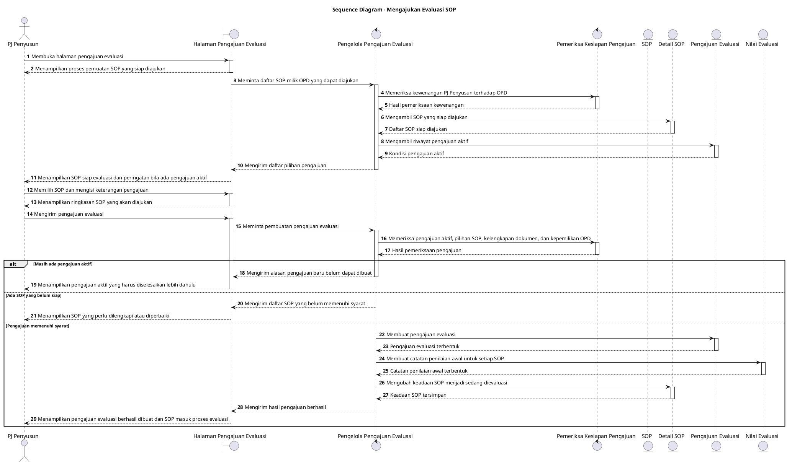

# Sequence Diagram: PJ Penyusun - Mengajukan Evaluasi SOP

Sumber use case: `UC-14` pada [`../usecase.md`](../usecase.md).

## Metadata

| Elemen | Deskripsi |
| :--- | :--- |
| Use case | Mengajukan Evaluasi SOP |
| Aktor utama | PJ Penyusun |
| Nomor kebutuhan fungsional | 12 |
| Tujuan | Menggambarkan proses PJ Penyusun memilih SOP siap diajukan, membentuk pengajuan evaluasi, menyiapkan ruang penilaian, dan menerima hasil proses dari sistem. |

## PlantUML

