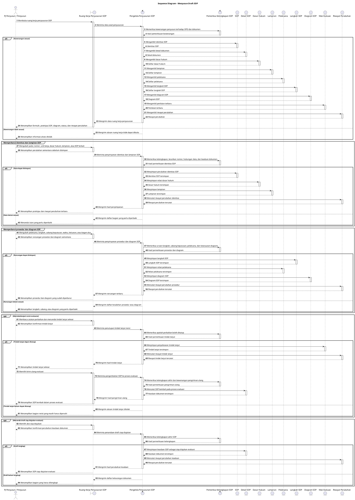

# Sequence Diagram: PJ Penyusun/Penyusun - Menyusun Draft SOP

Sumber use case: `UC-15` pada [`../usecase.md`](../usecase.md).

## Metadata

| Elemen | Deskripsi |
| :--- | :--- |
| Use case | Menyusun Draft SOP |
| Aktor utama | PJ Penyusun, Penyusun |
| Nomor kebutuhan fungsional | 10, 11, 13, 14 |
| Tujuan | Menggambarkan interaksi lengkap saat pengguna membuka ruang kerja, menyimpan identitas, prosedur, diagram, melihat riwayat perubahan, menindaklanjuti revisi, dan menandai draft siap diajukan evaluasi. |

## PlantUML

