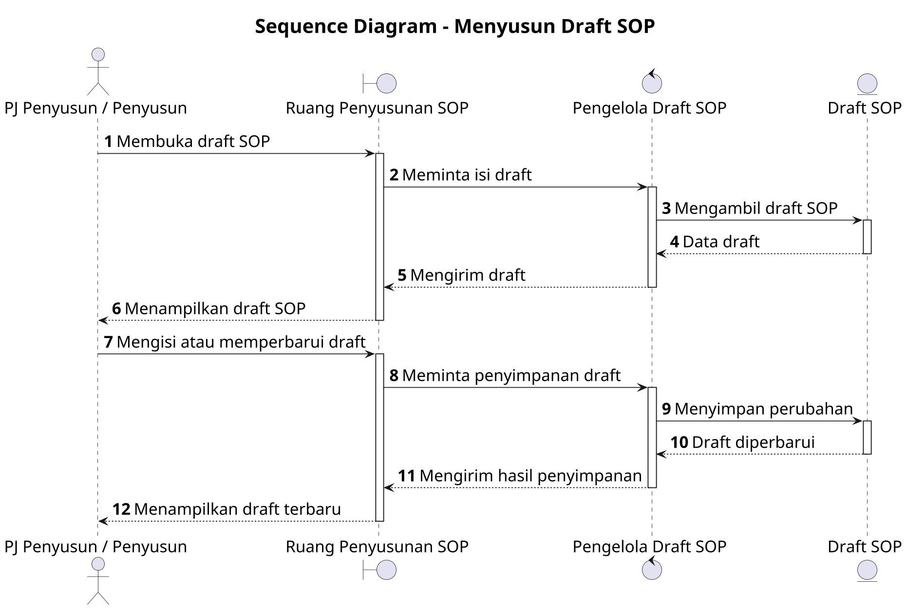

# Sequence Diagram: PJ Penyusun / Penyusun - Menyusun Draft SOP

Sumber use case: `UC-15` pada [`../usecase.md`](../usecase.md).

## Metadata

| Elemen | Deskripsi |
| :--- | :--- |
| Use case | Menyusun Draft SOP |
| Aktor utama | PJ Penyusun, Penyusun |
| Nomor kebutuhan fungsional | 10 |
| Tujuan | Menggambarkan interaksi penyusun dan sistem saat mengisi dan menyimpan draft SOP. |

## PlantUML

