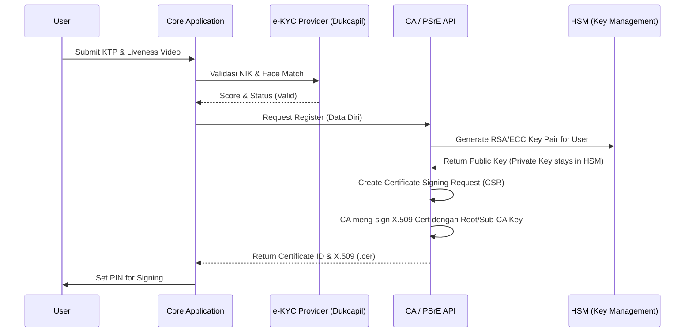
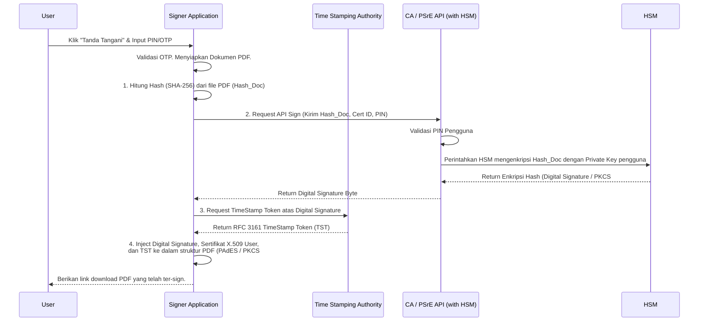
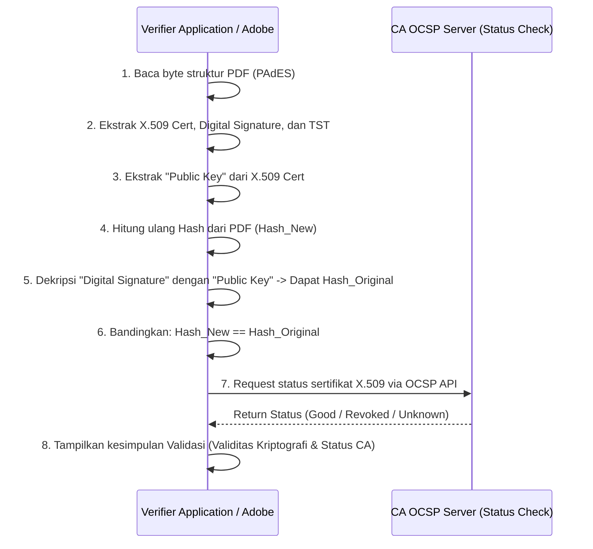

# Analisis Komprehensif Tanda Tangan Elektronik (TTE) dan Certificate Authority (CA)

## 1. Pendahuluan
Tanda Tangan Elektronik (TTE) adalah tanda tangan yang terdiri atas informasi elektronik yang dilekatkan, terasosiasi, atau terkait dengan informasi elektronik lainnya yang digunakan sebagai alat verifikasi dan autentikasi. Untuk memastikan keabsahan, integritas, dan tingkat kepercayaan yang tinggi (TTE Tersertifikasi), diperlukan pihak ketiga yang objektif dan terpercaya, yaitu **Certificate Authority (CA)** atau di Indonesia dikenal sebagai **Penyelenggara Sertifikasi Elektronik (PSrE)**.

Dokumen ini menjelaskan secara komprehensif mekanisme dasar TTE, peran CA, serta merincikan alur bisnis dan alur teknis penerapannya dalam sebuah sistem.

---

## 2. Konsep Dasar Kriptografi Kunci Asimetris (PKI)
Mekanisme TTE didasarkan pada teknologi *Public Key Infrastructure* (PKI) yang menggunakan kriptografi asimetris.
*   **Key Pair (Sepasang Kunci):** Setiap pengguna memiliki sepasang kunci kriptografi yang saling terkait secara matematis, namun mustahil diturunkan dari satu ke yang lain.
    *   **Private Key (Kunci Privat):** Bersifat rahasia dan hanya dikuasai oleh pemilik identitas. Digunakan semata-mata untuk **membuat** tanda tangan elektronik (enkripsi hash).
    *   **Public Key (Kunci Publik):** Bersifat terbuka dan dapat dibagikan kepada siapa saja. Digunakan untuk **memverifikasi** tanda tangan elektronik (dekripsi signature).
*   **Fungsi Hash (Hashing):** Algoritma kriptografi satu arah (contoh: SHA-256) yang merangkum data (dokumen PDF berukuran berapapun) menjadi deretan karakter dengan ukuran tetap (*hash value* / *digest*). Perubahan sekecil 1 bit pada dokumen akan menghasilkan nilai hash yang sama sekali berbeda, sehingga sangat andal untuk mendeteksi perubahan/tampering.

---

## 3. Mekanisme Tanda Tangan Elektronik
TTE tidak berarti menempelkan "gambar" tanda tangan basah ke dalam dokumen PDF. TTE adalah sebuah proses kriptografi yang mengikat identitas ke sebuah dokumen.

### A. Proses Pembuatan (Signing Process)
1.  **Hashing Dokumen:** Aplikasi menghitung nilai hash dari dokumen asli yang akan ditandatangani. Menghasilkan *Hash Value*.
2.  **Enkripsi Hash (Signing):** *Hash Value* tersebut kemudian dienkripsi menggunakan **Private Key** milik penandatangan. Hasil proses enkripsi inilah yang secara teknis disebut sebagai **Digital Signature** (Tanda Tangan Digital).
3.  **Penggabungan (Packaging):** *Digital Signature* yang dihasilkan, disisipkan ke dalam dokumen asli bersama dengan Sertifikat Elektronik penandatangan (yang mengandung *Public Key*). Pada file PDF, metadata ini disimpan dalam blok khusus.

### B. Proses Verifikasi (Verification Process)
1.  **Ekstraksi Data:** Sistem penerima (misal Adobe Acrobat atau sistem verifikator internal) mengekstrak dokumen asli, *Digital Signature*, dan Sertifikat dari file tersebut.
2.  **Dekripsi Signature:** Sistem menggunakan **Public Key** penandatangan (dari dalam Sertifikat) untuk mendekripsi *Digital Signature*. Hasil dekripsinya adalah **Hash Value Asli** (milik dokumen sebelum ditandatangani).
3.  **Hashing Ulang:** Sistem melakukan proses hashing ulang terhadap dokumen asli yang diekstrak untuk menghasilkan **Hash Value Baru**.
4.  **Perbandingan:**
    *   Jika *Hash Value Asli* **SAMA DENGAN** *Hash Value Baru*, maka dokumen dinyatakan **TIDAK BERUBAH (INTEGRITAS TERJAGA)**.
    *   Jika berbeda, maka dipastikan dokumen telah dimodifikasi (tampered) setelah ditandatangani.

---

## 4. Peran Certificate Authority (CA)
Dalam sistem PKI, timbul satu pertanyaan krusial: *"Bagaimana pihak verifikator bisa yakin bahwa Public Key (dan Private Key pasangannya) tersebut benar-benar milik Tuan A, dan bukan milik peretas (impostor)?"*

Di sinilah Certificate Authority (CA) berfungsi.
*   **Otoritas Terpercaya:** CA adalah pihak ketiga yang ditunjuk oleh negara (seperti Kominfo untuk PSrE) untuk memvalidasi identitas seseorang secara fisik/elektronik.
*   **Sertifikat Elektronik (X.509):** Setelah memvalidasi identitas Tuan A (misal mengecek KTP, NIK, dan Biometrik ke Dukcapil), CA menerbitkan **Sertifikat Elektronik**. Sertifikat ini adalah file digital (standar X.509) yang bertindak layaknya KTP digital, yang secara kriptografis mengikat *"Nama dan NIK Tuan A"* dengan *"Public Key milik Tuan A"*. Sertifikat ini ditandatangani secara digital oleh CA itu sendiri (menggunakan private key milik CA).
*   **Manajemen Siklus Hidup Kunci:** CA bertugas melakukan penerbitan (issuance), perpanjangan (renewal), dan pencabutan (revocation) sertifikat jika perangkat pengguna hilang atau kunci diretas.
*   **Pengecekan Status:** CA menyediakan protokol seperti **CRL (Certificate Revocation List)** dan **OCSP (Online Certificate Status Protocol)** agar sistem publik dapat mengecek apakah sertifikat milik Tuan A masih berlaku atau sudah dicabut (revoked) secara *real-time*.

---

## 5. Alur Bisnis (Business Flow)

Alur bisnis mencakup perjalanan end-to-end (User Journey) bagi pemangku kepentingan saat berinteraksi dengan sistem TTE.

### Flow 1: Registrasi dan Penerbitan Sertifikat (User Onboarding)
1.  **Input Data Identitas:** Pengguna mengisi formulir pendaftaran di portal aplikasi (Nama Lengkap, NIK, Email, No HP).
2.  **e-KYC (Know Your Customer):** Pengguna diminta melakukan *Liveness Detection* (verifikasi wajah/selfie) dan mengunggah foto KTP. Sistem mengirim data ini ke CA.
3.  **Verifikasi CA:** CA memvalidasi biometrik dan data demografi ke sumber otoritatif (contoh: Database Dukcapil Kemendagri).
4.  **Persetujuan Pengguna:** Jika valid, CA mengirim tautan atau notifikasi untuk meminta persetujuan pengguna terkait pembuatan *Key Pair*.
5.  **Penerbitan:** Sertifikat Elektronik terbit. Pengguna menerima notifikasi bahwa akun Tanda Tangan Elektroniknya telah aktif dan diminta mengatur PIN/Passphrase.

### Flow 2: Penandatanganan Dokumen (Document Signing)
1.  **Unggah & Inisiasi:** Pembuat dokumen mengunggah file PDF ke dalam sistem dan menunjuk siapa saja pihak yang harus menandatangani (Signer Routing).
2.  **Notifikasi:** Penandatangan mendapat email/notifikasi bahwa ada dokumen yang menunggu (Pending for Signature).
3.  **Review Dokumen:** Penandatangan membuka dokumen dan meninjau isi PDF tersebut secara visual di portal.
4.  **Penempatan Tanda Tangan (Opsional):** Penandatangan dapat menempatkan kotak stempel / gambar tanda tangan basah di halaman tertentu (sebagai *Visual Appearance*).
5.  **Autentikasi (Intent to Sign):** Sistem menuntut pengguna memasukkan PIN, OTP via SMS/Email, atau otentikasi biometrik. Ini adalah proses hukum untuk membuktikan niat (*intent*) penandatanganan.
6.  **Eksekusi:** Setelah otentikasi berhasil, sistem memproses kriptografi (menarik *Private Key* secara aman) dan menghasilkan dokumen PDF baru yang telah dibubuhi *Digital Signature*.

### Flow 3: Verifikasi Dokumen (Document Verification)
1.  Pihak ketiga (seperti Auditor, Bank, atau Penerima) menerima file PDF yang telah ditandatangani.
2.  Penerima dapat membuka file tersebut langsung menggunakan **Adobe Acrobat Reader** atau mengunggahnya ke **Portal Verifikasi Publik** (contoh: portal verifikasi Kominfo).
3.  Sistem akan menampilkan informasi:
    *   **Integritas:** "Dokumen belum diubah sejak ditandatangani".
    *   **Identitas Valid:** "Ditandatangani oleh Tuan A (NIK: 12345), diterbitkan oleh CA XYZ".
    *   **Waktu:** Waktu penandatanganan yang disahkan oleh server waktu (Time Stamp).

---

## 6. Alur Teknis (Technical Flow)

Alur teknis (Architecture & API) untuk model **Remote Signature**, di mana Private Key tidak disimpan di *device* pengguna, melainkan di dalam sistem terpusat bernama **HSM (Hardware Security Module)** yang dikelola oleh CA/PSrE, guna menjamin keamanan ekstrem.

### A. Flow Teknis - Penerbitan Sertifikat (Certificate Issuance)

### B. Flow Teknis - Proses Penandatanganan (Signing Flow)

### C. Flow Teknis - Proses Verifikasi (Verification Flow)

---

## 7. Standar Teknis Penting

*   **PAdES (PDF Advanced Electronic Signatures):** Standar ETSI (Eropa) yang diadaptasi secara global untuk mengemas tanda tangan digital ke dalam dokumen PDF. PAdES mendukung beberapa profil.
*   **PAdES-LTV (Long-Term Validation):** Fitur yang sangat penting. Meng-embed secara permanen informasi rantai sertifikat (Certificate Chain), root sertifikat, beserta respon status OCSP/CRL, ke dalam file PDF itu sendiri. Tujuannya adalah agar dokumen tetap **valid** saat diverifikasi 10 hingga 20 tahun ke depan, meskipun sertifikat penandatangannya sudah *expired* (kedaluwarsa) atau server OCSP milik CA sudah tutup.
*   **TSA (Time Stamping Authority):** Menyediakan token waktu (RFC 3161) yang tidak dapat dibantah. Menjamin bahwa TTE dilakukan pada detik yang spesifik sesuai waktu standar dunia (NTP server yang tersinkronisasi), bukan mengandalkan waktu lokal dari komputer pengguna.

## 8. Kesimpulan
Implementasi Tanda Tangan Elektronik Tersertifikasi yang didukung oleh *Certificate Authority* memberikan 3 pilar jaminan keamanan utama (Aspek CIA triad & Hukum):
1.  **Autentikasi:** Memastikan identitas nyata dari pihak penandatangan telah diverifikasi oleh otoritas.
2.  **Integritas:** Jaminan mutlak (secara matematis kriptografi) bahwa dokumen elektronik tidak dimodifikasi/diubah satu bit pun paska ditandatangani.
3.  **Nirsangkal (Non-Repudiation):** Subjek penandatangan tidak dapat secara hukum menyangkal bahwa mereka telah menyetujui dokumen tersebut, karena proses enkripsi hanya bisa dilakukan oleh kunci privat yang ada di bawah kendali tunggal otorisasi mereka (via PIN/OTP/Biometrik).
